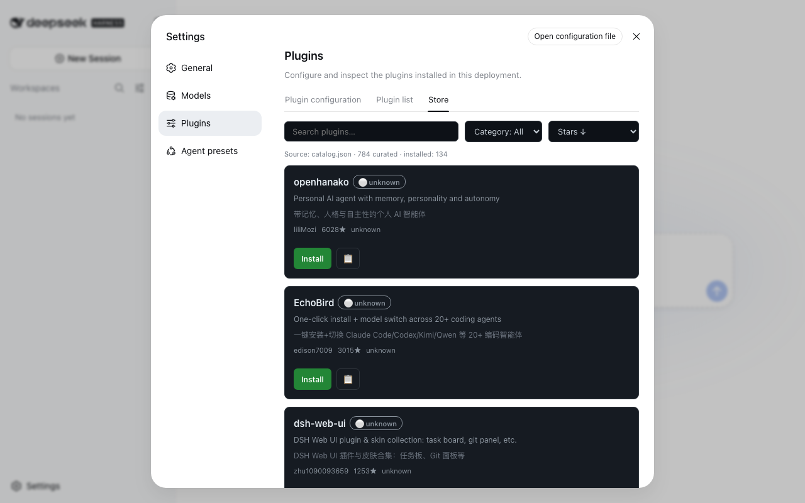

# dsh-suite


> 🌐 中文 · [English](README.en.md)

**别再翻 `dsh-plugin` topic 了，这里都是还能跑的插件。**

`dsh-suite` 是 [DeepSeek Harness](https://github.com/deepseek-ai/deepseek-harness)（DSH）插件的**活目录**——**每小时自动刷新、每日兼容实测**——外加 DSH 内置**插件商店**、`create-dsh-plugin` 脚手架、几个自研插件，以及一个**[一体化工作台](https://github.com/whyihaveyou/dsh-workstation)**（🚧 开发中）。

[](https://whyihaveyou.github.io/dsh-suite/zh.html)

[](https://whyihaveyou.github.io/dsh-suite/zh.html)

---

## 为什么做 dsh-suite

DSH 发布时没有官方插件 registry。现在找插件只能翻 GitHub 的 `dsh-plugin` topic（50+ 个零散小插件）和当天冒出来的几个静态 awesome-list——而 DSH 自己还在发**破坏性变更**（breaking changes）。

所以我们做了四件事：

1. **一个「活」目录**——880+ 精选插件，CI **每小时**刷新数据、**每天**把收录的包真实装进临时 profile 重测兼容性。
2. **一个内置插件商店**——`@dsh-suite/plugin-manager` 在 DSH Web UI 的设置页里加一个 **Store** 标签：逛目录、搜索、看徽章、一键安装，全程不用离开 DSH。
3. **一个脚手架**——`npm create dsh-plugin` 一条命令生成可跑的 `dsh.bundle` + Cordis 骨架。官方没给脚手架，而「怎么迁移我的插件」是社区呼声最高的需求之一。
4. **几个自研插件**——不是纯搬运，有第一方产出。
5. **一个一体化工作台**——[dsh-workstation](https://github.com/whyihaveyou/dsh-workstation)，开箱即用版（🚧 开发中）。

## 快速开始

```bash
# 1. 逛目录网站
open https://whyihaveyou.github.io/dsh-suite/zh.html

# 2. 把插件商店装进你的 DSH Web UI
npx @deepseek-ai/dsh plugin --profile web add @dsh-suite/plugin-manager
#    → 重启 Web UI，然后 设置 → Plugins → Store

# 3.（开发者）造一个自己的插件
npm create dsh-plugin@latest my-plugin
```



## 📚 插件目录

<!-- CATALOG:START -->
### ⭐ 精选

| 插件 | ⭐ | 兼容 | 描述 |
|---|---|---|---|
| [dsh-web-ui](https://github.com/zhu1090093659/dsh-web-ui) | 2613 | 🟢 ok | DSH Web UI 插件与皮肤合集：任务板、Git 面板等 |
| [DSH-better-sidebar](https://github.com/omdsh-dev/DSH-better-sidebar) | 1189 | 🟢 ok | 侧边栏完整工作台：文件渲染/终端/Git/子代理 |
| [dsh-deep-whale](https://github.com/Small-tailqwq/dsh-deep-whale) | 883 | ⚪ unknown | DSH Web 鲸鱼娘皮肤系列（深海女仆工坊） |
| [dsh-vision-toolkit](https://github.com/Anionex/dsh-vision-toolkit) | 421 | 🟢 ok | 给纯文本模型加视觉：图片问答、长截图 OCR、UI 还原 |
| [dsh_workflow](https://github.com/icetomoyo/dsh_workflow) | 59 | ⚪ unknown | 把 Claude Code 的 UltraCode 模式带给 DSH，多 Agent 调度可治理 |
| [dsh-turn-rewind](https://github.com/Anionex/dsh-turn-rewind) | 52 | 🟢 ok | 对话回退：回滚会话与工作区状态 |
| [mstar-harness](https://github.com/btspoony/mstar-harness) | 46 | ⚪ unknown | Skill 驱动的 Harness/Loop 工程工作流插件 |
| [ui-status-label](https://github.com/alingalingling/ui-status-label) | 33 | ⚪ unknown | 自定义「鲸鱼娘」思考状态的显示 |
| [dsh-custom-tool](https://github.com/omdsh-dev/dsh-custom-tool) | 24 | ⚪ unknown | Monaco 编辑器创建沙箱 JS 工具 |
| [dsh-share](https://github.com/hellodigua/dsh-share) | 19 | 🟢 ok | DSH 对话分享插件 |
| [distill](https://github.com/LoserFox/distill) | 19 | ⚪ unknown | 自动对话蒸馏：后台 subagent 反省 + 技能更新 |
| [all (全家桶)](https://github.com/whyihaveyou/dsh-suite) | 15 | 🟢 ok | 全家桶聚合包：一次安装带入第一方全家桶——插件商店、IM 通知、会话导出、多 agent 任务板。 |
| [dsh-acp-for-bitfun](https://github.com/bobleer/dsh-acp-for-bitfun) | 9 | ⚪ unknown | BitFun 与 DSH ACP 交互对接 |
| [plugin-manager](https://github.com/whyihaveyou/dsh-suite) | 7 | 🟢 ok | DSH Web UI 内置插件商店：浏览 dsh-suite 目录、搜索/筛选/排序、兼容徽章、一键安装——设置页插件区的 Store 标签页。 |
| [plugin-team-board](https://github.com/whyihaveyou/dsh-suite) | 7 | 🟢 ok | 多 agent 会话共享任务看板：跨 subagent 创建/认领/更新/查询任务，基于 append-only 会话日志持久化。 |
| [plugin-session-export](https://github.com/whyihaveyou/dsh-suite) | 3 | 🟢 ok | 把 append-only 会话日志导出成人读的 Markdown / HTML，按来源分组渲染（系统提示 / 思维链 / 工具调用 / 子agent）。 |
| [create-dsh-plugin](https://github.com/whyihaveyou/dsh-suite) | 3 | 🟢 ok | 一键脚手架生成 DeepSeek Harness (DSH) 插件：tool / events / webui 三套模板、next 标签版本锁定、内置 --verify 冒烟测试。 |
| [plugin-notify](https://github.com/whyihaveyou/dsh-suite) | 3 | 🟢 ok | 回合完成 / 出错 / 待审批时，把通知推到 IM webhook（飞书 / 企业微信 / 钉钉 / Slack / Discord / 自定义）+ 本机系统通知。 |
| [themes (皮肤中心)](https://github.com/whyihaveyou/dsh-themes) | 1 | 🟢 ok | 皮肤中心：151 款昼夜成对皮肤一包打尽——网格预览、搜索、一键试穿，支持收藏、最近试穿与随机换肤。 |
| [preset-center (场景预设)](https://github.com/whyihaveyou/dsh-suite/tree/main/packages/preset-center) | 1 | 🟢 ok | 中文开箱即用预设全家桶：小红书笔记助手 / 中文文案润色 / 日报周报生成器，一键应用到官方 Agent presets，无需重启、选择器立即可见。 |
| [plugin-deus (神模扳机)](https://github.com/whyihaveyou/dsh-suite/tree/main/packages/plugin-deus) | 1 | 🟢 ok | 神模扳机：一键触发实测验证过的 Minimal 行为，起手指纹自动识别回复模式，本地触发率统计（Wilson CI）。提示词实验台，不承诺任何隐藏能力。 |

### 🧰 工具

| 插件 | ⭐ | 兼容 | 描述 |
|---|---|---|---|
| [open-managed-agents](https://github.com/openma-ai/open-managed-agents) | 236 | ⚪ unknown | Claude Managed Agents API 的开源自托管平台（Cloudflare Workers） |
| [role-model](https://github.com/try-works/role-model) | 102 | ⚪ unknown | 按任务把请求路由到「正确的模型」（本地/云） |
| [irmia_devkit_open](https://github.com/irmia2026/irmia_devkit_open) | 39 | ⚪ unknown | Python 开发工具包（无描述） |
| [HoloGram](https://github.com/834063245-creator/HoloGram) | 24 | ⚪ unknown | 3D 代码依赖拓扑图生成器（14 语言） |
| [dsh-custom-tool](https://github.com/omdsh-dev/dsh-custom-tool) | 24 | ⚪ unknown | Monaco 编辑器创建沙箱 JS 工具 |
| [dsh-acp-for-bitfun](https://github.com/bobleer/dsh-acp-for-bitfun) | 9 | ⚪ unknown | BitFun 与 DSH ACP 交互对接 |
| [fabric](https://github.com/omdsh-dev/fabric) | 9 | ⚪ unknown | 类似 MC Fabric 的 hook 处理器 |
| [dsh-git-identity](https://github.com/LoserFox/dsh-git-identity) | 7 | ⚪ unknown | git 提交固定使用环境作者身份 |
| [Hypr-Agent-Protal](https://github.com/gfhdhytghd/Hypr-Agent-Protal) | 4 | ⚪ unknown | Hyprland 的 Computer Use MCP |
| [telegram](https://github.com/LoserFox/telegram) | 6 | ⚪ unknown | Telegram Bot API 桥接（长轮询） |
| [agent-knock-knock](https://github.com/scotthuang/agent-knock-knock) | 4 | ⚪ unknown | OpenClaw 插件：共享 tmux 控制本地 Codex/Claude Code |
| [dsh-bash-encoding](https://github.com/lhh010/dsh-bash-encoding) | 7 | ⚪ unknown | bash 输出编码自动识别（UTF-16LE/UTF-8/GBK） |
| [dsh-data-agent](https://github.com/omdsh-dev/dsh-data-agent) | 27 | 🟢 ok | 连数据库、写 SQL 的插件 |
| [dsh-doctor](https://github.com/coppynight/dsh-doctor) | 3 | 🟢 ok | flutter-doctor 风格诊断与安全自动修复 |
| [dsh-interconnect](https://github.com/Chinesezjc/dsh-interconnect) | 27 | 🟢 ok | 跨实例消息/事件交接插件 |
| [dsh-openbiliclaw](https://github.com/whiteguo233/dsh-openbiliclaw) | 26 | ⚪ unknown | OpenBiliClaw 内容推荐 Agent 接入 DSH |
| [dsh-plugin-check](https://github.com/omdsh-dev/dsh-plugin-check) | 18 | ⚪ unknown | 扫描插件仓库清单协议/patch 格式/构建陷阱 |
| [dsh-security-audit](https://github.com/omdsh-dev/dsh-security-audit) | 11 | ⚪ unknown | 本机安全审计：配置/插件来源/会话/网络暴露面 |
| [dsh-tool-csv](https://github.com/omdsh-dev/dsh-tool-csv) | 4 | ⚪ unknown | CSV 解析/查询/统计/转换工具 |
| [dsh-toolkit](https://github.com/omdsh-dev/dsh-toolkit) | 17 | ⚪ unknown | 零依赖工具包合集（time/encoding/json/csv/regex） |
| [atomstudio](https://github.com/AtomicsLaboratory/atomstudio) | 1 | ⚪ unknown | 可执行文档工程环境 |
| [dsh-cc-connect](https://github.com/whiteguo233/dsh-cc-connect) | 2 | ⚪ unknown | 通过 cc-connect 远程使用 DSH |
| [dsh-mnemon](https://github.com/omdsh-dev/dsh-mnemon) | 27 | ⚪ unknown | Mnemon 三层记忆体深度集成 |
| [dsh-paseo](https://github.com/renat3u/dsh-paseo) | 2 | ⚪ unknown | DSH 的 paseo 插件扩展支持 |
| [dsh-plugin-dev](https://github.com/omdsh-dev/dsh-plugin-dev) | 10 | ⚪ unknown | DSH 插件开发踩坑档案（skill+文档） |
| [dsh-tool-calculator](https://github.com/omdsh-dev/dsh-tool-calculator) | 6 | ⚪ unknown | 安全数学表达式求值器 |
| [dsh-tool-diff](https://github.com/omdsh-dev/dsh-tool-diff) | 4 | ⚪ unknown | 文本/JSON/CSV/Markdown 结构化 diff |
| [dsh-tool-encoding](https://github.com/omdsh-dev/dsh-tool-encoding) | 3 | ⚪ unknown | base64/hex/url 编解码 + 哈希工具 |
| [dsh-tool-json](https://github.com/omdsh-dev/dsh-tool-json) | 3 | ⚪ unknown | JMESPath JSON 查询工具 |
| [dsh-tool-markdown](https://github.com/omdsh-dev/dsh-tool-markdown) | 4 | ⚪ unknown | HTML↔Markdown 转换、GFM 表格规范化 |
| [dsh-tool-regex](https://github.com/omdsh-dev/dsh-tool-regex) | 3 | ⚪ unknown | 正则测试/捕获/安全替换工具 |
| [dsh-tool-schema](https://github.com/omdsh-dev/dsh-tool-schema) | 3 | ⚪ unknown | JSON Schema 验证工具 |
| [dsh-tool-stat](https://github.com/omdsh-dev/dsh-tool-stat) | 4 | ⚪ unknown | 描述统计/百分位/相关性工具 |
| [dsh-tool-time](https://github.com/omdsh-dev/dsh-tool-time) | 4 | ⚪ unknown | ISO 8601/时区/日历运算时间工具 |
| [dsh-trace](https://github.com/vibeinging/dsh-trace) | 2 | ⚪ unknown | DSH 遥测后端：导出轮次/步骤/工具 |
| [sandbox-micro](https://github.com/omdsh-dev/sandbox-micro) | 3 | ⚪ unknown | microsandbox 支持 |
| [zotero-harvest](https://github.com/Fisfzy/zotero-harvest) | 5 | ⚪ unknown | Zotero 文献采集入库插件（OpenAlex/arXiv/Crossref） |
| [dsh-harness-ops](https://github.com/fakechris/dsh-harness-ops) | 9 | ⚪ unknown | DSH 运维工具箱：每日快照 A/B 双槽轮换、一键回滚 |
| [dsh-inspect](https://github.com/omdsh-dev/dsh-inspect) | 5 | ⚪ unknown | 检查→修复→复查的对抗式闭环插件 |
| [dsh-openmaic](https://github.com/THU-MAIC/dsh-openmaic) | 8 | ⚪ unknown | OpenMAIC：课堂/幻灯片/交互式组件 |
| [dsh-plugin-mineru](https://github.com/HuanLinOTO/dsh-plugin-mineru) | 22 | ⚪ unknown | MineRU 文档解析工具 |
| [dsh-prompt-studio](https://github.com/Moeblack/dsh-prompt-studio) | 2 | ⚪ unknown | 编辑用户与内置系统提示段（实时预览） |
| [dsh-scholar](https://github.com/lzszq/dsh-scholar) | 15 | 🟢 ok | dsh-scholar（文献相关） |
| [dsh-ssh](https://github.com/UynajGI/dsh-ssh) | 5 | ⚪ unknown | SSH 远程执行：ProxyJump 链、SFTP |
| [dsh-tool-search](https://github.com/vibeinging/dsh-tool-search) | 2 | 🟢 ok | 按 agent 按需工具发现与渐进 schema 披露 |
| [dsh-webbridge](https://github.com/bill9109/dsh-webbridge) | 3 | ⚪ unknown | DSH 结合 Kimi WebBridge |
| [ego-browser](https://github.com/Fisfzy/ego-browser) | 14 | ⚪ unknown | 把 ego-lite 浏览器接入 DSH（给 Agent 用的 Chromium） |
| [math-lean](https://github.com/Fisfzy/math-lean) | 1 | ⚪ unknown | Lean 内核验证的数学推理插件 |
| [plugin-template](https://github.com/omdsh-dev/plugin-template) | 5 | ⚪ unknown | 官方 turtle ui 仓库派生的插件模板 |
| [Qwen-MM-Plugins](https://github.com/omdsh-dev/Qwen-MM-Plugins) | 4 | ⚪ unknown | Qwen-MM-Plugins 支持 |
| [sandbox-mxc](https://github.com/omdsh-dev/sandbox-mxc) | 2 | ⚪ unknown | 微软跨平台沙盒支持 |
| [sandbox-nono](https://github.com/omdsh-dev/sandbox-nono) | 3 | ⚪ unknown | nono 沙盒支持 |
| [web-components](https://github.com/omdsh-dev/web-components) | 2 | ⚪ unknown | web-components 支持 |
| [zotero-wave-rag](https://github.com/Fisfzy/zotero-wave-rag) | 3 | ⚪ unknown | 面向 Zotero 论文库的浪潮式 RAG 检索 |
| [modsearch](https://github.com/liustack/modsearch) | 104 | ⚪ unknown | DeepSeek Harness 的联网搜索插件。 |
| [dsh-browser](https://github.com/Lum1104/dsh-browser) | 154 | 🟢 ok | Chrome 侧边栏扩展，让 DSH 操控浏览器。 |
| [dsh-openapi](https://github.com/Degurechaff57/dsh-openapi) | 4 | ⚪ unknown | 安全 OpenAPI 3.x 发现与 API 调用工具。 |
| [dsh-better-browser](https://github.com/titanwings/dsh-better-browser) | 7 | ⚪ unknown | 通过 Kimi WebBridge 让 agent 操作用户已登录浏览器。 |
| [dsh-worktree](https://github.com/FlashingChen/dsh-worktree) | 5 | ⚪ unknown | Codex 风格永久 git worktree 插件。 |
| [graycode-for-dsh](https://github.com/Komeiji-Shiki/graycode-for-dsh) | 5 | ⚪ unknown | graycode 编码工具。 |
| [dsh-expression](https://github.com/yyh-001/dsh-expression) | 4 | ⚪ unknown | 找得到、发得出 —— DSH 表情包插件：语义搜图，只发真实文件，走 companion QQ 通道 |
| [dsh-director-toolkit](https://github.com/lhmd/dsh-director-toolkit) | 7 | ⚪ unknown | dsh-director-toolkit — DSH 插件（工具） |
| [codex-plugin-dsh](https://github.com/wingoo/codex-plugin-dsh) | 4 | ⚪ unknown | codex-plugin-dsh — DSH 插件（工具） |
| [dsh-prompt-persona](https://github.com/Xilin3/dsh-prompt-persona) | 4 | ⚪ unknown | dsh-prompt-persona — DSH 插件（工具） |
| [dsh-tool-policy](https://github.com/Drifter-yh/dsh-tool-policy) | 2 | ⚪ unknown | dsh-tool-policy — DSH 插件（工具） |
| [dsh-plugin-graph](https://github.com/erduotong/dsh-plugin-graph) | 2 | 🟢 ok | 一个Deepseek Harness的插件关系图谱可视化插件 |
| [dsh-research-notes](https://github.com/fff122/dsh-research-notes) | 3 | ⚪ unknown | dsh-research-notes — DSH 插件（工具） |
| [nowledge-mem-deepseek-harness](https://github.com/nowledge-co/nowledge-mem-deepseek-harness) | 5 | ⚪ unknown | nowledge-mem-deepseek-harness — DSH 插件（工具） |
| [dsh-vsc-integration](https://github.com/HarcoChen/dsh-vsc-integration) | 5 | ⚪ unknown | dsh-vsc-integration — DSH 插件（工具） |
| [dsh-safe-delete](https://github.com/Qintsg/dsh-safe-delete) | 3 | ⚪ unknown | dsh-safe-delete — DSH 插件（工具） |
| [dsh-plugins](https://github.com/HackSing/dsh-plugins) | 5 | ⚪ unknown | dsh-plugins — DSH 插件（工具） |
| [dsh-report-html](https://github.com/hccccc01333/dsh-report-html) | 3 | ⚪ unknown | dsh-report-html — DSH 插件（工具） |
| [dsh-openai-codex-auth](https://github.com/yoke233/dsh-openai-codex-auth) | 3 | ⚪ unknown | dsh-openai-codex-auth — DSH 插件（工具） |
| [dsh-github-connector](https://github.com/kaziii/dsh-github-connector) | 4 | ⚪ unknown | dsh-github-connector — DSH 插件（工具） |
| [deepseek-pet](https://github.com/keleus/deepseek-pet) | 19 | ⚪ unknown | 在你的deepseek-harness上养一只吃白饭的大蓝鲸 |
| [dsh-index](https://github.com/Sunrisepeak/dsh-index) | 2 | ⚪ unknown | dsh-index — DSH 插件（工具） |
| [dsh-web-search-firecrawl](https://github.com/yangzhe1003/dsh-web-search-firecrawl) | 2 | ⚪ unknown | dsh-web-search-firecrawl — DSH 插件（工具） |
| [dsh-plugin-template](https://github.com/bugmaker2/dsh-plugin-template) | 19 | ⚪ unknown | dsh-plugin-template — DSH 插件（工具） |
| [dsh-composer-history](https://github.com/PerryLink/dsh-composer-history) | 3 | 🟢 ok | dsh-composer-history — DSH 插件（工具） |
| [dsh-fun-ticker](https://github.com/omdsh-dev/dsh-fun-ticker) | 4 | ⚪ unknown | DSH 行情跑马灯插件：可自选标的的加密/汇率/A股/指数/港美股跑马灯，免 key 数据源，宿主代理+缓存 |
| [jumpserver-dsh](https://github.com/jumpserver-east/jumpserver-dsh) | 1 | ⚪ unknown | jumpserver-dsh — DSH 插件（工具） |
| [dsh-browser](https://github.com/ben7am1n/dsh-browser) | 1 | 🟢 ok | dsh-browser — DSH 插件（工具） |
| [dsh-dev-actions](https://github.com/skitse/dsh-dev-actions) | 1 | ⚪ unknown | dsh-dev-actions — DSH 插件（工具） |
| [dsh-plugin-doctor](https://github.com/lin-cheng-lab/dsh-plugin-doctor) | 1 | ⚪ unknown | DSH 插件体检：安装前检查 peer 版本兼容性，防止 rc 不匹配崩溃 🩺 |
| [deepseek-harness-background](https://github.com/czzzlq/deepseek-harness-background) | 2 | ⚪ unknown | deepseek-harness-background — DSH 插件（工具） |
| [task-passport](https://github.com/dongsheng123132/task-passport) | 5 | 🟢 ok | task-passport — DSH 插件（工具） |
| [dsh-prompt-presets](https://github.com/fff122/dsh-prompt-presets) | 1 | ⚪ unknown | dsh-prompt-presets — DSH 插件（工具） |
| [dsh-hub](https://github.com/coderPerseus/dsh-hub) | 3 | ⚪ unknown | dsh-hub — DSH 插件（工具） |
| [dsh-plugin-colorscheme](https://github.com/Civitasv/dsh-plugin-colorscheme) | 2 | ⚪ unknown | dsh-plugin-colorscheme — DSH 插件（工具） |
| [dsh-scout](https://github.com/omdsh-dev/dsh-scout) | 2 | ⚪ unknown | 面向 DeepSeek Harness 的只读环境探测插件，为智能体提供运行环境、软件版本、系统资源、端口、服务、硬件及工作区信息。 |
| [dsh-screenshot-diff](https://github.com/PangYiMing/dsh-screenshot-diff) | 1 | ⚪ unknown | dsh-screenshot-diff — DSH 插件（工具） |
| [dsh-turn-index](https://github.com/Simon314620/dsh-turn-index) | 1 | ⚪ unknown | deepseek harness的侧边栏对话轮次索引插件 |
| [dsh-mobile-control](https://github.com/PangYiMing/dsh-mobile-control) | 2 | 🟢 ok | dsh-mobile-control — DSH 插件（工具） |
| [dsh-hub](https://github.com/coderPerseus/dsh-hub) | 3 | ⚪ unknown | dsh-hub — DSH 插件（工具） |
| [dsh-tool-monitor](https://github.com/yoke233/dsh-tool-monitor) | 1 | ⚪ unknown | dsh-tool-monitor — DSH 插件（工具） |
| [dsh-suggest-prompt](https://github.com/studyzy/dsh-suggest-prompt) | 1 | ⚪ unknown | dsh-suggest-prompt — DSH 插件（工具） |
| [dsh-cloudflare-browser-run](https://github.com/RealAlexandreAI/dsh-cloudflare-browser-run) | 1 | ⚪ unknown | dsh-cloudflare-browser-run — DSH 插件（工具） |
| [safe-find-dsh-plugins](https://github.com/Jinsong-Zhou/safe-find-dsh-plugins) | 3 | ⚪ unknown | safe-find-dsh-plugins — DSH 插件（工具） |
| [dsh-all-search](https://github.com/RealAlexandreAI/dsh-all-search) | 1 | ⚪ unknown | dsh-all-search — DSH 插件（工具） |
| [dsh-plugin-pixluna](https://github.com/PixLunaLab/dsh-plugin-pixluna) | 2 | ⚪ unknown | dsh-plugin-pixluna — DSH 插件（工具） |
| [dsh-plugins-hub](https://github.com/TYEclipse/dsh-plugins-hub) | 2 | ⚪ unknown | dsh-plugins-hub — DSH 插件（工具） |
| [dsh-huadongbianzuqi](https://github.com/zjl88858/dsh-huadongbianzuqi) | 5 | ⚪ unknown | DeepSeek Harness的滑动变祖器插件 |
| [dsh-soul-md](https://github.com/Scorp1o117/dsh-soul-md) | 2 | ⚪ unknown | dsh-soul-md — DSH 插件（工具） |
| [dsh-daily-fortune](https://github.com/omdsh-dev/dsh-daily-fortune) | 3 | ⚪ unknown | dsh-daily-fortune — DSH 插件（工具） |
| [dsh-plugin-rag](https://github.com/YYTbit/dsh-plugin-rag) | 1 | ⚪ unknown | dsh-plugin-rag — DSH 插件（工具） |
| [dsh-model-selector](https://github.com/bitterSmilezzz/dsh-model-selector) | 1 | ⚪ unknown | dsh-model-selector — DSH 插件（工具） |
| [dsh-github](https://github.com/PerryLink/dsh-github) | 3 | 🟢 ok | dsh-github — DSH 插件（工具） |
| [dsh-plugin-review](https://github.com/Mingxi2077/dsh-plugin-review) | 2 | ⚪ unknown | dsh-plugin-review — DSH 插件（工具） |
| [dsh-turn-budget](https://github.com/randerous/dsh-turn-budget) | 1 | 🟢 ok | dsh-turn-budget — DSH 插件（工具） |
| [DIzzy-DSH](https://github.com/Acidmoon/DIzzy-DSH) | 6 | ⚪ unknown | DIzzy-DSH — DSH 插件（工具） |
| [dsh-file-explorer](https://github.com/schhaohao/dsh-file-explorer) | 2 | ⚪ unknown | dsh-file-explorer — DSH 插件（工具） |
| [dsh-tool-reqpipe](https://github.com/sikwoxy/dsh-tool-reqpipe) | 1 | 🟢 ok | dsh-tool-reqpipe — DSH 插件（工具） |
| [dsh-ajw](https://github.com/rsagacom/dsh-ajw) | 1 | ⚪ unknown | DS安甲网 (ds.ajw.cn) · 为你的 DeepSeek Harness 机器人 安装上所需功能的装甲吧 — 每日聚合 DeepSeek Harness / DSH 插件生态开源项目 |
| [dsh-fun-typewriter](https://github.com/omdsh-dev/dsh-fun-typewriter) | 3 | ⚪ unknown | dsh-fun-typewriter — DSH 插件（工具） |
| [dsh-port-guard](https://github.com/PangYiMing/dsh-port-guard) | 1 | ⚪ unknown | dsh-port-guard — DSH 插件（工具） |
| [qiushi-dsh-evidence-audit](https://github.com/030611/qiushi-dsh-evidence-audit) | 4 | 🟢 ok | qiushi-dsh-evidence-audit — DSH 插件（工具） |
| [dsh-plugin.github.io](https://github.com/dsh-plugin/dsh-plugin.github.io) | 1 | ⚪ unknown | dsh-plugin.github.io — DSH 插件（工具） |
| [dsh-weixin](https://github.com/xiaoshihou514/dsh-weixin) | 2 | ⚪ unknown | dsh-weixin — DSH 插件（工具） |
| [dsh-lens-lite](https://github.com/ben7am1n/dsh-lens-lite) | 1 | 🟢 ok | dsh-lens-lite — DSH 插件（工具） |
| [dsh-tavily-search](https://github.com/zhouzhencheng07/dsh-tavily-search) | 2 | ⚪ unknown | dsh-tavily-search — DSH 插件（工具） |
| [dsh-sticky-disclosure](https://github.com/Han-1413141/dsh-sticky-disclosure) | 3 | ⚪ unknown | dsh-sticky-disclosure — DSH 插件（工具） |
| [dsh-openai-codex-oauth](https://github.com/dyuan311/dsh-openai-codex-oauth) | 2 | ⚪ unknown | dsh-openai-codex-oauth — DSH 插件（工具） |
| [dshx](https://github.com/why913/dshx) | 2 | ⚪ unknown | dshx — DSH 插件（工具） |
| [dsh-reloader](https://github.com/lin-cheng-lab/dsh-reloader) | 1 | ⚪ unknown | DSH 一键重启：装完插件说一句 reload 就自动重启生效，不用手动 Ctrl+C 🔄 |
| [dsh-bisect-debug](https://github.com/PangYiMing/dsh-bisect-debug) | 1 | ⚪ unknown | dsh-bisect-debug — DSH 插件（工具） |
| [dsh-auto-chess](https://github.com/omdsh-dev/dsh-auto-chess) | 3 | ⚪ unknown | DSH Web里的自走棋插件：人机对战或双AI对弈 |
| [dsh-turn-meta](https://github.com/randerous/dsh-turn-meta) | 1 | ⚪ unknown | dsh-turn-meta — DSH 插件（工具） |
| [dsh-tool-browser](https://github.com/MashedPotato817/dsh-tool-browser) | 1 | 🟢 ok | dsh-tool-browser — DSH 插件（工具） |
| [dsh-music-plugin](https://github.com/syy-shark/dsh-music-plugin) | 3 | ⚪ unknown | dsh-music-plugin — DSH 插件（工具） |
| [dsh-batch-regression](https://github.com/PangYiMing/dsh-batch-regression) | 1 | ⚪ unknown | dsh-batch-regression — DSH 插件（工具） |
| [dsh-browser-control](https://github.com/PangYiMing/dsh-browser-control) | 1 | 🟢 ok | dsh-browser-control — DSH 插件（工具） |
| [dsh-code-ide](https://github.com/SakalioLabs/dsh-code-ide) | 1 | ⚪ unknown | dsh-code-ide — DSH 插件（工具） |
| [matlab-modelsim-vivado-plugin](https://github.com/sjscy05/matlab-modelsim-vivado-plugin) | 2 | ⚪ unknown | matlab-modelsim-vivado-plugin — DSH 插件（工具） |
| [dsh-codex](https://github.com/Yan-Zero/dsh-codex) | 12 | ⚪ unknown | dsh-codex — DSH 插件（工具） |
| [dsh-plugins](https://github.com/0sour/dsh-plugins) | 1 | ⚪ unknown | dsh-plugins — DSH 插件（工具） |
| [dsh-2origin](https://github.com/dongsheng123132/dsh-2origin) | 3 | ⚪ unknown | dsh-2origin — DSH 插件（工具） |
| [dsh-terminal](https://github.com/ZgblKylin/dsh-terminal) | 3 | 🟢 ok | dsh-terminal — DSH 插件（工具） |
| [dsh-survey](https://github.com/jinhuang712/dsh-survey) | 2 | ⚪ unknown | 问卷式批量提问插件 for DeepSeek Harness：一次性问 10+ 题（单选/多选/是否 toggle/对比题/开放题），可跳过、全屏浮层、提交后对半 recap |
| [deepseek-harness-plugin-manager](https://github.com/hrhgit/deepseek-harness-plugin-manager) | 3 | ⚪ unknown | deepseek-harness-plugin-manager — DSH 插件（工具） |
| [dsh-co-authored-by](https://github.com/shelken/dsh-co-authored-by) | 2 | ⚪ unknown | dsh-co-authored-by — DSH 插件（工具） |
| [DSH-Plugs](https://github.com/JustGenius-s/DSH-Plugs) | 5 | ⚪ unknown | DSH-Plugs — DSH 插件（工具） |
| [dsh-host-web-compat](https://github.com/kelai141/dsh-host-web-compat) | 1 | ⚪ unknown | dsh 宿主插件——经 webserver 钩子向页面注入旧内核浏览器 polyfill。 |
| [dsh-doctor](https://github.com/jorinyang/dsh-doctor) | 1 | 🟢 ok | dsh-doctor — DSH 插件（工具） |
| [dsh-code-intel](https://github.com/lonelymoon87/dsh-code-intel) | 0 | ⚪ unknown | dsh-code-intel — DSH 插件（工具） |
| [dsh-doctor](https://github.com/asdf17128/dsh-doctor) | 1 | 🟢 ok | dsh-doctor — DSH 插件（工具） |
| [dsh-backup-sync](https://github.com/csiroqa/dsh-backup-sync) | 1 | ⚪ unknown | dsh-backup-sync — DSH 插件（工具） |
| [dsh-auto](https://github.com/simon300000/dsh-auto) | 3 | ⚪ unknown | dsh-auto — DSH 插件（工具） |
| [dsh-annotate](https://github.com/BrambleXu/dsh-annotate) | 5 | ⚪ unknown | dsh-annotate — DSH 插件（工具） |
| [dsh-codex-connect](https://github.com/franksong2702/dsh-codex-connect) | 9 | ⚪ unknown | dsh-codex-connect — DSH 插件（工具） |
| [DSH-Decktop](https://github.com/JustGenius-s/DSH-Decktop) | 21 | ⚪ unknown | DSH-Decktop — DSH 插件（工具） |
| [dsh-cad-review](https://github.com/dongsheng123132/dsh-cad-review) | 3 | ⚪ unknown | dsh-cad-review — DSH 插件（工具） |
| [dsh-xai](https://github.com/MirDie/dsh-xai) | 2 | ⚪ unknown | dsh-xai — DSH 插件（工具） |
| [dsh-academic-research](https://github.com/userInner/dsh-academic-research) | 0 | ⚪ unknown | dsh-academic-research — DSH 插件（工具） |
| [dsh-plugin-hello](https://github.com/xu1132/dsh-plugin-hello) | 0 | 🟢 ok | dsh-plugin-hello — DSH 插件（工具） |
| [deepseek-harness-rs](https://github.com/Tokimorphling/deepseek-harness-rs) | 1 | ⚪ unknown | deepseek-harness-rs — DSH 插件（工具） |
| [dsh-prompt-enhancer](https://github.com/Fishsb/dsh-prompt-enhancer) | 6 | ⚪ unknown | DeepSeek Harness DSH 提示词增强插件：✨ 一键优化草稿 |
| [dsh-specflow](https://github.com/lonelymoon87/dsh-specflow) | 1 | ⚪ unknown | dsh-specflow — DSH 插件（工具） |
| [dsh-plugins](https://github.com/ohtokaah-sys/dsh-plugins) | 0 | ⚪ unknown | dsh-plugins — DSH 插件（工具） |
| [dsh-tool-chaos](https://github.com/cyanseek/dsh-tool-chaos) | 0 | ⚪ unknown | dsh-tool-chaos — DSH 插件（工具） |
| [dsh-robotic-harness](https://github.com/dingkaihu63/dsh-robotic-harness) | 12 | ⚪ unknown | dsh-robotic-harness — DSH 插件（工具） |
| [dsh-codex-subscription](https://github.com/WSL043/dsh-codex-subscription) | 3 | ⚪ unknown | dsh-codex-subscription — DSH 插件（工具） |
| [dsh-sticky-note](https://github.com/Meredith2328/dsh-sticky-note) | 7 | ⚪ unknown | DSH 便签插件：随手记点子/感想/TODO，Markdown 预览 + 快捷键 + 历史归档，存储路径可配置 |
| [dsh-gen3d](https://github.com/LuZhouheng/dsh-gen3d) | 0 | ⚪ unknown | dsh-gen3d — DSH 插件（工具） |
| [dsh-mdbox](https://github.com/Chi-hong22/dsh-mdbox) | 0 | ⚪ unknown | dsh-mdbox — DSH 插件（工具） |
| [dsh-kanban](https://github.com/isolat-3k/dsh-kanban) | 3 | ⚪ unknown | 一个Hermes风格的看板插件，在deepseek harness上使用 |
| [dsh-tool-git](https://github.com/lxj808624/dsh-tool-git) | 3 | 🟢 ok | dsh-tool-git — DSH 插件（工具） |
| [dsh-header-status](https://github.com/crystalWinter666/dsh-header-status) | 0 | ⚪ unknown | dsh-header-status — DSH 插件（工具） |
| [dsh-mcp-manager](https://github.com/1a125/dsh-mcp-manager) | 1 | ⚪ unknown | dsh-mcp-manager — DSH 插件（工具） |
| [dsh-tray](https://github.com/qing3a/dsh-tray) | 0 | ⚪ unknown | dsh-tray — DSH 插件（工具） |
| [dsh-oauth-mcp-client](https://github.com/springbrand-lab/dsh-oauth-mcp-client) | 7 | ⚪ unknown | OAuth 2.1 MCP 客户端：给 DSH 接支持 Streamable HTTP 的 MCP 服务器。 |
| [dsh-playwright-browser](https://github.com/Clizo1209/dsh-playwright-browser) | 7 | 🟢 ok | Playwright browser automation for DeepSeek Harness｜面向 DeepSeek Harness 的 Playwright 浏览器自动化插件 |
| [deepseek-harness-action](https://github.com/Lixiaoyiao/deepseek-harness-action) | 11 | ⚪ unknown | GitHub Action 集成：AI 代码评审、CI 诊断、自动修复、Issue 转 PR 全流程自动化。 |
| [Oh-My-DSH](https://github.com/NoWint/Oh-My-DSH) | 8 | ⚪ unknown | DeepSeek Harness 插件精选集 · 300+ dsh-plugin 收录 · 22 大分类 |
| [dsh-win-terminal-inspector](https://github.com/clearkurt/dsh-win-terminal-inspector) | 3 | ⚪ unknown | Windows 终端检查：查看 DSH 持久/PTY shell 的运行状态。 |
| [dsh-tool-hashline](https://github.com/InklingYoshi584/dsh-tool-hashline) | 2 | ⚪ unknown | 哈希锚定读写工具：read/edit/grep 每一行都带内容指纹，改没改一目了然。 |
| [dsh-view-modes](https://github.com/NigelYao/dsh-view-modes) | 1 | ⚪ unknown | 视图模式：Verbose / Normal / Summary 三档切换。 |
| [dsh-codex-oauth](https://github.com/Babulubobo/dsh-codex-oauth) | 1 | 🟢 ok | 用 ChatGPT（Codex Pro/Plus）订阅跑 DSH。 |
| [dsh-figma-to-lottie](https://github.com/zimai233/dsh-figma-to-lottie) | 1 | ⚪ unknown | Figma/SVG 转 Lottie 动画：SVG 路径直接编成动画。 |
| [opencode-usage](https://github.com/AmaTsumeAkira/opencode-usage) | 1 | ⚪ unknown | OpenCode Go 订阅额度徽章插件（dsh bundle） | OpenCode Go quota badge plugin for dsh |
| [dsh-plugin-git-inspect](https://github.com/Wanbinyu/dsh-plugin-git-inspect) | 1 | ⚪ unknown | 只读 Git 检查工具：安全地查看仓库状态。 |
| [dsh-html-canvas](https://github.com/Jinsong-Zhou/dsh-html-canvas) | 2 | ⚪ unknown | 把 AI 生成的 HTML 变成可点击编辑的画布。 |
| [dsh-turn-approval](https://github.com/arrow949/dsh-turn-approval) | 2 | ⚪ unknown | 回合级「本次任务允许」审批：只放行当前这一轮。 |
| [dsh-plugins](https://github.com/mouliangyu/dsh-plugins) | 1 | ⚪ unknown | 社区插件集合（独立包组织）。 |
| [dsh-plugin-knowledge-graph](https://github.com/Luke-Yong/dsh-plugin-knowledge-graph) | 3 | ⚪ unknown | 代码知识图谱：read_graph 工具基于代码库知识图谱回答结构性问题。 |
| [dsh-document-parser](https://github.com/miaobuao/dsh-document-parser) | 1 | ⚪ unknown | LiteParse 驱动的文档解析工具：parse_document。 |
| [long-draft-input](https://github.com/Heyflyingpig/long-draft-input) | 3 | ⚪ unknown | Deepseek Harness 插件：用于聚合发送框长文本 |
| [dsh-playwright-native](https://github.com/mitao-su/dsh-playwright-native) | 1 | ⚪ unknown | 把原生 Playwright CLI 注册为 DeepSeek Harness 透传工具（dsh-plugin） |
| [dsh-composer-polish](https://github.com/tianji-qingtian/dsh-composer-polish) | 15 | ⚪ unknown | 输入框草稿一键润色：把随手打的草稿重写得更顺，自动回填回输入框。 |
| [dsh-code-impact](https://github.com/baidd1011/dsh-code-impact) | 2 | ⚪ unknown | 面向 DeepSeek Harness 的只读 TypeScript/JavaScript 代码变更影响分析插件 Read-only TypeScript/JavaScript change impact analysis plugin for DeepSe… |
| [dsh-oauth-api](https://github.com/hahaha-taotao/dsh-oauth-api) | 1 | ⚪ unknown | 树外 OAuth 插件：Grok/xAI、Codex、Claude 订阅接入。 |
| [dsh-plugin](https://github.com/acosmi/dsh-plugin) | 2 | ⚪ unknown | 社区插件集合包。 |
| [dsh-zh-output](https://github.com/YKennen/dsh-zh-output) | 3 | ⚪ unknown | DeepSeek Harness 中文输出插件：强制中文思考与输出的中文预设 |
| [dsh-excel-chat](https://github.com/hccccc01333/dsh-excel-chat) | 4 | 🟢 ok | 跟 Excel 对话：用自然语言创建、编辑、修复、校验表格（单元格、公式、样式）。 |
| [dsh-eyecare](https://github.com/Yummyxl/dsh-eyecare) | 2 | ⚪ unknown | dsh护眼插件 |
| [dsh-plugin-healthcheck](https://github.com/chenw2759-wq/dsh-plugin-healthcheck) | 6 | ⚪ unknown | 害怕插件装了就崩溃？用这个插件帮你检测插件是否正常/是否含木马！ |
| [deepseek-harness-openai-oauth](https://github.com/DGPisces/deepseek-harness-openai-oauth) | 5 | 🟢 ok | GPT 模型接入：通过 Codex app-server 的 ChatGPT OAuth 把 GPT 模型当 provider 用。 |
| [dsh-plugin-browser](https://github.com/xu1132/dsh-plugin-browser) | 1 | 🟢 ok | 无头 Playwright 浏览器驱动：agent 自动操作网页。 |
| [deepseek-plugin-store](https://github.com/Ericwong5021/deepseek-plugin-store) | 13 | ⚪ unknown | DeepSeek Harness 独立社区插件商店：发现、安装并提交经过验证的插件、工具与扩展。 | Independent community plugin directory. |
| [dsh-plugin-store](https://github.com/wink-run/dsh-plugin-store) | 4 | 🟢 ok | DSH 社区插件目录主页。 |
| [dsh-aura-scheduler](https://github.com/ljsysfurryACE/dsh-aura-scheduler) | 1 | ⚪ unknown | 主动调度：Aura 心跳 + 价值网络（官方协议实现）。 |
| [harness-pet](https://github.com/cakeni/harness-pet) | 5 | ⚪ unknown | 社区小宠物：一只住在 DeepSeek Harness 里的小鲸鱼。 |
| [dsh-egress-guard](https://github.com/LKRCharon/dsh-egress-guard) | 0 | ⚪ unknown | 零网络、fail-closed 的密钥预检：模型请求前先本地拦一道。 |
| [dsh-geo](https://github.com/winyh/dsh-geo) | 0 | ⚪ unknown | 生成式引擎优化（GEO）DeepSeek Harness 插件：面向本地 Markdown 知识库的 SEO、GEO 与 AEO 审计工具。 |
| [dsh-video-downloader](https://github.com/zimai233/dsh-video-downloader) | 1 | ⚪ unknown | 媒体下载：检测并下载 Bilibili/YouTube/抖音/小红书视频音频。 |
| [dsh-mermaid-preview](https://github.com/realguan/dsh-mermaid-preview) | 0 | ⚪ unknown | Mermaid 代码块渲染成图表（Web 端）。 |
| [dsh-web-search-provider](https://github.com/hiyms/dsh-web-search-provider) | 0 | 🟢 ok | 原生网页搜索 provider（ctx.web seam）：OpenAI Responses 后端。 |
| [dsh-action-parity](https://github.com/dongsheng123132/dsh-action-parity) | 3 | ⚪ unknown | 跨界面动作绑定与回放一致性证据：验证不同界面下同一操作行为一致。 |
| [dsh-input-history](https://github.com/omdsh-dev/dsh-input-history) | 3 | ⚪ unknown | DSH Web 输入历史插件：Ctrl+Up / Ctrl+Down 像终端一样召回与切换已发送消息，零核心改动 |
| [dsh-tool-backtest](https://github.com/dmsobtl/dsh-tool-backtest) | 0 | 🟢 ok | DSH 插件：策略回测引擎 — 定义买卖信号，跑历史数据，输出绩效指标。 |
| [dsh-plugins](https://github.com/SisyphusSQ/dsh-plugins) | 1 | ⚪ unknown | 可组合的 DSH 插件 monorepo。 |
| [dsh-plugin-quote-reply](https://github.com/yangYzc/dsh-plugin-quote-reply) | 1 | 🟢 ok | DSH plugin: select text in a conversation, then quote it into the composer or reply in a new window. / DeepSeek Harness 划词引用插件：选中… |
| [dsh-sound](https://github.com/yeshimei/dsh-sound) | 0 | ⚪ unknown | Distinct alert sounds for DeepSeek Harness: network error, approval request, question asked, and turn-completion notifications. |
| [dsh-tool-playwright](https://github.com/cheng-nan01/dsh-tool-playwright) | 0 | ⚪ unknown | 一个给 DeepSeek Harness 用的插件：让 AI 能真的打开浏览器上网——打开网页、点按钮、填表单、翻页、看页面内容，就像人一样操作浏览器。 |
| [knowlp-rag](https://github.com/wly8691-jpg/knowlp-rag) | 2 | ⚪ unknown | 双知识图谱 RAG：Markdown 笔记建成会「用进废退」的知识图谱，DSH/Claude Code 都能用。 |
| [omdp](https://github.com/XJungit/omdp) | 2 | ⚪ unknown | 作者自己的 DSH 插件 monorepo 合集。 |
| [dsh-ProjectModel](https://github.com/Youngxj/dsh-ProjectModel) | 0 | ⚪ unknown | deepseek项目组功能 |
| [dsh-pain-point-check](https://github.com/ICCuse/dsh-pain-point-check) | 1 | ⚪ unknown | 强制痛点检查守卫：连续两次非结论性回合后主动找用户确认。 |
| [dsh-entity-dd](https://github.com/sherconan/dsh-entity-dd) | 1 | ⚪ unknown | 出海交易对手尽调 · DeepSeek Harness 插件：先确认你在跟哪个法人签约，再判断这份登记资料能不能作为决策依据。免费官方数据源，无需密钥。 |
| [dsh-wash-calendar](https://github.com/zimai233/dsh-wash-calendar) | 0 | ⚪ unknown | 周期性习惯打卡日历：记录上次清洗日期并提醒。 |
| [dsh-codex-auth](https://github.com/suntianc/dsh-codex-auth) | 7 | 🟢 ok | 复用本机 Codex CLI 的 ChatGPT 登录态，给 DSH 加 Codex 模型 provider。 |
| [dsh-code-lens](https://github.com/lisycotana/dsh-code-lens) | 0 | ⚪ unknown | code 模式子派发可观测性：工具调用链路可见。 |
| [dsh-subprocess-inherit-environment](https://github.com/zhangzujian/dsh-subprocess-inherit-environment) | 2 | ⚪ unknown | 把完整 Harness 环境变量透传给子进程（可拆卸的调试向插件）。 |
| [dsh-doctor-windows](https://github.com/sublatesublate-design/dsh-doctor-windows) | 0 | ⚪ unknown | Windows 环境诊断：DSH 在 Windows 上的问题排查。 |
| [MuseAI](https://github.com/yejiming/MuseAI) | 559 | ⚪ unknown | 创建你的 AI 角色，进入你的故事世界。和角色聊天、冒险、穿书，让每一次互动都留下羁绊（支持 DeepSeek Harness 插件，欢迎使用） |
| [dsh-user-experience](https://github.com/DietCokewithSugar/dsh-user-experience) | 18 | ⚪ unknown | UX 体检插件：扫描 React + TypeScript 源码里的交互问题，定位到具体位置并给出修复建议。 |
| [dsh-plugin-automations](https://github.com/Sev7een/dsh-plugin-automations) | 1 | ⚪ unknown | 定时任务插件：Web profile 里安排计划任务。 |
| [dsh-web-search-tavily](https://github.com/nitrazepam01/dsh-web-search-tavily) | 2 | ⚪ unknown | Tavily 搜索源 bundle：热切换、免配置接入。 |
| [trio](https://github.com/huey1in/trio) | 5 | ⚪ unknown | DSH 全家桶:浏览器自动化 + MCP Server + GitHub 集成 | Browser automation + MCP server + GitHub for DeepSeek Harness — one install, three supe… |
| [dsh-policy-drift-proof](https://github.com/dongsheng123132/dsh-policy-drift-proof) | 3 | ⚪ unknown | 策略漂移证据：内容寻址、脱敏保存策略变化记录。 |
| [dsh-audit-bundle](https://github.com/dongsheng123132/dsh-audit-bundle) | 3 | ⚪ unknown | 跨独立证据源的审计索引：内容寻址汇总各证据源。 |
| [dsh-recovery-proof](https://github.com/dongsheng123132/dsh-recovery-proof) | 3 | ⚪ unknown | 只读恢复演练证据：记录恢复演练过程供审计。 |
| [dsh-mediacrawler](https://github.com/xwh-01/dsh-mediacrawler) | 3 | ⚪ unknown | MediaCrawler 采集的有界隔离 MCP 适配器：安全地做社交媒体数据采集。 |
| [dsh-credentials-system](https://github.com/khiqwq/dsh-credentials-system) | 0 | ⚪ unknown | 系统绑定加密凭证 provider：凭据跟系统用户绑定。 |
| [dsh-plugins](https://github.com/wsxwj123/dsh-plugins) | 1 | ⚪ unknown | 插件集合（独立包，一个仓库管理）。 |
| [deepseek-harness-cli](https://github.com/soolaugust/deepseek-harness-cli) | 2 | ⚪ unknown | 交互式终端 agent（DeepSeek Harness 分支）：一切皆插件。 |
| [dsh-chat-outline](https://github.com/liliuCourier/dsh-chat-outline) | 3 | 🟢 ok | 对话栏左侧常驻大纲：快速定位每次 user 提问与最后 assistant 回复（DeepSeek Harness 插件） |
| [dsh-passwords](https://github.com/slywalker2006/dsh-passwords) | 3 | ⚪ unknown | 登录密码门：首次配置、静态加密、暴力破解锁定、审计日志、HTTPS——让 DSH 可安全远程访问、支持多用户。 |
| [mindspace-dsh-local-rag](https://github.com/Spirtxiaoqi7/mindspace-dsh-local-rag) | 3 | ⚪ unknown | 本地混合 RAG：ARPM 派生，检索增强全在本机完成。 |
| [dsh-mcp-pack](https://github.com/mengyaoi/dsh-mcp-pack) | 1 | ⚪ unknown | 常用 MCP server 一键接入 DeepSeek Harness (dsh) 的 .cordis.yml 清单合集，开箱即用，零代码。 |
| [upstream-radar](https://github.com/MicroMilo/upstream-radar) | 4 | ⚪ unknown | 上游雷达：持续监控 DSH 插件的漏洞与破坏性变更影响。 |
| [dsh-plugin-anydoc](https://github.com/beancookie/dsh-plugin-anydoc) | 5 | ⚪ unknown | DSH 插件：基于 @firecrawl/anydoc 将 Word、PPT、Excel、PDF、EPUB、CSV 等文档转换为 GitHub-Flavored Markdown |
| [deepseek-harness-lite](https://github.com/sakurarain1213/deepseek-harness-lite) | 2 | ⚪ unknown | 轻量本地优先的 DSH 发行版 + 验证过插件包（社区非官方）。 |
| [dsh-bash-encoding](https://github.com/omdsh-dev/dsh-bash-encoding) | 2 | ⚪ unknown | DSH bash 输出编码自动识别插件：替换 ctx.bash，自管 spawn 收集原始字节，自动检测 UTF-16LE/UTF-8/GBK 等编码并正确解码，修复 WSL/Windows 下 bash 工具的中文乱码。 |
| [dsh-oai-oauth](https://github.com/werifu/dsh-oai-oauth) | 1 | 🟢 ok | 不用 API key、用 OpenAI 订阅直接跑 ChatGPT。 |
| [surfing-plugin](https://github.com/cyijun/surfing-plugin) | 11 | ⚪ unknown | 自建搜索接入：用 SearXNG 搜索 + Crawl4AI 抓取网页，替换 DSH 默认的联网方案。 |
| [deepseek-harness-vsc-extension](https://github.com/weinibuliu/deepseek-harness-vsc-extension) | 7 | ⚪ unknown | DSH 的 VS Code 扩展：在编辑器里直接使用 DeepSeek Harness。 |
| [dsh-ci-doctor](https://github.com/jkrandom-sudo/dsh-ci-doctor) | 3 | ⚪ unknown | CI 故障诊断：盯着 GitHub Actions 新失败，把原始日志翻译成可操作的诊断。 |
| [dsh-read-history](https://github.com/Slowdownnn/dsh-read-history) | 2 | ⚪ unknown | 迁移claude/codex的对话历史到dsh |
| [dsh-yuzuha-prompts-manager](https://github.com/Airrcat/dsh-yuzuha-prompts-manager) | 2 | ⚪ unknown | 提示词管理插件：宿主+浏览器双面，集中管理 dsh web profile 的提示词。 |
| [dsh-pet](https://github.com/Vulcan626/dsh-pet) | 3 | 🟢 ok | 社区版 DeepSeek 桌宠客户端插件。 |
| [dsh-win-launchscript](https://github.com/NaNExist/dsh-win-launchscript) | 1 | ⚪ unknown | 适用于 Windows 的 DeepSeek Harness（DSH）一键启动脚本，自动启动 Web 服务、打开浏览器，并在关闭窗口后停止服务。 |
| [dsh-model-provider-label](https://github.com/haiyoucuv/dsh-model-provider-label) | 2 | ⚪ unknown | 模型选择器同时显示 provider 显示名与模型名，同名模型不再混淆。 |
| [dsh-pub](https://github.com/dsh-pub/dsh-pub) | 2 | ⚪ unknown | dsh.pub 双语、源码背书的 DSH 插件注册表与安装器。 |
| [anysearch-dsh](https://github.com/anysearch-team/anysearch-dsh) | 36 | 🟢 ok | AnySearch 联网搜索接入：给 DSH 配上 AnySearch 的搜索 provider 和进阶搜索工具。 |
| [dsh-toy](https://github.com/c3ll256/dsh-toy) | 45 | ⚪ unknown | 玩具控制协议（TCP）：用 DSH 控制可编程玩具，给 agent 加一点实体交互的玩法。 |
| [dsh-conv-search](https://github.com/beijingwahw/dsh-conv-search) | 3 | ⚪ unknown | dsh-conv-search（对话内文本搜索）— in-conversation text search plugin for DeepSeek Harness (Ctrl+F, match case, whole word, streaming-awar… |
| [dsh-web-search-exa](https://github.com/TonyDua/dsh-web-search-exa) | 5 | ⚪ unknown | 零配置 Exa 网页搜索源：无 key 匿名模式接入。 |
| [dsh-plugins](https://github.com/Ceelog/dsh-plugins) | 4 | ⚪ unknown | deepseek harness 插件工作区：一包放多个 DSH 插件（树外维护）。 |
| [dsh-mindmap](https://github.com/chenw2759-wq/dsh-mindmap) | 5 | ⚪ unknown | DSH 思维导图模式插件：课件(PPT/PDF/Word)+电子书 → 打印级复习思维导图 HTML（A3 横向、每主干一页、大括号式横向、宋体、右栏笔记区、封面总览 + 交互式测试题） |
| [dsh-testgen](https://github.com/bujue600-arch/dsh-testgen) | 4 | ⚪ unknown | 自动生成单元测试：/testgen 命令 + generate_tests 工具，生成、运行、修复直到全绿。 |
| [dsh-bottom-bar](https://github.com/kc0ed/dsh-bottom-bar) | 3 | ⚪ unknown | 用于提供更丰富的DeepSeek Harness底栏信息显示插件 |
| [dsh-stock-watch](https://github.com/Awu12277/dsh-stock-watch) | 14 | ⚪ unknown | A股自选股实时行情盯盘插件 - DeepSeek Harness Web 右上角可折叠弹窗 |
| [dsh-tool-search](https://github.com/Letter2025/dsh-tool-search) | 3 | 🟢 ok | 工具搜索与瘦身：Hermes 式渐进披露——按需搜索、描述、调用长尾工具。 |
| [dsh-spec-loop](https://github.com/tianji-qingtian/dsh-spec-loop) | 12 | ⚪ unknown | Spec-driven 开发闭环（OpenSpec 兼容）：/spec 命令族驱动 生成规格 → 批准 → 实现 → 逐条验收 → 归档 | Spec-driven dev loop (OpenSpec-compatible) for DeepSeek Ha… |
| [dsh-cmd-starter](https://github.com/PandaColour/dsh-cmd-starter) | 3 | ⚪ unknown | 为deepseek-harness提供一个命令行启动工具，让它 --append-prompt --resume 等类claude命令 |
| [dsh-mcp-manager](https://github.com/HenC49/dsh-mcp-manager) | 1 | ⚪ unknown | 一个 DeepSeek Harness MCP 配置页 |
| [dsh-nebulagraph-v5](https://github.com/xiajingchun/dsh-nebulagraph-v5) | 2 | ⚪ unknown | 连接 Nebula v5 图数据库的插件。 |
| [dsh-plugin-text-translation](https://github.com/1738348785/dsh-plugin-text-translation) | 3 | ⚪ unknown | 文本与文档翻译插件：标签防爆遮罩保护代码/占位符，批量翻译 i18n 文案不破坏结构。 |
| [dsh-overleaf](https://github.com/fly233338/dsh-overleaf) | 7 | ⚪ unknown | Overleaf 写作接入：通过 OverleafMCP 让 DSH 直接读写你的 LaTeX 项目和文档。 |
| [dsh-pet](https://github.com/PC2005-cloud/dsh-pet) | 44 | 🟢 ok | DeepSeek Harness 桌面宠物插件 + 完整素材生成链：AI 提示词 → 绿幕视频 → 透明动画 → 可安装插件，从零到宠物全流程可复现 |
| [dsh-humanizer](https://github.com/DEEP-IOS/dsh-humanizer) | 4 | 🟢 ok | DeepSeek Harness原生中文文本人工智能痕迹消除与多重审核对抗工作流 |
| [dsh-pixluna](https://github.com/PixLunaLab/dsh-pixluna) | 2 | 🟢 ok | dsh-plugin-pixluna | 让 DSH 自己看涩图！ |
| [dsh-deepseek-billing](https://github.com/golitter/dsh-deepseek-billing) | 3 | ⚪ unknown | 在 DSH 中查看 DeepSeek API 账户余额及计费信息 |
| [dsh-suggested-replies](https://github.com/Anionex/dsh-suggested-replies) | 3 | ⚪ unknown | DSH Web 预测回复插件：AI 回复后在输入框上方生成可点击填入草稿的下一步消息候选 |
| [dsh-agy](https://github.com/chaos-03x/dsh-agy) | 7 | 🟢 ok | Google Antigravity (agy) 接入：OAuth 授权 + 多账号池 + 429 自动轮换 + 设备指纹。 |
| [dsh-plugin-mermaid](https://github.com/lj970926/dsh-plugin-mermaid) | 3 | ⚪ unknown | Mermaid 代码块渲染：图表/源码双视图。 |
| [dsh-todo-freshness-guard](https://github.com/lamost423/dsh-todo-freshness-guard) | 1 | ⚪ unknown | 防止 stale todo_write 状态的守卫插件。 |
| [dsh-windows-readiness-proof](https://github.com/dongsheng123132/dsh-windows-readiness-proof) | 2 | ⚪ unknown | Windows 平台就绪证明（内容寻址，脱敏观测）。 |
| [dsh-article-publish](https://github.com/yangyongzhen/dsh-article-publish) | 3 | ⚪ unknown | 文章发布插件：agent 在会话里写完文章直接发布到 CSDN/掘金/博客园，还能拉科技资讯当素材。 |
| [dsh-survival](https://github.com/XDzzzzzZyq/dsh-survival) | 1 | ⚪ unknown | DeepSeek Harness 生存模式 |
| [dsh-cache-stabilizer](https://github.com/dongsheng123132/dsh-cache-stabilizer) | 2 | ⚪ unknown | 缓存前缀稳定化 + 基于证据的缓存指标。 |
| [dsh-tool-somark](https://github.com/saurtone/dsh-tool-somark) | 2 | ⚪ unknown | SoMark 文档解析工具（somark_parse）。 |
| [dsh-mcp-settings](https://github.com/xluomo/dsh-mcp-settings) | 2 | ⚪ unknown | dsh mcp服务器配置管理 |
| [dsh-terminal](https://github.com/dongsheng123132/dsh-terminal) | 2 | 🟢 ok | 持久交互式终端模式。 |
| [dsh-anchored-standard](https://github.com/xiaobright/dsh-anchored-standard) | 2034 | ⚪ unknown | 两段式 Agent 预设：先用精简配置快速启动，再切换到完整 Standard 工具集，兼顾启动速度与全功能。 |
| [dsh-whalito-desk](https://github.com/entireyu/dsh-whalito-desk) | 3 | ⚪ unknown | 鲸仔 Whalito，DeepSeek Harness 桌面助手。这是由DSH + DS-V4-Pro-0813开发的tauri桌面程序。 |
| [dsh-browser](https://github.com/xylt369/dsh-browser) | 4 | 🟢 ok | 浏览器能力：有头 Edge/Playwright 驱动、SSRF 安全导航、无障碍树点击、权限门。 |
| [dsh-qqbot](https://github.com/tencent-connect/dsh-qqbot) | 38 | 🟢 ok | 让 QQ 机器人接入 DeepSeek Harness（dsh）的官方插件 |
| [dsh-plugin-store](https://github.com/w769721503/dsh-plugin-store) | 3 | 🟢 ok | DeepSeek Harness 插件商店：浏览、搜索、筛选并一键安装 dsh-plugin 生态插件 |
| [dsh-office](https://github.com/omdsh-dev/dsh-office) | 6 | ⚪ unknown | 办公三件套！Office document tools for DeepSeek Harness (dsh): generate, read, and edit spreadsheets (.xlsx), PDFs, and presentations (.… |
| [dsh-plugins](https://github.com/kestiny18/dsh-plugins) | 2 | ⚪ unknown | 社区插件 monorepo（独立发布的多个 DSH 插件）。 |
| [promptwall](https://github.com/Chhlafiu4312/promptwall) | 3 | ⚪ unknown | 本地提示注入与密钥外泄防火墙：给 DSH 加一道安全闸。 |
| [dsh-tailscale-sync](https://github.com/MoonGlassKitty/dsh-tailscale-sync) | 3 | ⚪ unknown | Zero-config Tailscale sync for DeepSeek Harness (dsh-plugin). 零配置：在手机上继续电脑端 DeepSeek Harness 的工作。 |
| [dsh-mcp-center](https://github.com/drfccv/dsh-mcp-center) | 1 | 🟢 ok | 可视化连接任意 MCP 服务器：点点点就接入。 |
| [dsh-side-chat](https://github.com/AHGGG/dsh-side-chat) | 8 | ⚪ unknown | Codex 风格侧边聊天：选中文本后在独立侧栏追问，不打断主对话。 |
| [dsh-ocg-billing](https://github.com/hiro-nikaitou/dsh-ocg-billing) | 1 | ⚪ unknown | OpenCode Go 计费层：缓存官方定价 + 花费计算。 |
| [dsh-quote-reply](https://github.com/HOFO-GYG/dsh-quote-reply) | 3 | ⚪ unknown | 选中即引用：把选中的文字或整条回复以 Markdown 引用块填入输入框。 |
| [dsh-browser](https://github.com/duyefeng/dsh-browser) | 1 | 🟢 ok | 给 DeepSeek Harness 的浏览器插件：AI 直接开真实的 Edge 浏览器逛网页、点击、填表、截图，无需 CDP 或 MCP。 |
| [SapBuddy-dsh](https://github.com/gxx950224/SapBuddy-dsh) | 1 | ⚪ unknown | SapBuddy 的 DSH 版：41 个 SAP 工具、技能集、写门禁。 |
| [dsh-blackjack](https://github.com/WhiseNT/dsh-blackjack) | 1 | ⚪ unknown | 谁不想coding的时候急头白脸的和大肥鱼来一场紧张刺激的21点呢 |
| [dsh-keepalive](https://github.com/xiaohj233/dsh-keepalive) | 2 | ⚪ unknown | 可选分离式看门狗：快照检查修复 DSH Web 进程。 |
| [dsh-scrape-webpage](https://github.com/131CDA1/dsh-scrape-webpage) | 5 | ⚪ unknown | 用于DeepSeek Harness的网页读取插件 |
| [dsh-museai-tavern](https://github.com/yejiming/dsh-museai-tavern) | 6 | ⚪ unknown | MuseAI的DeepSeek Harness插件，可以将你的MuseAI角色放进DSH使用啦！ |
| [citeguard](https://github.com/Chhlafiu4312/citeguard) | 3 | ⚪ unknown | 引用提取与证据核验：帮 agent 的回答带可验证出处。 |
| [dsh-commandcode-go-provider](https://github.com/jiesou/dsh-commandcode-go-provider) | 3 | ⚪ unknown | Command Code Go API provider for dsh. Command Code 订阅 + DeekSeek Harness 兼容层 |
| [dsh-openai-oauth](https://github.com/DGPisces/dsh-openai-oauth) | 5 | 🟢 ok | GPT 模型接入：通过 Codex app-server 的 ChatGPT OAuth 把 GPT 模型当 provider 用。 |
| [dsh-web-search-Tavily](https://github.com/SZMY-haruhi/dsh-web-search-Tavily) | 3 | ⚪ unknown | 把 Tavily Search API 接成 DSH 的联网搜索源。 |
| [dsh-satori](https://github.com/Ri0n72Y/dsh-satori) | 2 | ⚪ unknown | 连接 DSH 与 Satori 服务器，获得 IM 能力。 |
| [dsh-pi](https://github.com/TGYD-helige/dsh-pi) | 3 | ⚪ unknown | 在 DSH 里跑可信的 Pi 扩展：兼容宿主直接运行未经修改的 Pi extensions。 |
| [dsh-hotplug-engine](https://github.com/AnothetLoice/dsh-hotplug-engine) | 2 | 🟢 ok | 插件安装/回滚/审计服务化：热插拔引擎。 |
| [dsh-claude-provider](https://github.com/MoFeng2223/dsh-claude-provider) | 2 | ⚪ unknown | 自定义 Claude provider：DSH 里用 Claude 模型。 |
| [dsh-plugin-working-status](https://github.com/Abyss-Seeker/dsh-plugin-working-status) | 7 | ⚪ unknown | 把思考状态里那句 "Deep diving..." 改成你喜欢的任何话。超轻量级。 |
| [dsh-mcp-admin](https://github.com/kairoz9/dsh-mcp-admin) | 4 | ⚪ unknown | MCP 管理：设置页查看 /mcp 状态，按 profile 管理 MCP 服务器。 |
| [dsh-plugin-manager](https://github.com/monk233/dsh-plugin-manager) | 5 | 🟢 ok | DSH 插件管理, 一键启用/禁用插件 |
| [dsh-beacons](https://github.com/Da-Mie/dsh-beacons) | 2 | ⚪ unknown | 右侧提示词导航栏（Codex/OpenChamber 风格滚动定位条）。 |
| [dsh-plugin](https://github.com/Tabbit-Browser/dsh-plugin) | 22 | ⚪ unknown | 让 DSH 通过插件控制 Tabbit 浏览器：安装后 agent 可以驱动 Tabbit 做浏览器操作。 |
| [adb_dsh_plugin](https://github.com/mang0cola/adb_dsh_plugin) | 2 | ⚪ unknown | 把本机 ADB 注册为 DSH 工具：通过 ADB 控制 Android 设备。 |
| [dsh-livis-connector](https://github.com/fyy99/dsh-livis-connector) | 3 | ⚪ unknown | 把 Livis 接进 DSH：应用内授权 + 中继管理。 |
| [dsh-utility-tools](https://github.com/sharkymew/dsh-utility-tools) | 3 | ⚪ unknown | DSH（DeepSeek Harness）对话工具插件：拖拽任意文件进入对话 + 选中文本引用。 |
| [dsh-usage-dashboard](https://github.com/Cassius0924/dsh-usage-dashboard) | 5 | ⚪ unknown | DeepSeek 额度与用量仪表盘 — DSH (DeepSeek Harness) 动态 Cordis 插件 |
| [dsh-sci](https://github.com/Blaczz/dsh-sci) | 3 | ⚪ unknown | 零依赖科学计算工具：物理单位换算、科学计算开箱即用。 |
| [dsh-docling](https://github.com/Sqhao-O/dsh-docling) | 12 | ⚪ unknown | 本地文档智能：离线 OCR 解析 PDF、Office、图片和扫描件，全程不出本机。 |
| [dsh-git-guard](https://github.com/bibibala/dsh-git-guard) | 1 | ⚪ unknown | Git-aware write guard plugin for DeepSeek Harness: blocks whole-file writes that would overwrite the user's uncommitted changes,… |
| [dsh-cyber-particle](https://github.com/AKS1st/dsh-cyber-particle) | 3 | ⚪ unknown | 动态粒子网络背景：赛博氛围感界面。 |
| [dsh-browseruse](https://github.com/yzd6552-commits/dsh-browseruse) | 3 | ⚪ unknown | browser-use 风格浏览器自动化：驱动专属浏览器执行网页任务。 |
| [dsh-rewind](https://github.com/2501136589/dsh-rewind) | 2 | 🟢 ok | DSH回退插件 |
| [dsh-plugin-auditor](https://github.com/HYY-King/dsh-plugin-auditor) | 2 | ⚪ unknown | DSH plugin auditor: pre-flight compatibility check for profile plugin combinations. DSH 插件审核器：安装新插件前扫描组合兼容性，预防启动崩溃。 |
| [dsh-plugin-diff-review](https://github.com/Civitasv/dsh-plugin-diff-review) | 4 | ⚪ unknown | 工作区改动审查：浏览 diff、暂存/丢弃文件、提交推送、行内评论，内置文件页签查看编辑。 |
| [plugin-deus (神模扳机)](https://github.com/whyihaveyou/dsh-suite/tree/main/packages/plugin-deus) | 1 | 🟢 ok | 神模扳机：一键触发实测验证过的 Minimal 行为，起手指纹自动识别回复模式，本地触发率统计（Wilson CI）。提示词实验台，不承诺任何隐藏能力。 |
| [dsh-tavern](https://github.com/Player-MINEPIG/dsh-tavern) | 3 | ⚪ unknown | 让 DSH 兼容 SillyTavern 的卡牌/世界书等产物并支持运行时加载。 |
| [dsh-webchatlike](https://github.com/cindyguyuehu123/dsh-webchatlike) | 4 | ⚪ unknown | 网页版聊天体验：编辑提问、重新生成、消息上直接翻版本，像在 deepseek.com 上聊天。 |
| [dsh-us-stocks](https://github.com/Realyujie/dsh-us-stocks) | 6 | ⚪ unknown | 美股数据工具：基于 yahoo-finance2 提供行情数据，让 agent 能查美股。 |
| [dsh-zh-hant-hk](https://github.com/Argonaut790/dsh-zh-hant-hk) | 2 | ⚪ unknown | DeepSeek Harness plugin: Hong Kong Traditional Chinese wording (對話, 設定, 儲存) |
| [dsh-chat-timeline](https://github.com/jjxjjjjiik-bot/dsh-chat-timeline) | 5 | ⚪ unknown | DeepSeek 官方网页右侧聊天导航栏（ScrollNav）的 1:1 移植。 |
| [dsh-doctor](https://github.com/astra3294/dsh-doctor) | 3 | 🟢 ok | 确定性诊断与恢复：DSH 出问题按图索骥排查修复。 |
| [douyin-plugin-dsh-plugin](https://github.com/chu557/douyin-plugin-dsh-plugin) | 3 | ⚪ unknown | 在使用dsh等待的过程中刷抖音 |
| [dsh-go-rotator](https://github.com/echo-xianyu/dsh-go-rotator) | 3 | ⚪ unknown | OpenCode Go 订阅 key 轮换器：多 key 自动切换防限流。 |
| [dsh-voice-mic](https://github.com/Zachary7456/dsh-voice-mic) | 3 | ⚪ unknown | DeepSeek Harness (dsh) 语音输入插件：麦克风按钮/快捷键录音，实时转写回填输入框。三种识别引擎：浏览器 Web Speech、本地 SenseVoice/Paraformer 离线后端（一键部署）、OpenAI 兼容云端 ASR API。 |
| [deepseek-harness-for-vscode](https://github.com/skymecode/deepseek-harness-for-vscode) | 6 | ⚪ unknown | deepseek-harness 的 VS Code 社区扩展。 |
| [DSH-EvoResearch](https://github.com/Karbo123/DSH-EvoResearch) | 5 | ⚪ unknown | 自进化科研工作流 |
| [dsh-queue-plus](https://github.com/starslittle/dsh-queue-plus) | 7 | ⚪ unknown | 排队消息增强面板：编辑、删除、插话、排序，批量删除带确认。 |
| [dsh-auto-mode](https://github.com/NanmiCoder/dsh-auto-mode) | 53 | ⚪ unknown | 安全的自动授权：在「每次都要点批准」和「无脑全放开」之间加一档，按规则自动放行常规操作。 |
| [dsh-document-review](https://github.com/yabo083/dsh-document-review) | 2 | ⚪ unknown | 本地浏览器里审阅 Markdown 文档：批注 + 修订。 |
| [dsh-audio-alert](https://github.com/ellelkktrraaa/dsh-audio-alert) | 2 | ⚪ unknown | dsh中断声音提示喵（可配置音频喵）Browser audio alerts for dsh attention edges: approval requests, ask-user questions, and finished turns. |
| [dsh-envoy](https://github.com/KhalilYamber/dsh-envoy) | 4 | ⚪ unknown | Hana 插件：把 coding 任务外包给本机 DeepSeek Harness，审批同步回 Hana 内决策，结果以原生卡片带回 |
| [dsh-drop-file-to-path](https://github.com/GLFzr/dsh-drop-file-to-path) | 5 | ⚪ unknown | DSH 拖拽文件转路径插件：Codex 式拖拽，路径自动插入输入框（Drop File to Path for DeepSeek Harness） |
| [dsh-onebot](https://github.com/Hoshino-Yumetsuki/dsh-onebot) | 3 | 🟢 ok | OneBot v11 适配器：HTTP、正向/反向 WebSocket 都支持。 |
| [dsh-obsidian-assistant](https://github.com/iamzcr/dsh-obsidian-assistant) | 4 | 🟢 ok | DeepSeek Harness 插件（Cordis toolset）：操作本地 Obsidian 知识库（vault），提供搜索、读写笔记、双向链接 / 关系图谱、批量整理，并通过 Obsidian 的 "Local REST API" 社区插件调用高级能… |
| [dsh-side-chat](https://github.com/2031814001yuyue-tech/dsh-side-chat) | 3 | ⚪ unknown | 并行侧边对话：主对话外开一条真实并行 agent 会话（独立上下文、共享工作区），结论摘要带回。 |
| [dsh-plugin-manager](https://github.com/2768651338/dsh-plugin-manager) | 5 | 🟢 ok | DeepSeek Harness 的图形化插件管理插件：在 设置 → 插件 里新增「插件管家」标签页，用中文名和说明展示每个插件是做什么的，并提供一键启停开关与内置备注编辑——启停写入全局层补丁并实时热生效，备注保存到本地覆盖文件长期生效。 |
| [dsh-simplify](https://github.com/GongYuanCaiJi/dsh-simplify) | 3 | ⚪ unknown | DeepSeek Harness 插件：审查最近改动的代码，就清晰度、一致性与可维护性提出改进（移植自 pi-simplify） |
| [dsh-github-login](https://github.com/Noob-stupid/dsh-github-login) | 4 | ⚪ unknown | DeepSeek Harness 生态的 GitHub 可视化登录工具（零终端）：设备码流程，令牌同步 gh CLI | Visual GitHub login for the DSH ecosystem - no terminal needed |
| [dsh-docs](https://github.com/Sqhao-O/dsh-docs) | 12 | ⚪ unknown | 本地文档智能：离线 OCR 解析 PDF、Office、图片和扫描件，全程不出本机。 |
| [dsh-hanako](https://github.com/Nyasers/dsh-hanako) | 9 | ⚪ unknown | 把 DSH 接进 Hana：作为进程外 subagent 使用，任务走 dsh web host 执行。 |
| [octie-dsh-plugin](https://github.com/StarChen-Cycler/octie-dsh-plugin) | 3 | ⚪ unknown | Octie 重构为 DSH bundle：持久 DAG 任务图状态机 + octie_* 工具。 |
| [dsh-codex-provider-plugin](https://github.com/DamonBao/dsh-codex-provider-plugin) | 2 | ⚪ unknown | OpenAI Codex provider：ChatGPT OAuth、原生设置页。 |
| [DSH-shutdown](https://github.com/knlght/DSH-shutdown) | 2 | ⚪ unknown | 一键结束 DeepSeek Harness 服务：Settings 关机页 + 二次确认 + 优雅退出，关掉浏览器不再留下后台进程 |
| [dsh-guardian](https://github.com/akira399/dsh-guardian) | 2 | ⚪ unknown | 任务防护：预检扫描（抓缺失 inject 声明）、循环检测、防递归崩溃。 |
| [dsh-plugin-open-editor](https://github.com/Civitasv/dsh-plugin-open-editor) | 2 | ⚪ unknown | 一键用你喜欢的编辑器打开当前项目。 |
| [dsh-web-mobile-fix](https://github.com/AcidGr/dsh-web-mobile-fix) | 3 | ⚪ unknown | DSH Web 移动端修复增强插件。 |
| [dsh-timeline](https://github.com/zhangzheng25/dsh-timeline) | 4 | ⚪ unknown | DSH 插件：极简提问时间线——每条提问一个圆点，点击跳转，悬停预览。Minimal question timeline for DeepSeek Harness. |
| [dsh-crw](https://github.com/us/dsh-crw) | 2 | 🟢 ok | fastCRW 支撑的 web_search/web_fetch provider。 |
| [adhdgofly-dsh-ext](https://github.com/zuoguyoupan2023/adhdgofly-dsh-ext) | 2 | 🟢 ok | 词性高亮：名词绿、动词红，让 AI 文本一眼看清结构。 |
| [dsh-solo-thinking](https://github.com/fredalxin/dsh-solo-thinking) | 9 | ⚪ unknown | 独立头脑风暴分支：每个方向一个独立会话，分支间只交换 agent 主动写的 Handoff。 |
| [dsh-subscription-auth](https://github.com/Khellendros97/dsh-subscription-auth) | 4 | 🟢 ok | dsh对接openai、grok、anthropic、kimi订阅渠道 |
| [dsh-knowledge-graph](https://github.com/cwbcheng/dsh-knowledge-graph) | 2 | ⚪ unknown | 把任意资料文本用 AI 拆解成知识图（事实/推论），供检索与推理。 |
| [dsh-update-checker](https://github.com/duntansen/dsh-update-checker) | 2 | ⚪ unknown | DSH web plugin: check DeepSeek Harness updates from Settings (dsh --version vs npm latest/next) ｜ DSH Web 插件：在设置页自检 DeepSeek Harn… |
| [dsh-change-center](https://github.com/Chance-Wu/dsh-change-center) | 2 | ⚪ unknown | 文件变更的捕获 → 审查 → 拒绝 / 应用 → 回滚中心 |
| [dsh-attention-notifier](https://github.com/zdjmrq/dsh-attention-notifier) | 2 | ⚪ unknown | 微信式任务栏提醒:DeepSeek Harness 持久化 Cordis 插件(判定端),配合 dsh-shell 呈现 |
| [dsh-credential-handoff](https://github.com/xiaohj233/dsh-credential-handoff) | 2 | ⚪ unknown | 会话级凭证交接：通过 credential 服务安全传递。 |
| [dsh-smooth-stream](https://github.com/SpookySandwich/dsh-smooth-stream) | 6 | ⚪ unknown | Better streaming text animation for DeepSeek Harness 给DSH加入更好文字动画 |
| [dsh-smooth-stream](https://github.com/SpookySandwich/dsh-smooth-stream) | 6 | ⚪ unknown | Better streaming text animation for DeepSeek Harness 给DSH加入更好文字动画 |
| [dsh-forge](https://github.com/zhn1100/dsh-forge) | 4 | ⚪ unknown | 可复现的 DSH 插件开发环境。 |
| [oh-my-dsh](https://github.com/LiuMengxuan04/oh-my-dsh) | 8 | ⚪ unknown | Oh My DSH (DSH Autopilot): durable, bounded autonomous development for DeepSeek Harness |
| [LaoA-dshGF](https://github.com/zhulin025/LaoA-dshGF) | 2 | ⚪ unknown | DeepSeek Harness 赛博女友插件 |
| [dsh-free-search](https://github.com/DDDMUC/dsh-free-search) | 3 | ⚪ unknown | Free web search provider for DeepSeek Harness - DuckDuckGo backend, no API key needed |
| [dsh-better-edit](https://github.com/Rianico/dsh-better-edit) | 4 | ⚪ unknown | Hash-anchored read/edit/batch_edit/undo_last_edit tools for DeepSeek Harness (dsh) — dsh port of pi-hashline-edit-lsz |
| [dsh-prompt-manager](https://github.com/errorcode7/dsh-prompt-manager) | 4 | ⚪ unknown | DeepSeekHarness的提示词管理器插件 |
| [snapgrep](https://github.com/Owen718/snapgrep) | 8 | ⚪ unknown | An in-process trigram index that makes code search in Pi&DSH 20-70x faster than ripgrep, with identical results and no sidecar pr… |
| [pi-deepseek-anchor](https://github.com/kxh4892636/pi-deepseek-anchor) | 6 | ⚪ unknown | pi extension: DeepSeek V4 Pro Minimal-anchored bootstrap, then full Standard tools (port of dsh-anchored-standard) |
| [deepseek-harness-zh_pro](https://github.com/magian1127/deepseek-harness-zh_pro) | 5 | ⚪ unknown | untranslated |
| [dsh-surfing-plugin](https://github.com/cyijun/dsh-surfing-plugin) | 11 | ⚪ unknown | untranslated |
| [DSH-changeproof](https://github.com/Apageoflove/DSH-changeproof) | 4 | ⚪ unknown | untranslated |
| [dsh-save-money](https://github.com/zhu168/dsh-save-money) | 13 | ⚪ unknown | untranslated |
| [oh-my-dsh](https://github.com/amplifthq/oh-my-dsh) | 3 | ⚪ unknown | untranslated |
| [dsh-smooth-stream](https://github.com/Laplace-bit/dsh-smooth-stream) | 5 | ⚪ unknown | untranslated |
| [Deepseek-Harness-for-VS-Code](https://github.com/Vithrive/Deepseek-Harness-for-VS-Code) | 3 | ⚪ unknown | untranslated |
| [dsh-file-upload](https://github.com/GLFzr/dsh-file-upload) | 5 | ⚪ unknown | untranslated |
| [dsh-minimal-anchored](https://github.com/KDB-Wind/dsh-minimal-anchored) | 3 | ⚪ unknown | untranslated |

### 🧩 技能

| 插件 | ⭐ | 兼容 | 描述 |
|---|---|---|---|
| [dsh-plugin-skills](https://github.com/omdsh-dev/dsh-plugin-skills) | 8 | ⚪ unknown | 构建与测试 DeepSeek Harness 插件的 Agent skills。 |
| [dsh-plugin-codex-bridge](https://github.com/YYTbit/dsh-plugin-codex-bridge) | 2 | ⚪ unknown | dsh-plugin-codex-bridge — DSH 插件（技能） |
| [dsh-plugin-opencode-bridge](https://github.com/YYTbit/dsh-plugin-opencode-bridge) | 3 | ⚪ unknown | dsh-plugin-opencode-bridge — DSH 插件（技能） |
| [dsh-plugin-pi-bridge](https://github.com/YYTbit/dsh-plugin-pi-bridge) | 2 | ⚪ unknown | dsh-plugin-pi-bridge — DSH 插件（技能） |
| [dsh-plugins-raincode](https://github.com/rainforest888/dsh-plugins-raincode) | 3 | 🟢 ok | dsh-plugins-raincode — DSH 插件（技能） |
| [dsh-skill-manager](https://github.com/bitterSmilezzz/dsh-skill-manager) | 1 | 🟢 ok | dsh-skill-manager — DSH 插件（技能） |
| [dsh-plugin-auto-docs](https://github.com/YYTbit/dsh-plugin-auto-docs) | 1 | ⚪ unknown | dsh-plugin-auto-docs — DSH 插件（技能） |
| [dsh-plugin-code-review](https://github.com/YYTbit/dsh-plugin-code-review) | 1 | ⚪ unknown | dsh-plugin-code-review — DSH 插件（技能） |
| [dsh-find-skill](https://github.com/Moximxxx/dsh-find-skill) | 2 | 🟢 ok | dsh-find-skill — DSH 插件（技能） |
| [spike-faye-lei-dsh-skills](https://github.com/spike-faye-lei/spike-faye-lei-dsh-skills) | 1 | ⚪ unknown | spike-faye-lei-dsh-skills — DSH 插件（技能） |
| [dsh-academic-skill](https://github.com/TohsakaRIN521/dsh-academic-skill) | 2 | ⚪ unknown | academic-paper-completion 旨在补全你将要发表的文章中除了理论计算数值分析的其余部分,减少或消除ai引用幻觉 |
| [dsh-seismicx](https://github.com/MOLAaaaaaaa/dsh-seismicx) | 1 | ⚪ unknown | dsh-seismicx — DSH 插件（技能） |
| [rpg-maker-mac-skill](https://github.com/HomophonicFate/rpg-maker-mac-skill) | 0 | ⚪ unknown | rpg-maker-mac-skill — DSH 插件（技能） |
| [dsh-skill-manager](https://github.com/JimmyJin2006/dsh-skill-manager) | 0 | ⚪ unknown | 在设置界面管理你已有的技能！ |
| [dsh-plugin-longgraph](https://github.com/levi-qiao/dsh-plugin-longgraph) | 2 | ⚪ unknown | 长图/循环图/循环收敛自动生成（社区插件）。 |
| [superpowers-dsh](https://github.com/LayneChai/superpowers-dsh) | 31 | 🟢 ok | Superpowers 技能包移植版：TDD、调试、规划、协作等经典工作流技能，装进 DSH 直接用。 |
| [dsh-skill-viewer](https://github.com/Fishquito7/dsh-skill-viewer) | 35 | ⚪ unknown | 技能管理面板：在设置页直接启用/停用、删除、添加 Skills，不用改配置文件。 |
| [dsh-PaddleOCR-Skills](https://github.com/Aidenwu0209/dsh-PaddleOCR-Skills) | 2 | ⚪ unknown | PaddleOCR 技能包：原生工具 + GUI 配置界面。 |
| [dsh-capability-receipt](https://github.com/dongsheng123132/dsh-capability-receipt) | 3 | ⚪ unknown | 技能加载收据：内容寻址记录 DSH 实际加载了哪些技能。 |
| [dsh-Unlimited-OCR-Skill](https://github.com/Aidenwu0209/dsh-Unlimited-OCR-Skill) | 1 | ⚪ unknown | Unlimited-OCR 技能：原生工具 + GUI 配置。 |
| [DeepSeek-Harness-Skill](https://github.com/itmoqing/DeepSeek-Harness-Skill) | 4 | ⚪ unknown | 这是一个Codex/Claude来进行任务发布给DeepSeek Harness干活的工作流的Skill，能实现并发，多个工作区一起执行 |
| [dsh-plugin-rdk](https://github.com/D-Robotics/dsh-plugin-rdk) | 1 | ⚪ unknown | D-Robotics RDK (地瓜机器人) integration for DeepSeek Harness — native RDK skill catalog, rdk_skills browser tool, and rdk_board_detect… |
| [dsh-reverse-skill](https://github.com/dhicoc/dsh-reverse-skill) | 13 | ⚪ unknown | 逆向技能全家桶（85 个 SKILL.md）：逆向工程、授权渗透和安全研究的工作流，打包成插件。 |
| [dsh-skill-manager](https://github.com/Lanxing6480/dsh-skill-manager) | 3 | ⚪ unknown | Deepseek Harness 的Skill管理插件 |
| [dsh-skills-manager](https://github.com/xiaoxianyu-office/dsh-skills-manager) | 3 | ⚪ unknown | DSH Skills 管理器：设置页系统/用户技能分类，用户技能开关/编辑/删除/新建。Skills manager for DeepSeek Harness: system/user skill management (toggle/edit/delete… |
| [dsh-skill-remote](https://github.com/CSY656/dsh-skill-remote) | 1 | ⚪ unknown | 远程技能源：从 skills.sh/GitHub 安装技能。 |
| [dsh-youmind-plugin](https://github.com/seamas0825-lab/dsh-youmind-plugin) | 4 | ⚪ unknown | YouMind OpenAPI 工具 + 技能包：把 YouMind 的开放接口接进 DSH。 |
| [dsh-mattpocock-skills](https://github.com/xiaoxiaosrm/dsh-mattpocock-skills) | 3 | ⚪ unknown | mattpocock/skills 的非官方移植：工程(18)+生产力(7)技能包。 |
| [dsh-skills-mcp-manager](https://github.com/zebbkira/dsh-skills-mcp-manager) | 5 | ⚪ unknown | 面向 DeepSeek Harness Web GUI 的正式插件包：在设置页的「Web UI 插件」分组中新增一张「技能与 MCP」卡片，用于在浏览器里管理技能（skills）与 MCP 服务器。 |
| [iterate-plugin](https://github.com/jingzhao-l/iterate-plugin) | 1 | ⚪ unknown | DeepSeek Harness (dsh) 插件：把 iterate 技能落成自治闭环代码迭代 — 多轮并行审查、确定性去重收敛、原子修复+验证自停、meta-review 一致性审计、dry-run 只读审查。由 iterate-skill 主仓库统一维… |
| [dsh-design-skills](https://github.com/zhaiyateng/dsh-design-skills) | 10 | ⚪ unknown | 设计审美技能包：6 套风格（暗色 SaaS、苹果极简等），让 vibe-coding 出来的网站告别 AI 味。 |
| [dsh-plugin-cas-kb](https://github.com/niuniu-869/dsh-plugin-cas-kb) | 2 | ⚪ unknown | 中国会计准则/税法条款级查询 bundle + 引用锚定技能。 |
| [dsh-hyperframes](https://github.com/STARDUSTLC666/dsh-hyperframes) | 2 | ⚪ unknown | DSH 视频创作技能插件：注册 HyperFrames by HeyGen 官方移植技能五件套（HTML 写视频/CLI/注册表/网址转视频/GSAP），安装即用。· HyperFrames skill plugin for DeepSeek Harness. |
| [dsh-hud](https://github.com/a903067276-rgb/dsh-hud) | 3 | ⚪ unknown | HUD 状态面板：git 状态、MCP 服务器、技能、模型与 token 用量悬浮窗。 |
| [dsh-SkillsManagePlugins](https://github.com/z-col/dsh-SkillsManagePlugins) | 2 | ⚪ unknown | DSH Skills 可视化管理器：在 DSH Web 界面可视化查看、编辑、创建、删除 Skills（用户级 ~/.dsh/skills 与项目级 .dsh/skills） |
| [dsh-plugin-manager](https://github.com/liqichen/dsh-plugin-manager) | 4 | ⚪ unknown | DSH 插件管理器:在 DeepSeek Harness 设置面板内嵌 GUI,管理 MCP 服务 / Skills / 内置插件包,改动热生效无需重启 |

### 🎨 界面

| 插件 | ⭐ | 兼容 | 描述 |
|---|---|---|---|
| [dsh-web-ui](https://github.com/zhu1090093659/dsh-web-ui) | 2613 | 🟢 ok | DSH Web UI 插件与皮肤合集：任务板、Git 面板等 |
| [DSH-better-sidebar](https://github.com/omdsh-dev/DSH-better-sidebar) | 1189 | 🟢 ok | 侧边栏完整工作台：文件渲染/终端/Git/子代理 |
| [ui-status-label](https://github.com/alingalingling/ui-status-label) | 33 | ⚪ unknown | 自定义「鲸鱼娘」思考状态的显示 |
| [dsh-deep-whale](https://github.com/Small-tailqwq/dsh-deep-whale) | 883 | ⚪ unknown | DSH Web 鲸鱼娘皮肤系列（深海女仆工坊） |
| [dsh-focus-chat](https://github.com/dingyi222666/dsh-focus-chat) | 16 | ⚪ unknown | 「聚焦会话」精简会话视图 |
| [dsh-side-panel](https://github.com/ccq1/dsh-side-panel) | 16 | 🟢 ok | DSH 侧边栏：文件浏览器、终端、Git 审查 |
| [dsh-ui-progress](https://github.com/lhh010/dsh-ui-progress) | 8 | ⚪ unknown | 会话进度条：todos 进度/实时 token 速率 |
| [dsh-ui-whale](https://github.com/lhh010/dsh-ui-whale) | 30 | ⚪ unknown | 全手绘像素鲸鱼伙伴插件 |
| [dsh-annotation](https://github.com/omdsh-dev/dsh-annotation) | 53 | ⚪ unknown | 选中批注：选文字→批注→随消息发送 |
| [dsh-chat-width](https://github.com/chen-001/dsh-chat-width) | 3 | ⚪ unknown | 调整 DSH 回复宽度 |
| [dsh-companion](https://github.com/william-jin-cmu/dsh-companion) | 5 | ⚪ unknown | 常驻桌面助手：全局唤起/定时自动化/插件市场 |
| [dsh-genui](https://github.com/omdsh-dev/dsh-genui) | 104 | ⚪ unknown | 会话内联渲染交互式 UI 组件 |
| [dsh-input-history](https://github.com/lhh010/dsh-input-history) | 4 | ⚪ unknown | Ctrl+Up/Down 召回已发送消息 |
| [dsh-navbar](https://github.com/vlln/dsh-navbar) | 24 | ⚪ unknown | 对话节点导航条（右缘节点串跳转） |
| [dsh-paste-input](https://github.com/lhh010/dsh-paste-input) | 8 | ⚪ unknown | Ctrl+V 粘贴/拖拽/选文件增强 |
| [dsh-plugin-background](https://github.com/gameswu/dsh-plugin-background) | 8 | ⚪ unknown | DSH 壁纸插件 |
| [tonghuashun-webui](https://github.com/renat3u/tonghuashun-webui) | 2 | ⚪ unknown | 仿同花顺的webui插件 |
| [dsh-deepcel](https://github.com/Small-tailqwq/dsh-deepcel) | 8 | ⚪ unknown | 模仿 Excel 的 DSH 皮肤 |
| [dsh-deeplink](https://github.com/qyw233/dsh-deeplink) | 2 | ⚪ unknown | 深链插件：?session=/?workspace= 直接打开 |
| [dsh-diff-viewer](https://github.com/lehhair/dsh-diff-viewer) | 13 | ⚪ unknown | PiUI 风格 diff 查看器，替换原生 DiffBlock |
| [dsh-drag-and-drop](https://github.com/bill9109/dsh-drag-and-drop) | 7 | ⚪ unknown | 跨平台文件拖拽与原始路径插入 |
| [dsh-qq2006](https://github.com/LaplaceYoung/dsh-qq2006) | 11 | ⚪ unknown | QQ2006 皮肤插件 |
| [dsh-session-notification](https://github.com/dingyi222666/dsh-session-notification) | 7 | ⚪ unknown | 会话完成等四状态通知 |
| [dsh-spotlight](https://github.com/0xsline/dsh-spotlight) | 5 | ⚪ unknown | 键盘优先的命令面板 |
| [dsh-ths-skin](https://github.com/AdamPlatin123/dsh-ths-skin) | 1 | ⚪ unknown | 同花顺行情终端风格皮肤 + K 线面板 |
| [dsh-tps](https://github.com/Small-tailqwq/dsh-tps) | 1 | ⚪ unknown | TPS 皮肤插件 |
| [dsh-ultra-ui](https://github.com/havingautism/dsh-ultra-ui) | 3 | ⚪ unknown | (无描述) |
| [dsh-web-ui-notify](https://github.com/bill9109/dsh-web-ui-notify) | 12 | ⚪ unknown | DSH 桌面通知提醒 |
| [ex-setting](https://github.com/omdsh-dev/ex-setting) | 2 | ⚪ unknown | DSH 设置扩展 |
| [whale-girl](https://github.com/vlln/whale-girl) | 167 | ⚪ unknown | QQ 宠物形态的桌面宠物插件 |
| [dsh-status-rotator](https://github.com/01Virex/dsh-status-rotator) | 9 | ⚪ unknown | 替换 DSH 状态显示的 web 插件。 |
| [dsh-ramify](https://github.com/yanglongyun/dsh-ramify) | 7 | ⚪ unknown | 创意分支画布插件：树状工作区生成、对比。 |
| [dsh-xiaohei](https://github.com/opensetk/dsh-xiaohei) | 5 | ⚪ unknown | dsh 的罗小黑皮肤插件。 |
| [dsh-xiaoyao-skins](https://github.com/147228/dsh-xiaoyao-skins) | 23 | ⚪ unknown | 夕小瑶 × DSH Web 皮肤合集、安装器与创作工具链。 |
| [dsh-wikilink](https://github.com/zhaoscsc/dsh-wikilink) | 3 | ⚪ unknown | dsh-wikilink — DSH 插件（界面） |
| [deepseek-harness-skin](https://github.com/HeiGeAi/deepseek-harness-skin) | 34 | ⚪ unknown | DeepSeek Harness 换肤系统：21 套内置皮肤 + 一张图生成整套配色的自定义皮肤。数据源驱动，保对比度推导，构建期校验可读性。 |
| [dsh-search-mcp](https://github.com/gxpppp/dsh-search-mcp) | 8 | ⚪ unknown | dsh-search-mcp — DSH 插件（界面） |
| [dsh-kanban](https://github.com/Ericwong5021/dsh-kanban) | 2 | ⚪ unknown | dsh-kanban — DSH 插件（界面） |
| [dsh-event-auditor](https://github.com/qing3a/dsh-event-auditor) | 1 | ⚪ unknown | DeepSeek Harness 事件流审计面板插件：观察事件类型/分发模式/计数/最近事件，帮助插件作者理解 harness 内部 |
| [dsh-web-search-tavily](https://github.com/crayonlu/dsh-web-search-tavily) | 3 | 🟢 ok | dsh-web-search-tavily — DSH 插件（界面） |
| [dsh-pet](https://github.com/FlytoMAYDAY80/dsh-pet) | 10 | 🟢 ok | DSH 有声桌宠：悬浮桌面的 DeepSeek 小鲸鱼，不打开 DSH 也能实时感知会话状态（需要确认/工作中/完成/空闲/离线），支持音效提醒与零代码定制素材 |
| [dsh-miku-skin](https://github.com/stushansusu/dsh-miku-skin) | 2 | ⚪ unknown | 初音未来主题皮肤，用于 DeepSeek Harness (DSH) Web GUI —— 蓝紫洋红渐变、毛玻璃面板、可自定义背景图、亮暗双主题 |
| [dsh-ui-workbench](https://github.com/LoftyTao/dsh-ui-workbench) | 2 | ⚪ unknown | DeepSeek Harness WebUI 的右侧边文件管理以及变更审查界面插件。 |
| [dsh-fun-weather](https://github.com/omdsh-dev/dsh-fun-weather) | 3 | ⚪ unknown | dsh-fun-weather — DSH 插件（界面） |
| [dsh-test-runner](https://github.com/suimi8/dsh-test-runner) | 2 | ⚪ unknown | dsh-test-runner — DSH 插件（界面） |
| [dsh-web-search-firecrawl](https://github.com/crayonlu/dsh-web-search-firecrawl) | 2 | ⚪ unknown | dsh-web-search-firecrawl — DSH 插件（界面） |
| [dsh-web-background](https://github.com/BruceWu1126/dsh-web-background) | 2 | ⚪ unknown | dsh-web-background — DSH 插件（界面） |
| [dsh-skins](https://github.com/Moeblack/dsh-skins) | 3 | ⚪ unknown | dsh-skins — DSH 插件（界面） |
| [dsh-portable-tavern](https://github.com/XCNXNXNX/dsh-portable-tavern) | 5 | ⚪ unknown | DeepSeek Harness 的「便携酒馆」插件：RPG 式 SillyTavern V2/V3 角色卡生成器 + 酒馆角色扮演聊天。支持世界书、角色卡 JSON/PNG 导入导出、面板主题与本地音乐。独立插件，仅依赖官方 @deepseek-ai SD… |
| [dsh-builtin-toggles](https://github.com/Starfie1d1272/dsh-builtin-toggles) | 6 | 🟢 ok | dsh-builtin-toggles — DSH 插件（界面） |
| [dsh-science](https://github.com/omdsh-dev/dsh-science) | 4 | ⚪ unknown | dsh-science — DSH 插件（界面） |
| [dsh-skin](https://github.com/KinGao294/dsh-skin) | 11 | ⚪ unknown | dsh-skin — DSH 插件（界面） |
| [dsh-pomodoro](https://github.com/causebefore/dsh-pomodoro) | 3 | 🟢 ok | DeepSeek Harness Web 番茄钟插件：可配置专注与休息时长，提供侧栏入口和可拖动浮动面板 |
| [dsh-theme-neko](https://github.com/drfccv/dsh-theme-neko) | 4 | ⚪ unknown | dsh-theme-neko — DSH 插件（界面） |
| [dsh-k12-lesson-builder](https://github.com/shyboy/dsh-k12-lesson-builder) | 2 | ⚪ unknown | dsh-k12-lesson-builder — DSH 插件（界面） |
| [dsh-web-attention-badge](https://github.com/Luaphes/dsh-web-attention-badge) | 4 | ⚪ unknown | dsh-web-attention-badge — DSH 插件（界面） |
| [harness-whale](https://github.com/cakeni/harness-whale) | 5 | ⚪ unknown | harness-whale — DSH 插件（界面） |
| [dsh-conversation-indicator](https://github.com/smanx/dsh-conversation-indicator) | 1 | ⚪ unknown | dsh-conversation-indicator — DSH 插件（界面） |
| [dsh-black-whale](https://github.com/147228/dsh-black-whale) | 4 | ⚪ unknown | DeepSeek Harness 黑鲸实验室主题：官网黑鲸 × 夕小瑶 IP，真实 profile 可安装的 Web UI 插件 |
| [dsh-plugins](https://github.com/Karuisawa-Mrs/dsh-plugins) | 1 | ⚪ unknown | dsh-plugins — DSH 插件（界面） |
| [dsh-client-ui-responsive](https://github.com/kelai141/dsh-client-ui-responsive) | 1 | ⚪ unknown | dsh Web UI 的移动响应式 AppFrame——派生自 dsh-client-ui-layout，新增 <640px 抽屉侧栏、底部 sheet 与安全区。 |
| [dsh-ui-skins](https://github.com/edwardyang0011/dsh-ui-skins) | 2 | ⚪ unknown | dsh-ui-skins — DSH 插件（界面） |
| [nightwhale](https://github.com/nightwhale-dev/nightwhale) | 1 | ⚪ unknown | The community power-layer for DeepSeek Harness (dsh). 夜鲲 — 吞并生态好能力,评测集筛选,只喂真正有效的增强。 |
| [dsh-auto-continue](https://github.com/HsiangNianian/dsh-auto-continue) | 18 | ⚪ unknown | DSH Web UI plugin: automatically sends "继续" (continue) when a request is interrupted by network errors or other non-human causes |
| [dskin](https://github.com/dancingmemory/dskin) | 22 | ⚪ unknown | DSKIN · DeepSeek Harness（DSH）卡通像素皮肤插件 / Cartoon pixel skin plugin for DSH Web GUI — 原始界面不动，像素宠物会散步、眨眼、跳跃 / living pixel pets that… |
| [dsh-webui-auth](https://github.com/Yuuz12/dsh-webui-auth) | 5 | ⚪ unknown | WebUI 登录认证：HTTP/传输层强制登录，资源、插件 bundle、/api、WebSocket 四层防护，服务端会话 + HttpOnly Cookie。 |
| [DSH-for-VSC](https://github.com/yauntyour/DSH-for-VSC) | 5 | ⚪ unknown | 把 DeepSeek Harness（DSH）的 WebUI 搬进 VS Code：编辑器内嵌面板 + 侧边栏控制台，服务离线自动拉起，日志随时可查。 |
| [deepseek-harness-themes](https://github.com/orxz/deepseek-harness-themes) | 5 | ⚪ unknown | deepseek-harness 主题合集：一套皮肤打包装。 |
| [dsh-pixel-whale](https://github.com/yoke233/dsh-pixel-whale) | 1 | ⚪ unknown | 像素鲸鱼运行伴侣：带点云动画的小鲸鱼陪跑。 |
| [dsh-plugin](https://github.com/Gandufu/dsh-plugin) | 1 | ⚪ unknown | DeepSeek Harness 插件集合｜齐天大圣双主题皮肤，支持亮暗模式、响应式布局与热插拔 |
| [dsh-refined](https://github.com/djh2203/dsh-refined) | 1 | ⚪ unknown | DeepSeek-Refined 的 DeepSeek Harness 移植版 为 DeepSeek Harness（DSH）前端注入 Obsidian Border 风格的 Markdown 美化与多主题配色。 |
| [dsh-plugin-workshop](https://github.com/yyyyukari/dsh-plugin-workshop) | 23 | ⚪ unknown | Steam 工坊式的插件浏览页：应用内搜索、看趋势、中文搜索，零服务端依赖直接逛 GitHub 插件。 |
| [dsh-funpack](https://github.com/lvyuchuiyi/dsh-funpack) | 6 | ⚪ unknown | 趣味功能合集：夸夸、运势、战报、番茄钟、摸鱼提醒、沉浸氛围、成就赛季、桌宠语音、Live2D、Boss 隐身和代码花园一包集齐。 |
| [dsh-ui-quote-selection](https://github.com/nekogpt/dsh-ui-quote-selection) | 4 | ⚪ unknown | 选中即引用：聊天里选中文字一键「引用到输入框」，针对这段话继续提问，省去复制粘贴。 |
| [dsh-whale-subagent](https://github.com/1while1/dsh-whale-subagent) | 2 | ⚪ unknown | 鲸娘主题子代理巢：每个派出去的 subagent 变成一张可见卡片（像素动画）。 |
| [dsh-doublecheck](https://github.com/PerryLink/dsh-doublecheck) | 2 | 🟢 ok | 发布前双重检查：拷问需求、测试实现、防翻车。 |
| [dsh-plugin-manager](https://github.com/MAXeaglet/dsh-plugin-manager) | 3 | 🟢 ok | DSH 插件管理器：桌面 GUI + CLI，管理 dsh 的 profile、插件与一键启动 dsh web (Tauri 2 + Node CLI) |
| [dsh-client-shortcuts](https://github.com/blue-a11y/dsh-client-shortcuts) | 2 | ⚪ unknown | 全局键盘快捷键插件：快捷键直达常用操作。 |
| [dsh-dashboard](https://github.com/baiyun200/dsh-dashboard) | 1 | 🟢 ok | DSH 插件看板 · DeepSeek Harness 插件生态可视化（shadcn/ui，每日自动构建部署） |
| [dsh-web-text-drop](https://github.com/liceses/dsh-web-text-drop) | 0 | ⚪ unknown | DSH Web GUI 文本文件拖拽导入插件:把 md / txt / log / 代码等文本文件拖进页面, 按内容长度自动处理 —— 短内容直接进输入框,长内容复制到工作区并粘贴可读路径。 |
| [freestyle-dsh-theme](https://github.com/suzike/freestyle-dsh-theme) | 10 | ⚪ unknown | DeepSeek Harness 主题体验插件：OKLCH 主题提案 + 主题设计器（跨重启持久化） |
| [dsh-wordbox](https://github.com/arcmosin/dsh-wordbox) | 4 | ⚪ unknown | DSH Web GUI常用词箱子，方便项目常用词的存储和粘贴 | DSH Web GUI Common Words Box – for storing and pasting frequently used project terms." |
| [dsh-vault](https://github.com/Ox0400/dsh-vault) | 3 | 🟢 ok | 加密凭据保险库：AES-256-GCM + TOTP，模型工具加密存取密钥。 |
| [dsh-voice](https://github.com/zhuiyueya/dsh-voice) | 1 | 🟢 ok | 语音支持：语音转文字输入 + 文字朗读 TTS。 |
| [dsh-turn-watchdog](https://github.com/Equinox7379/dsh-turn-watchdog) | 1 | ⚪ unknown | 回合看门狗：检测卡住的会话并悄悄提醒。 |
| [dsh-growth](https://github.com/winyh/dsh-growth) | 0 | ⚪ unknown | 增长分析：AARRR、留存、用户增长分析工具。 |
| [dsh-theme-taffy](https://github.com/Misaki14987/dsh-theme-taffy) | 3 | ⚪ unknown | 我不是雏草姬 |
| [dsh-waterball-pet](https://github.com/sundusk/dsh-waterball-pet) | 2 | ⚪ unknown | 漂浮水球宠物：纯 SVG 绘制，住在 DSH Web 界面里陪你干活。 |
| [dsh-ui-background](https://github.com/ropz12138/dsh-ui-background) | 1 | ⚪ unknown | deepseek harness 的背景插件，会涉及一些其他组件css覆盖 |
| [dsh-ux](https://github.com/jiangnanquan/dsh-ux) | 5 | ⚪ unknown | DSH web UI 增强插件 + 无边框 Electron 桌面壳 |
| [dsh-narrative-ledger](https://github.com/dongsheng123132/dsh-narrative-ledger) | 3 | ⚪ unknown | 叙事台账：可验证的叙事状态、连续性和角色知识账本。 |
| [Dsh-UI-Enhance](https://github.com/xjackzenvey/Dsh-UI-Enhance) | 0 | ⚪ unknown | Deepseek Harness 增强工具 |
| [dsh-meme-hub](https://github.com/the-beating-light-of-the-nail/dsh-meme-hub) | 20 | ⚪ unknown | The meme side of DeepSeek Harness — 贪玩蓝鲸/QQ2006/whale girls/mini-games · A curated tour of the wildest dsh plugins |
| [dsh-terminal-panel](https://github.com/wuwuzhige-sudo/dsh-terminal-panel) | 3 | ⚪ unknown | 手动终端标签页：在 Web 界面直接跑宿主命令，持久 cwd、sudo 密码提示、命令行补全。 |
| [dsh-whale-pet](https://github.com/lglglglgy/dsh-whale-pet) | 3 | ⚪ unknown | 蓝色小鲸鱼桌宠：会游来游去、会晕、会喷水，还会盯着你的鼠标看。 |
| [dsh-opencode-go-usage](https://github.com/v587d/dsh-opencode-go-usage) | 2 | ⚪ unknown | OpenCode Go 订阅用量显示（Web 界面角落）。 |
| [dsh-git-graph](https://github.com/1841220388zzzcccxxx-star/dsh-git-graph) | 8 | ⚪ unknown | Embedded git repository graph visualizer for the DeepSeek Harness Web GUI | 嵌入式 Git 仓库图谱可视化插件（提交历史图 / 分支过滤 / 文件 diff / VSCode 式未提… |
| [dsh-update-radar](https://github.com/Equinox7379/dsh-update-radar) | 1 | ⚪ unknown | 更新雷达：检查已装 link: 插件有没有上游更新。 |
| [dsh-ui-topbar-compact](https://github.com/maque2333/dsh-ui-topbar-compact) | 1 | ⚪ unknown | 缩窄DeepSeek Harness原生webUI顶栏 |
| [dsh-claude-theme](https://github.com/chajiuqqq/dsh-claude-theme) | 2 | ⚪ unknown | dsh的claude风格界面 |
| [dsh-home-ui](https://github.com/lehhair/dsh-home-ui) | 2 | ⚪ unknown | PiUI 风格首页信息流视觉优化。 |
| [dsh-eva-theme-plugin](https://github.com/oceanxuikun/dsh-eva-theme-plugin) | 1 | ⚪ unknown | EVA 主题插件：初号机/二号机等配色。 |
| [dsh-plugin-gouden-leeuw-theme](https://github.com/Andy294753951/dsh-plugin-gouden-leeuw-theme) | 1 | ⚪ unknown | Gouden Leeuw 月夜庇护所主题（非官方）。 |
| [dsh-undo-plugin](https://github.com/lire1131/dsh-undo-plugin) | 12 | ⚪ unknown | 配置后悔药：插件/皮肤/设置改动自动快照，可撤销、可回滚，带快照管理面板和快捷键。 |
| [plugin-manager](https://github.com/whyihaveyou/dsh-suite) | 7 | 🟢 ok | DSH Web UI 内置插件商店：浏览 dsh-suite 目录、搜索/筛选/排序、兼容徽章、一键安装——设置页插件区的 Store 标签页。 |
| [dsh-drag-and-drop](https://github.com/omdsh-dev/dsh-drag-and-drop) | 2 | ⚪ unknown | 为 DSH Web UI 增加跨平台文件拖拽与原始路径插入能力，无需复制文件 |
| [dsh-voice-input](https://github.com/forrestahha/dsh-voice-input) | 3 | ⚪ unknown | 语音输入：在 DSH Web 里用语音转文字发消息。 |
| [dsh-soundscape](https://github.com/Blaczz/dsh-soundscape) | 2 | ⚪ unknown | 会话音效：回合完成播放合成铃声 + 环境音。 |
| [dsh-mcp-manager](https://github.com/Nichts0v0/dsh-mcp-manager) | 3 | ⚪ unknown | 在 DeepSeek Harness 设置页管理 MCP 服务器：运行时添加/编辑/启停/重连/删除，实时状态、自动重连，中英双语界面。MCP server manager for DeepSeek Harness — add, edit, enable/d… |
| [dsh-system-control](https://github.com/FrankZhangIronly/dsh-system-control) | 0 | ⚪ unknown | 侧栏底部系统菜单：重启/关机按钮。 |
| [sebastian-kitchen-board](https://github.com/penguinpanda/sebastian-kitchen-board) | 0 | ⚪ unknown | 家庭厨房与生活助手：食材、菜谱、家务安排。 |
| [dsh-workshop](https://github.com/loguhan/dsh-workshop) | 3 | ⚪ unknown | Steam 工坊式插件商店：浏览 850+ 社区插件、一键安装，GitHub 镜像加速 + 安全校验。 |
| [dsh-material-you](https://github.com/mtaech/dsh-material-you) | 1 | ⚪ unknown | Material You (M3) 皮肤：HCT 色调 + Maple Mono NF 字体。 |
| [WhaleKit](https://github.com/zprolab/WhaleKit) | 2 | ⚪ unknown | WhaleKit 技能框架：Superpowers 为 DSH 定制版。 |
| [dsh-plugin-peak-pricing](https://github.com/c-ling/dsh-plugin-peak-pricing) | 2 | ⚪ unknown | DeepSeek 峰谷定价时段徽章（DSH 双面插件，纯 UI、无状态、无网络请求） |
| [dsh-deck-builder](https://github.com/Blaczz/dsh-deck-builder) | 2 | ⚪ unknown | 把 Markdown 转成自包含 HTML 演示文稿。 |
| [dsh-file-explorer](https://github.com/joejojoking-cloud/dsh-file-explorer) | 15 | ⚪ unknown | 文件浏览器：右侧可拖拽的文件树，支持 Markdown 渲染、语法高亮、面板内编辑和 VS Code 集成。 |
| [dsh-thinking-status-customizer](https://github.com/Dbi-Eshuh/dsh-thinking-status-customizer) | 4 | ⚪ unknown | 用生命周期安全的 CSS 自定义 DSH Web 的思考状态显示。 |
| [dsh-whale-pet](https://github.com/Er1c0v0/dsh-whale-pet) | 1 | ⚪ unknown | 鲸娘桌宠（非官方）。 |
| [dsh-outline](https://github.com/urzeye/dsh-outline) | 6 | 🟢 ok | DeepSeek Harness（DSH）Web GUI 的实时大纲插件 |
| [dsh-zen](https://github.com/zealot00/dsh-zen) | 1 | ⚪ unknown | 禅模式：一键沉浸专注，把复杂隔离在系统内部。 |
| [dsh-plugins](https://github.com/linqunxun/dsh-plugins) | 2 | ⚪ unknown | 客户端 UI 插件合集（作者个人集）。 |
| [dhs-theme-plugin](https://github.com/kongxiangyiren/dhs-theme-plugin) | 1 | ⚪ unknown | dsh 主题管理插件 |
| [DPwhale-plugin](https://github.com/zed1902209846-dotcom/DPwhale-plugin) | 1 | ⚪ unknown | 用 deepseek-harness 的创造模式做的小桌宠插件，每次对话随机出现名字，听说抽到梁神有特殊效果哦/The small table pet plugin made with the deepseek-harness creation mode r… |
| [dsh-whale-report](https://github.com/SenmuuuuW/dsh-whale-report) | 14 | ⚪ unknown | 鲸鱼记事本 — 你的 Agent 年度报告：从会话事件日志生成日报/周报/月报/年报，任意区间、只读不改写 |
| [dsh-password-prompt](https://github.com/MagicCrazyMan/dsh-password-prompt) | 2 | ⚪ unknown | Web GUI 掩码密码面板：password_prompt 工具，安全输入敏感信息。 |
| [Better_Deepseek_Harkness](https://github.com/silencieuxzero/Better_Deepseek_Harkness) | 3 | ⚪ unknown | 更好的deepseek harness，为webui进行了一些拓展 |
| [claude-parchment-theme](https://github.com/RayYeung1989/claude-parchment-theme) | 1 | ⚪ unknown | 一款 Claude 风格的 dsh插件：为 DSH WebUI 打造，暖羊皮纸 Parchment 色板、Terracotta 品牌色与衬线字体 |
| [dsh-plugin-suite](https://github.com/crTnT/dsh-plugin-suite) | 3 | ⚪ unknown | DeepSeek Harness 社区插件套件：插件中心与自动更新器 |
| [dsh-file-explorer](https://github.com/wendi-lok/dsh-file-explorer) | 2 | ⚪ unknown | 左侧栏文件目录卡：树状浏览 + 快速预览。 |
| [dsh-mic-input](https://github.com/QT-Chen/dsh-mic-input) | 1 | ⚪ unknown | 麦克风语音输入：浏览器内 Web Speech API 识别。 |
| [dsh-skin-amis](https://github.com/wanzhiwei5/dsh-skin-amis) | 2 | ⚪ unknown | 鸣潮爱弥斯主题皮肤: 粉白配色+赛博霓虹装饰的 DeepSeek Harness Web GUI 皮肤 / Amis-inspired pink-white skin for DSH Web UI |
| [touhou-hakurei](https://github.com/xiake595/touhou-hakurei) | 11 | ⚪ unknown | 灵梦（Reimu）·博丽神社（东方Project）美化版皮肤：神社昼夜实景背景、灵梦立绘、画框侧边栏与输入框、纸白透明界面 — DeepSeek Harness Web GUI skin |
| [dsh-media-preview](https://github.com/tsonglew/dsh-media-preview) | 3 | ⚪ unknown | 音视频预览器（配合 dsh-better-sidebar）：原生播放 + Range 请求支持。 |
| [dsh-moyan](https://github.com/elviszhang007/dsh-moyan) | 4 | ⚪ unknown | 简洁、克制、安静，旨在为您的Vibe Coding增加些许文艺感。每次打开WebUI，左下角都会出现一句话，从古诗词到文采句，再到脍炙人口的游戏台词，应有尽有。语料库可高度自定义，插件风格完全适配原生Harness界面，功能简洁明确，绝不喧宾夺主。 |
| [Catppuccin-dsh-theme](https://github.com/zhijun-dai/Catppuccin-dsh-theme) | 5 | ⚪ unknown | Catppuccin 柔和粉彩主题：给 DSH Web 换上一套治愈系配色。 |
| [dsh-naiwa-theme](https://github.com/DevourerM/dsh-naiwa-theme) | 2 | ⚪ unknown | 为deepseek harness构建的奶蛙主题，可是我觉得很神圣呀。（素材来自互联网） |
| [dsh-theme-pack](https://github.com/math-lrz/dsh-theme-pack) | 1 | ⚪ unknown | 16 套第三方主题皮肤：Catppuccin/Gruvbox/Everforest 等。 |
| [dsh-ui-whale](https://github.com/omdsh-dev/dsh-ui-whale) | 2 | ⚪ unknown | 【求⭐】🐋DSH Web UI 全手绘像素鲸鱼伙伴插件：会话标题栏常驻，平时眨眼/偶尔摆尾/动胸鳍，思考运行时持续动起来，回合完成头顶喷水，点击还会冒爱心，不工作时还会偷懒睡觉，零核心改动。 【喜欢的话就点点star⭐吧~】 |
| [dsh-width-tiers](https://github.com/aaronlei/dsh-width-tiers) | 2 | ⚪ unknown | 聊天内容宽度分级：不同场景不同版心宽度。 |
| [dsh-layout-tools](https://github.com/dHR-P/dsh-layout-tools) | 1 | ⚪ unknown | DSH Web 三栏工作台：对话流净化（工具调用/思考移入右侧面板）+ 左侧工作区文件树（git 状态徽标） |
| [dsh-skin-claude-code](https://github.com/le-soleil-se-couche/dsh-skin-claude-code) | 3 | 🟢 ok | Claude Code 风格皮肤：完美复刻 Claude Code 字体 + Codex 暖色调。 |
| [dsh-web-search-tavily](https://github.com/cnChenKai/dsh-web-search-tavily) | 2 | ⚪ unknown | Tavily 搜索 provider（ctx.web）：免 key 模式。 |
| [dsh-turn-navigator](https://github.com/xiaoso456/dsh-turn-navigator) | 1 | ⚪ unknown | 对话回合间快速跳转。 |
| [dsh-eye-care](https://github.com/Anionex/dsh-eye-care) | 2 | ⚪ unknown | 护眼主题：暖光、暖暗、跟随系统。 |
| [dsh-web-search-responses](https://github.com/herminger/dsh-web-search-responses) | 1 | ⚪ unknown | 复用对话模型 OpenAI Responses API 的搜索源。 |
| [dsh-aemeath-pet](https://github.com/culture-flask/dsh-aemeath-pet) | 3 | ⚪ unknown | 爱弥斯 · DeepSeek Harness 桌宠 — DeepSeek Harness Web GUI 的像素风宠物插件。 |
| [dsh-workbench](https://github.com/Dpf555/dsh-workbench) | 6 | 🟢 ok | VS Code 风格三栏文件浏览 + Monaco 编辑器，网页版 DSH 直接变身 IDE。 |
| [dsh-web-theme-packs](https://github.com/tzy168/dsh-web-theme-packs) | 3 | ⚪ unknown | 主题切换插件：自己换 DSH 界面主题。 |
| [dsh-gadgets](https://github.com/Highjobop/dsh-gadgets) | 3 | ⚪ unknown | 轻量小工具合集：外观调整（dsh-skin）+ 会话整理（dsh-tidy）等。 |
| [dsh-plugin-devecocli](https://github.com/frankq007/dsh-plugin-devecocli) | 1 | ⚪ unknown | HarmonyOS 开发工具：设备/模拟器管理、UI 操作。 |
| [dsh-tavily-search-provider](https://github.com/xiaohj233/dsh-tavily-search-provider) | 2 | ⚪ unknown | Tavily 搜索 provider：完整搜索控制映射、免 key。 |
| [dsh-computer-use](https://github.com/ZRui-C/dsh-computer-use) | 13 | ⚪ unknown | 文本优先的浏览器与 macOS 后台控制：用文字指挥浏览器和电脑。 |
| [dsh-commit-review](https://github.com/the-qian/dsh-commit-review) | 4 | ⚪ unknown | 一个 DSH 插件：为 Web GUI 增加 /commit 与 /review 两个斜杠命令 |
| [dsh-catppuccin](https://github.com/NoNameLeGo/dsh-catppuccin) | 5 | 🟢 ok | DeepSeek Harness Web GUI 的 Catppuccin 主题插件：Latte / Frappé / Macchiato / Mocha 四种风味一键切换 |
| [dsh-sidebar-qa](https://github.com/ChenRuoT/dsh-sidebar-qa) | 8 | ⚪ unknown | 一个基于DSH-better-sidebar的侧边栏提问tab，实现类codex的侧边提问或claude code的/btw功能 |
| [dsh-boot-guard](https://github.com/SaiSenBox/dsh-boot-guard) | 4 | 🟢 ok | 启动救援控制台：插件坏了导致 Web UI 起不来时，用不依赖 loader 的控制台救场。 |
| [dsh-plugin-qr-connect](https://github.com/mervyn-teo/dsh-plugin-qr-connect) | 3 | ⚪ unknown | 二维码侧栏按钮：扫码把移动设备连到 DSH。 |
| [dsh-blue-whale](https://github.com/starslittle/dsh-blue-whale) | 6 | ⚪ unknown | DeepSeek Chat 官方蓝鲸配色皮肤，亮/暗色跟随系统。 |
| [dsh-hotreload-plugin-manager](https://github.com/kyorakuyk/dsh-hotreload-plugin-manager) | 3 | ⚪ unknown | 插件热管理：装/卸/更新/启停插件不用重启，面板里直接操作。 |
| [dsh-plugin-visual-composer](https://github.com/VanillaCreamer/dsh-plugin-visual-composer) | 3 | ⚪ unknown | 可视化 Cordis 插件树编辑器：拖拽式组装 DSH 插件配置。 |
| [dsh-client-ui-skin-claude](https://github.com/PAKIKNOWLEDGE/dsh-client-ui-skin-claude) | 5 | ⚪ unknown | Claude 风格皮肤：暖黑画布 + Anthropic 配色。 |
| [deepseek-skin-studio](https://github.com/JueMing2049/deepseek-skin-studio) | 0 | ⚪ unknown (原生插件通道 beta；书签/CDP 注入为主) | DSH 换肤工作室：一张图一套皮肤；书签/CDP/原生三通道注入 + 可视化工坊 + 13 套内置主题 + DSH-SKIN-SPEC 导出。 |
| [dsh-whale-font](https://github.com/kxSenlin/dsh-whale-font) | 3 | ⚪ unknown | 把 DeepSeek Harness 对话里的主语人称「我/你/I/me」渲染成 DeepSeek 蓝鲸图标（DSH 插件） |
| [dsh-scroll-timeline](https://github.com/invalidnaaaame/dsh-scroll-timeline) | 3 | ⚪ unknown | ChatGPT 风格侧栏滚动时间轴：磁性吸附的时间刻度条。 |
| [dafy-whale-theme](https://github.com/DViridescent/dafy-whale-theme) | 5 | ⚪ unknown | DeepSeek Harness 蓝色大肥鱼主题插件：海洋配色、鱼群、气泡、吉祥物与品牌替换 |
| [dsh-skin-appearance](https://github.com/Vim0x3c/dsh-skin-appearance) | 5 | ⚪ unknown | DeepSeek Harness 外观定制插件：八套内置主题 + 自定义壁纸（透明度/模糊），Host 设置持久化 | Appearance plugin for dsh web |
| [deepseek-harness-GUI](https://github.com/festoney8/deepseek-harness-GUI) | 5 | ⚪ unknown | DeepSeek Harness 超级轻量启动器，基于 Tauri 封装桌面版 APP，支持升级 DSH 内核、提供免安装便携版 |
| [dsh-any-background](https://github.com/Tkingxiao/dsh-any-background) | 4 | 🟢 ok | 一个自定义主题插件，包括背景图（大小和位置），主界面和设置界面（透明度，色轮全色主题色）插件 |
| [dsh-meow-cat](https://github.com/dsh-pub/dsh-meow-cat) | 2 | ⚪ unknown | 回合结束一只小猫跑过界面底部并喵一声。 |
| [maid-atelier-ui-bundle](https://github.com/flaricy/maid-atelier-ui-bundle) | 2 | ⚪ unknown | Maid Atelier 主题 + 实用文件/预览/Git/终端侧面板。 |
| [dsh-plugin-terminal](https://github.com/siberiah2o/dsh-plugin-terminal) | 2 | ⚪ unknown | 底部终端面板：交互式多标签终端。 |
| [dsh-message-preview](https://github.com/asukasec/dsh-message-preview) | 2 | ⚪ unknown | 右侧用户消息导航：长对话快速定位。 |
| [dsh-whale-arcade](https://github.com/jitengfei/dsh-whale-arcade) | 2 | ⚪ unknown | 等待模型回复时的鲸鱼小游戏厅（社区维护）。 |
| [dsh-skin-blue-whale](https://github.com/zenghuizhu69-hub/dsh-skin-blue-whale) | 3 | ⚪ unknown | 「蓝鲸跃海」皮肤：官方渐变 + 跃起的鲸鱼，极简安静。 |
| [dsh-precise-cache](https://github.com/Townrain/dsh-precise-cache) | 2 | ⚪ unknown | 聊天统计行旁五位小数缓存命中率读数。 |
| [dsh-rules-manager](https://github.com/jilian-dsh/dsh-rules-manager) | 2 | 🟢 ok | 规则与命令管理：/rules 命令 + 设置面板可视化编辑。 |
| [dsh-ui-preset-enhance](https://github.com/lssyd20070106/dsh-ui-preset-enhance) | 6 | ⚪ unknown | WebUI 增强：自定义背景、主题色、提示词等，附小白安装手册。 |
| [dsh-snapshot](https://github.com/DfsyJian/dsh-snapshot) | 3 | 🟢 ok | 文件自动快照 + 一键回滚：侧栏时间轴查看历史版本。 |
| [deepseek-harness-pets](https://github.com/orxz/deepseek-harness-pets) | 2 | 🟢 ok | 这是一个专为 DeepSeek-Harness 定制的桌宠皮肤包， DeepSeek 的标志性“大鲸鱼”等宠物养成。 |
| [plugin-switch](https://github.com/cynch18/plugin-switch) | 2 | ⚪ unknown | GUI 直接启停插件：不用重启服务器，面板点一下开关。 |
| [dsh-liang-skin](https://github.com/kingOfSoySauce/dsh-liang-skin) | 9 | ⚪ unknown | DeepSeek Harness 滑动变阻器皮肤 |
| [dsh-skin-switcher](https://github.com/zhtx2024/dsh-skin-switcher) | 4 | ⚪ unknown | DeepSeek Harness Web GUI 皮肤切换插件：设置界面一键切换已安装皮肤 |
| [dsh-font](https://github.com/tianyhjg-lab/dsh-font) | 6 | ⚪ unknown | Font switcher for DeepSeek Harness Web GUI: 99 UI fonts + 31 code fonts with CJK-Latin pairing, instant apply, localStorage persi… |
| [dsh-maid-whale-webUI](https://github.com/yunxiiQwQ/dsh-maid-whale-webUI) | 5 | ⚪ unknown | DeepSeek Harness Web UI 鲸鱼女仆主题插件 |
| [dsh-model-failover](https://github.com/Letter2025/dsh-model-failover) | 3 | ⚪ unknown | Two-level model circuit breaker with failover for DeepSeek Harness: trip a model or a whole provider after repeated request failu… |
| [dsh-plugin-terminal](https://github.com/mervyn-teo/dsh-plugin-terminal) | 3 | ⚪ unknown | DeepSeek Harness Web plugin: a real PTY terminal in a VS Code-style collapsible footer panel |
| [QAQ](https://github.com/WTStarMark/QAQ) | 3 | ⚪ unknown | QAQ: a launch resilience guard for DeepSeek Harness (DSH). Supervises dsh web, reads the real DOM via headless Chrome + CDP to ca… |
| [dsh-opencodego-usage](https://github.com/BeiZi6/dsh-opencodego-usage) | 3 | ⚪ unknown | DSH Web GUI plugin: OpenCodeGo quota breathing light + liquid-glass panel with rolling/weekly/monthly progress bars (作者 Xu Yuansh… |
| [dsh-dream-skin](https://github.com/RevolutionLA/dsh-dream-skin) | 5 | ⚪ unknown | DeepSeek Harness 换肤 / 壁纸 / 主题包插件 (dsh-plugin) — 8 套 Mirage 主题、每用户强调色、壁纸2.0、主题包导入导出/分享链接、收藏与随机，纯原生 token 系统实现。 |
| [dsh-file-mention](https://github.com/hucj09/dsh-file-mention) | 3 | ⚪ unknown | DSH (DeepSeek Harness) Web GUI 插件：输入 @ 引用工作区文件，体验类似 Claude Code 的 @file。 |
| [dsh-theme-cyberpunk2077](https://github.com/Tommy00748/dsh-theme-cyberpunk2077) | 4 | ⚪ unknown | untranslated |
| [dsh-update-checker](https://github.com/Airmetro/dsh-update-checker) | 4 | ⚪ unknown | untranslated |
| [dsh-liquid-glass](https://github.com/xingyingyuzhui/dsh-liquid-glass) | 5 | ⚪ unknown | untranslated |
| [whale-notify](https://github.com/Mochabafey/whale-notify) | 4 | ⚪ unknown | untranslated |
| [dsh-pluginmanager](https://github.com/buhuikongpan/dsh-pluginmanager) | 3 | ⚪ unknown | untranslated |
| [dsh-oh-my-theme](https://github.com/zhxqc/dsh-oh-my-theme) | 3 | ⚪ unknown | untranslated |

### 🐋 皮肤

| 插件 | ⭐ | 兼容 | 描述 |
|---|---|---|---|
| [themes (皮肤中心)](https://github.com/whyihaveyou/dsh-themes) | 1 | 🟢 ok | 皮肤中心：151 款昼夜成对皮肤一包打尽——网格预览、搜索、一键试穿，支持收藏、最近试穿与随机换肤。 |

### 💬 会话

| 插件 | ⭐ | 兼容 | 描述 |
|---|---|---|---|
| [pi-discuss-mode](https://github.com/zwrong/pi-discuss-mode) | 11 | ⚪ unknown | Pi Coding Agent 的只读讨论模式 |
| [dsh-turn-rewind](https://github.com/Anionex/dsh-turn-rewind) | 52 | 🟢 ok | 对话回退：回滚会话与工作区状态 |
| [dsh-share](https://github.com/hellodigua/dsh-share) | 19 | 🟢 ok | DSH 对话分享插件 |
| [dsh-message-edit](https://github.com/Moeblack/dsh-message-edit) | 22 | ⚪ unknown | 分支式消息编辑、reroll、版本时间线 |
| [dsh-context-doctor](https://github.com/Zhenyu98/dsh-context-doctor) | 9 | ⚪ unknown | 上下文注入审计：AGENTS.md/技能/tool schema token 成本 |
| [dsh-session-health](https://github.com/omdsh-dev/dsh-session-health) | 8 | 🟢 ok | 多帧 zstd 会话文件帧级扫描诊断 |
| [dsh-evolve](https://github.com/william-jin-cmu/dsh-evolve) | 5 | ⚪ unknown | 自进化：agent 在会话内给自己长出/剪掉能力 |
| [dsh-memory-evolve](https://github.com/csyangwen/dsh-memory-evolve) | 89 | ⚪ unknown | 跨会话长期记忆 + 后台自我进化（纯插件） |
| [dsh-web-archive](https://github.com/renat3u/dsh-web-archive) | 7 | ⚪ unknown | 折叠对话中无用消息（Think/Bash 等） |
| [deepseek-manners](https://github.com/Moeblack/deepseek-manners) | 11 | ⚪ unknown | 给每条消息后注入感谢语 |
| [dsh-agent-budget](https://github.com/vibeinging/dsh-agent-budget) | 2 | ⚪ unknown | 原生 agent 树 token 预算插件 |
| [dsh-conversation-share](https://github.com/bill9109/dsh-conversation-share) | 1 | ⚪ unknown | 分享任意段落对话 |
| [dsh-kb-sieve](https://github.com/omdsh-dev/dsh-kb-sieve) | 2 | ⚪ unknown | 可审计知识库打包（references + SQLite） |
| [dsh-postmortem](https://github.com/zzh-newlearner/dsh-postmortem) | 2 | ⚪ unknown | 本地优先的会话故障复盘 |
| [dsh-session-search](https://github.com/Tieboyh/dsh-session-search) | 2 | ⚪ unknown | 无索引跨 agent 会话搜索 |
| [dsh-sidechain](https://github.com/Buyi-wsgzg/dsh-sidechain) | 7 | ⚪ unknown | 侧会话插件：/side 持续性 + /btw 一次性 |
| [dsh-tool-approval](https://github.com/ilharp/dsh-tool-approval) | 1 | 🟢 ok | 手动审批（Manual/Ask 模式） |
| [dsh-turn-navigator](https://github.com/vibeinging/dsh-turn-navigator) | 2 | ⚪ unknown | DSH Web 轮次导航插件 |
| [plugin-session-export](https://github.com/whyihaveyou/dsh-suite) | 3 | 🟢 ok | 把 append-only 会话日志导出成人读的 Markdown / HTML，按来源分组渲染（系统提示 / 思维链 / 工具调用 / 子agent）。 |
| [dsh-chat-import](https://github.com/Nwflower/dsh-chat-import) | 35 | ⚪ unknown | 从 Claude Code/Codex/Reasonix 导入历史消息到 DSH。 |
| [dsh-stream-rules](https://github.com/jiesou/dsh-stream-rules) | 4 | ⚪ unknown | 按需注入规则，不浪费上下文。 |
| [dsh-compaction-instant](https://github.com/KitDoesIt/dsh-compaction-instant) | 7 | 🟢 ok | 无 LLM 的无损压缩引擎。 |
| [dsh-recall](https://github.com/Mongfayi/dsh-recall) | 3 | ⚪ unknown | DSH Web UI 消息撤回插件。 |
| [dsh-plugin-claude-bridge](https://github.com/YYTbit/dsh-plugin-claude-bridge) | 5 | 🟢 ok | dsh-plugin-claude-bridge — DSH 插件（会话） |
| [dsh-goal-mode-enhance](https://github.com/KarlOfLaw/dsh-goal-mode-enhance) | 2 | ⚪ unknown | 为 DeepSeek Harness 提供可视化 goal 模式：Goal 栏 / 头部入口 / 设置页（历史+多会话总览）/ goal_overview 模型工具 |
| [context-vista](https://github.com/GooodWei/context-vista) | 4 | 🟢 ok | 为 DeepSeek Harness 提供右侧悬浮栏以及 /context 命令，用环形图实时展示当前上下文 token 用量与分配，compact指令效果，同时支持估算费用消耗，对标 Claude Code 的 /context。 |
| [dsh-claude-move](https://github.com/PerryLink/dsh-claude-move) | 3 | ⚪ unknown | dsh-claude-move — DSH 插件（会话） |
| [dsh-ergonomics](https://github.com/hisaniwo/dsh-ergonomics) | 2 | 🟢 ok | DSH 会话人体工学：/new 一键新会话 + 输入历史 ↑↓ 回溯 |
| [dsh-model-config-sync](https://github.com/LiangYin233/dsh-model-config-sync) | 11 | ⚪ unknown | DSH 高级模型配置器：为 DeepSeek Harness 提供将 pi-ai 预设模型的上下文、输出上限、推理挡位一键应用到自定义提供商的能力。 |
| [dsh-undo](https://github.com/LingLambda/dsh-undo) | 4 | ⚪ unknown | dsh-undo — DSH 插件（会话） |
| [dsh-session-timeline](https://github.com/XiLuovo/dsh-session-timeline) | 3 | ⚪ unknown | DeepSeek Harness 会话时间轴插件：横短横线波浪、当前消息定位、点击跳转、圆角预览 tooltip、可收起/展开 |
| [dsh-plugins](https://github.com/Yihong89/dsh-plugins) | 3 | ⚪ unknown | dsh-plugins — DSH 插件（会话） |
| [dsh-superpowers](https://github.com/codeAnqiang-ma/dsh-superpowers) | 3 | ⚪ unknown | dsh-superpowers — DSH 插件（会话） |
| [billion-context-dsh](https://github.com/Tyan66666/billion-context-dsh) | 13 | 🟢 ok | billion-context-dsh — DSH 插件（会话） |
| [dsh-session-pins](https://github.com/alooshxl/dsh-session-pins) | 3 | ⚪ unknown | dsh-session-pins — DSH 插件（会话） |
| [dsh-cue-plugin](https://github.com/unnnnoooo/dsh-cue-plugin) | 5 | ⚪ unknown | DeepSeek Harness 的跨会话引用(cue)插件 |
| [dsh-memento](https://github.com/PerryLink/dsh-memento) | 3 | 🟢 ok | dsh-memento — DSH 插件（会话） |
| [dsh-archive-viewer](https://github.com/keepermttl/dsh-archive-viewer) | 3 | ⚪ unknown | DeepSeek Harness 归档会话管理插件：查看/恢复已归档会话（回到原工作区分组）+ 右上角一键关闭 dsh。MIT 许可，欢迎收录到任何插件合集，注明出处即可。 |
| [dsh-memory](https://github.com/ben7am1n/dsh-memory) | 1 | 🟢 ok | dsh-memory — DSH 插件（会话） |
| [dsh-plugins](https://github.com/hyls9527/dsh-plugins) | 3 | ⚪ unknown | dsh-plugins — DSH 插件（会话） |
| [dsh-opencode-usage](https://github.com/moduqishi/dsh-opencode-usage) | 2 | ⚪ unknown | dsh-opencode-usage — DSH 插件（会话） |
| [dsh-session-hub](https://github.com/Asaiuta/dsh-session-hub) | 3 | ⚪ unknown | dsh-session-hub — DSH 插件（会话） |
| [dsh-memento](https://github.com/PerryLink/dsh-memento) | 3 | 🟢 ok | dsh-memento — DSH 插件（会话） |
| [dsh-archive-viewer](https://github.com/keepermttl/dsh-archive-viewer) | 3 | ⚪ unknown | DeepSeek Harness 归档会话管理插件：查看/恢复已归档会话（回到原工作区分组）+ 右上角一键关闭 dsh。MIT 许可，欢迎收录到任何插件合集，注明出处即可。 |
| [dsh-codex-provider](https://github.com/Hu9956/dsh-codex-provider) | 5 | 🟢 ok | dsh-codex-provider — DSH 插件（会话） |
| [dsh-memory](https://github.com/Jesse-njx/dsh-memory) | 2 | 🟢 ok | dsh-memory — DSH 插件（会话） |
| [dsh-workbench](https://github.com/echo-escape/dsh-workbench) | 1 | 🟢 ok | 这是一个用于展示和分享为开发的各类插件（Plugins）与技能（Skills）的集合。您可以在这里浏览并发现能增强您 DSH 体验的扩展！ |
| [dsh-codex-import](https://github.com/918154429/dsh-codex-import) | 1 | ⚪ unknown | dsh-codex-import — DSH 插件（会话） |
| [dsh-session-pin](https://github.com/PerryLink/dsh-session-pin) | 2 | ⚪ unknown | dsh-session-pin — DSH 插件（会话） |
| [dsh-prompt-stash](https://github.com/Wine-Red/dsh-prompt-stash) | 3 | 🟢 ok | Local, per-session prompt stash for DeepSeek Harness Web | 本地、分对话的提示词输入暂存工具。写了一半的长提示词，临时需要先问一个短问题？ 同时准备多个方案，但尚未决定发哪一个？将未完成的想法放入草稿… |
| [dsh-open-in-finder](https://github.com/moduqishi/dsh-open-in-finder) | 2 | ⚪ unknown | dsh-open-in-finder — DSH 插件（会话） |
| [dsh-mcp-proxy](https://github.com/ben7am1n/dsh-mcp-proxy) | 1 | 🟢 ok | dsh-mcp-proxy — DSH 插件（会话） |
| [dsh-nocturne-memory](https://github.com/RealAlexandreAI/dsh-nocturne-memory) | 1 | ⚪ unknown | dsh-nocturne-memory — DSH 插件（会话） |
| [dsh-balance](https://github.com/TwotwoPiggy/dsh-balance) | 6 | 🟢 ok | dsh-balance — DSH 插件（会话） |
| [dsh-mneme](https://github.com/modusensus/dsh-mneme) | 12 | ⚪ unknown | Mneme——把记忆主权还给人的记忆插件：SQLite + 可人工编辑的 Markdown 双写，autoDream 在梦境中巩固记忆，106 个测试护航。 |
| [dsh-cost-meter](https://github.com/Han-1413141/dsh-cost-meter) | 31 | ⚪ unknown | DeepSeek Harness 会话费用统计插件:本会话费用、当日费用、历史记录与官方价格同步 |
| [dsh-claude-mem](https://github.com/Bleed00/dsh-claude-mem) | 2 | ⚪ unknown | dsh-claude-mem — DSH 插件（会话） |
| [dsh-revive](https://github.com/omdsh-dev/dsh-revive) | 3 | ⚪ unknown | DSH 一键复活：重启后给所有被打断的会话自动发送「继续」指令（/revive 命令 + revive_sessions 工具 + 浏览器一键按钮） |
| [dsh-plugin-wepre](https://github.com/shujiTech/dsh-plugin-wepre) | 1 | ⚪ unknown | dsh-plugin-wepre — DSH 插件（会话） |
| [dsh-plugin-meta-memory](https://github.com/YYTbit/dsh-plugin-meta-memory) | 2 | ⚪ unknown | dsh-plugin-meta-memory — DSH 插件（会话） |
| [dsh-auto-review](https://github.com/PerryLink/dsh-auto-review) | 3 | ⚪ unknown | dsh-auto-review — DSH 插件（会话） |
| [DeepSeek-Harness-for-VS-Code](https://github.com/NEXTINDIE/DeepSeek-Harness-for-VS-Code) | 3 | ⚪ unknown | DeepSeek-Harness-for-VS-Code — DSH 插件（会话） |
| [dsh-plugin-context-compressor](https://github.com/YYTbit/dsh-plugin-context-compressor) | 1 | 🟢 ok | dsh-plugin-context-compressor — DSH 插件（会话） |
| [dsh-context-taxonomy](https://github.com/ArtificialNotImbecile/dsh-context-taxonomy) | 1 | ⚪ unknown | dsh-context-taxonomy — DSH 插件（会话） |
| [dsh-tdai-memory](https://github.com/Scorp1o117/dsh-tdai-memory) | 3 | ⚪ unknown | dsh-tdai-memory — DSH 插件（会话） |
| [dsh-context-lens](https://github.com/gordonlu/dsh-context-lens) | 1 | ⚪ unknown | dsh-context-lens — DSH 插件（会话） |
| [dsh-plugin-session-import](https://github.com/huguangyu666/dsh-plugin-session-import) | 4 | 🟢 ok | dsh-plugin-session-import — DSH 插件（会话） |
| [dsh-resume-plugin](https://github.com/Demogorgon314/dsh-resume-plugin) | 1 | ⚪ unknown | 让 DeepSeek Harness 安全读取并继续 Codex 与 Claude Code 的历史会话。 |
| [dsh-cost-ledger](https://github.com/suimi8/dsh-cost-ledger) | 2 | ⚪ unknown | dsh-cost-ledger — DSH 插件（会话） |
| [dsh-plugin-codex-import](https://github.com/Gordonynh/dsh-plugin-codex-import) | 1 | ⚪ unknown | dsh-plugin-codex-import — DSH 插件（会话） |
| [dsh-continual-evolve](https://github.com/ZK-Andy/dsh-continual-evolve) | 6 | ⚪ unknown | dsh-continual-evolve — DSH 插件（会话） |
| [dsh-command-opt](https://github.com/csiroqa/dsh-command-opt) | 1 | ⚪ unknown | DeepSeek Harness（DSH）命令优化插件：Tab/Enter 补全命令名、参数格式引导与提示弹框、tool 开启会话（subagent）补丁、空对话命令输出修复。Command optimization plugin for DeepSeek… |
| [dsh-telemetry-redactor](https://github.com/030611/dsh-telemetry-redactor) | 3 | 🟢 ok | dsh-telemetry-redactor — DSH 插件（会话） |
| [dsh-revdiff](https://github.com/BrambleXu/dsh-revdiff) | 2 | ⚪ unknown | dsh-revdiff — DSH 插件（会话） |
| [dsh-usage-widget](https://github.com/xinmo114514/dsh-usage-widget) | 2 | ⚪ unknown | DSH (DeepSeek Harness) 持久化 Web 插件：Token 用量统计悬浮窗 —— 可拖动窗口/圆点、曲线/热力图、总 tokens 大数字；宿主半聚合会话日志并提供 /usage/api/snapshot |
| [dsh-balance-meter](https://github.com/Ghost011118/dsh-balance-meter) | 14 | ⚪ unknown | dsh-balance-meter — DSH 插件（会话） |
| [dsh-cost-chip](https://github.com/boNeXY226/dsh-cost-chip) | 4 | ⚪ unknown | DeepSeek Harness (dsh) 插件：/cost 查看每个会话花费 + 可拖拽的悬浮费用胶囊 |
| [dsh-latex-tools](https://github.com/liuup/dsh-latex-tools) | 5 | 🟢 ok | dsh-latex-tools — DSH 插件（会话） |
| [dsh-memory](https://github.com/Towzai/dsh-memory) | 1 | 🟢 ok | dsh-memory — DSH 插件（会话） |
| [mindspace-dsh-session-memory](https://github.com/Spirtxiaoqi7/mindspace-dsh-session-memory) | 2 | ⚪ unknown | mindspace-dsh-session-memory — DSH 插件（会话） |
| [dsh-verification-receipt](https://github.com/030611/dsh-verification-receipt) | 4 | 🟢 ok | 将每轮工具结果计数与启发式验证信号写入本地 JSONL，不保存提示词/参数/正文（隐私最小化） |
| [dsh-auto-compact](https://github.com/wangxiang0605qvq/dsh-auto-compact) | 0 | ⚪ unknown | dsh-auto-compact — DSH 插件（会话） |
| [dsh-hotkeys](https://github.com/csiroqa/dsh-hotkeys) | 1 | ⚪ unknown | DeepSeek Harness（DSH）全局快捷键插件：会话切换、发送/清空草稿、停止生成、复制与归档，键位可在设置中自定义。Global keyboard shortcuts plugin for DeepSeek Harness. |
| [dsh-plugin-jinji](https://github.com/quan2005/dsh-plugin-jinji) | 3 | ⚪ unknown | 把「记忆」带进 DeepSeek Harness：极简文本记忆系统（Markdown 日志 + 画像档案），以大模型为核心驱动。无需安装其他软件，无需编译，无第三方依赖。 |
| [dsh-memory](https://github.com/Amengclass/dsh-memory) | 0 | 🟢 ok | dsh-memory — DSH 插件（会话） |
| [dsh-supervisor](https://github.com/Wha1eChai/dsh-supervisor) | 1 | ⚪ unknown | dsh-supervisor — DSH 插件（会话） |
| [dsh-archive-viewer](https://github.com/csiroqa/dsh-archive-viewer) | 0 | ⚪ unknown | dsh-archive-viewer — DSH 插件（会话） |
| [dsh-plugin-asmemory](https://github.com/Xplore-LAB/dsh-plugin-asmemory) | 0 | ⚪ unknown | dsh-plugin-asmemory — DSH 插件（会话） |
| [powercontext-dsh](https://github.com/knqiufan/powercontext-dsh) | 10 | ⚪ unknown | 接 PowerContext 服务器：通过 HTTP 提供回忆、记忆、交接、经验和技能。 |
| [dsh-balance-stats](https://github.com/pangzi499/dsh-balance-stats) | 3 | ⚪ unknown | 余额、会话成本、token 用量与发票汇总，都在 Web 端看。 |
| [dsh-session-import](https://github.com/kinyokun/dsh-session-import) | 3 | ⚪ unknown | DSH 会话日志导入插件:解析 /export 的 zip/jsonl,结构真实性验证 + SHA-256 指纹校验,同步模型/预设/权限等状态,导入/删除实时推送免刷新 |
| [dsh-usage-plugin](https://github.com/Yihong89/dsh-usage-plugin) | 3 | ⚪ unknown | 会话级 token 用量与费用估算：/usage 命令 + usage_report 工具，按官方定价计算。 |
| [DeepSeek-Harness-billing-plugin](https://github.com/WilliamLIiii/DeepSeek-Harness-billing-plugin) | 9 | ⚪ unknown | 计费插件：会话头部直接显示账户余额和「按当前模型大概还能跑多少任务」。 |
| [dsh4vscode](https://github.com/DoggyHU/dsh4vscode) | 3 | ⚪ unknown | VS Code 里的 DSH 聊天：面板背后是完整 agent——读写文件、跑命令、搜网页、并行派子任务。 |
| [deepseek-billing-plugin](https://github.com/xinCodes/deepseek-billing-plugin) | 4 | ⚪ unknown | DeepSeek Harness (DSH) 插件：DeepSeek 官方 API 余额与当前会话费用估算 |
| [dsh-history](https://github.com/xuender/dsh-history) | 3 | ⚪ unknown | 命令历史：在 DSH Web 输入框用 ↑/↓ 召回并重跑当前会话的历史命令。 |
| [dsh-pin-recall](https://github.com/kerwin2046/dsh-pin-recall) | 2 | ⚪ unknown | 把助手回复钉住，随时召回进模型上下文：重要内容不丢。 |
| [dsh-deepseek-billing](https://github.com/Jolly-J/dsh-deepseek-billing) | 4 | ⚪ unknown | DSH WebUI 插件:DeepSeek 余额显示与按会话费用估算 |
| [dsh-checkpoint](https://github.com/dpskh/dsh-checkpoint) | 2 | ⚪ unknown | 在会话里标记探索起点，配合 rewind 把探索过程折叠成报告。 |
| [dsh-plugin-sysmon](https://github.com/hnmrxz/dsh-plugin-sysmon) | 2 | ⚪ unknown | 本机资源监控：CPU/内存/磁盘/负载/运行时长，底部状态栏常驻。 |
| [dsh-worktrees](https://github.com/Alexis-fish/dsh-worktrees) | 1 | 🟢 ok | Git worktree isolation for parallel DeepSeek Harness sessions |
| [dsh-token-panel](https://github.com/juhe291/dsh-token-panel) | 6 | ⚪ unknown | Token 角落仪表盘：实时看会话的 token 压力、分模型成本、日/月用量和趋势曲线。 |
| [dsh-plugin-usage-dashboard](https://github.com/hnmrxz/dsh-plugin-usage-dashboard) | 2 | ⚪ unknown | 用量与费用看板：底部状态栏显示会话级 token 与花费。 |
| [dsh-token-monitor](https://github.com/zhangzheng25/dsh-token-monitor) | 4 | ⚪ unknown | Token 用量设置页：今日/7 天/30 天统计 + GitHub 风格 90 天贡献图。 |
| [dsh-system-proxy](https://github.com/khiqwq/dsh-system-proxy) | 3 | ⚪ unknown | 出站网络路由：按目标主机和上下文在直连/HTTP(S)/SOCKS4/5 代理间选路，支持分主机/provider/插件规则。 |
| [dsh-background-agents](https://github.com/PerryLink/dsh-background-agents) | 3 | 🟢 ok | 后台长任务 agent：启动可续跑的子 agent，Web 界面实时看进度。 |
| [dsh-rewind](https://github.com/dpskh/dsh-rewind) | 2 | 🟢 ok | 把 checkpoint 之后的探索折叠成自动报告，重新开始。 |
| [dsh-side-chat](https://github.com/KarlOfLaw/dsh-side-chat) | 1 | 🟢 ok | 主会话感知的并行侧边聊天：右侧开独立子会话，按需理解主对话。 |
| [dsh-slice-agent-loop](https://github.com/TT-Wang/dsh-slice-agent-loop) | 1 | ⚪ unknown | 可替换的 agent 主循环：上下文引擎用有界切片。 |
| [dsh-model-router](https://github.com/tianji-qingtian/dsh-model-router) | 20 | ⚪ unknown | 模型路由与成本优化：简单问题 flash 直答、故障自动降级，会话级 token/缓存/成本实时可见。 |
| [dsh-everything-oauth](https://github.com/kam74515-boop/dsh-everything-oauth) | 1 | ⚪ unknown | 导入本机 Codex/Grok/Claude/OpenCode/CC Switch 的登录态进 DSH。 |
| [dsh-agent-replay](https://github.com/forrestsweet/dsh-agent-replay) | 1 | ⚪ unknown | DeepSeek Harness 会话回放与脱敏分享插件：将真实 Agent 轨迹导出为独立交互 HTML，用于文档、演示和问题反馈。 |
| [dsh-memory-director](https://github.com/ljsysfurryACE/dsh-memory-director) | 0 | ⚪ unknown | MemoryDirector：LLM 驱动的记住/忘记（官方协议实现）。 |
| [dsh-bottom-stats](https://github.com/318197375/dsh-bottom-stats) | 0 | ⚪ unknown | 底部统计栏增强：全宽不截断 + 上下文占用显示。 |
| [tmcra-deepseek-harness-memory](https://github.com/reshuibuduo/tmcra-deepseek-harness-memory) | 1 | ⚪ unknown | TMCRA Agent 长期记忆系统的 DeepSeek Harness 接入插件：自动延续跨对话项目记忆，并沉淀项目知识与工作经验。 |
| [dsh-skillradar](https://github.com/hellosky983/dsh-skillradar) | 3 | ⚪ unknown | 技能雷达：扫描当前会话可见的技能，按与近期对话的相关性打分并推荐。 |
| [dsh-plugin](https://github.com/Suxeca/dsh-plugin) | 3 | ⚪ unknown | DSH 会话切换面板插件（Ctrl+K / Ctrl+[ ]，npm 可装）+ 插件开发模板 |
| [dsh-ui-progress](https://github.com/omdsh-dev/dsh-ui-progress) | 2 | ⚪ unknown | DSH Web UI 会话进度插件：输入框停靠区常驻会话进度条（todos 真实进度 / 实时 token 生成速率 / 中断橘红态 / 待办提醒），零核心改动 |
| [dsh-git-branch-switcher](https://github.com/mixin-ai/dsh-git-branch-switcher) | 0 | ⚪ unknown | 会话头部 git 分支胶囊：UI 一键切换分支。 |
| [dsh-plugins](https://github.com/NinjaSln-labs/dsh-plugins) | 1 | ⚪ unknown | 社区插件集合（会话健康、知识图谱等）。 |
| [dsh-skill-evolve](https://github.com/dmsobtl/dsh-skill-evolve) | 0 | 🟢 ok | DSH 插件：Agent 自我进化引擎 — 从成功会话中自动提炼可复用 skill，越用越聪明。 |
| [dsh-mcp-adapter](https://github.com/NexusAgentX/dsh-mcp-adapter) | 0 | 🟢 ok | MCP 适配器：一个代理工具代替堆一堆 MCP schema。 |
| [dsh-session-analyst](https://github.com/dmsobtl/dsh-session-analyst) | 1 | 🟢 ok | DSH 插件：Agent 会话质量分析 —— 工具成功率、token 效率、冗余调用检测、跨会话回归对比。PS：上传文件有点问题，等我重新整理下 |
| [dsh-tmcra-memory](https://github.com/reshuibuduo/dsh-tmcra-memory) | 1 | ⚪ unknown | TMCRA Agent 长期记忆系统的 DeepSeek Harness 接入插件：跨对话延续项目记忆，自动沉淀项目知识与工作经验。 |
| [dsh-plugin-cc](https://github.com/cpj-dev/dsh-plugin-cc) | 20 | ⚪ unknown | 把 DSH 桥进 Claude Code：让 Claude Code 做代码评审、提意见、派任务，还能导入会话。 |
| [dsh-plugin-langfuse](https://github.com/linyp/dsh-plugin-langfuse) | 4 | 🟢 ok | Langfuse 可观测性：把 agent 会话导出为 OpenTelemetry 链路树送到 Langfuse。 |
| [dsh-git-credentials](https://github.com/revive/dsh-git-credentials) | 2 | ⚪ unknown | GitLab/GitHub API token 不进入模型上下文：凭证安全隔离。 |
| [dsh-usage-footer](https://github.com/1514100951/dsh-usage-footer) | 4 | ⚪ unknown | DSH web 用量/费用悬浮按钮插件：账户余额、峰谷时段、今日/本会话消费估算与 token 统计（含设置开关） |
| [dsh-usage-cost](https://github.com/fflow2023/dsh-usage-cost) | 1 | ⚪ unknown | 轻量费用统计：会话级 + 全局 API 花费（峰谷时段）。 |
| [dsh-daily-brief](https://github.com/Equinox7379/dsh-daily-brief) | 1 | ⚪ unknown | 日常活动简报：按会话统计回合/消息/工具调用，供日报类问题。 |
| [dsh-netcafe](https://github.com/mario03690/dsh-netcafe) | 0 | ⚪ unknown | AI 网吧托管成果工具集成：声明提取等（bundle）。 |
| [dsh-codex-sync](https://github.com/DreamZhongJu/dsh-codex-sync) | 0 | ⚪ unknown | Import DeepSeek-on-Codex chat history into DeepSeek Harness (dsh) |
| [dsh-fusion](https://github.com/omdsh-dev/dsh-fusion) | 2 | ⚪ unknown | 将多个 DeepSeek Harness 对话融合为一个可继续的会话，支持 Agent 智能剪枝、话题分组、内容排序和界面操作 |
| [dsh-better-chat-history](https://github.com/echo-xianyu/dsh-better-chat-history) | 2 | ⚪ unknown | 优化会话加载速度、减少磁盘读写：聊天记录秒开。 |
| [dsh-subagent-status](https://github.com/zzy2210/dsh-subagent-status) | 0 | ⚪ unknown | DeepSeek Harness 常驻插件:在会话标题栏显示主代理与每个子代理实际使用的模型和思考档位 | Persistent DSH web plugin: shows the model & reasoning effort actually used… |
| [dsh-llmwiki](https://github.com/chancelu/dsh-llmwiki) | 2 | 🟢 ok | 本地 Markdown wiki 当长期记忆：RRF 融合检索，上下文窗口=内存、本地 wiki=硬盘。 |
| [dsh-cookie-bridge](https://github.com/xiaoheizi1212/dsh-cookie-bridge) | 1 | ⚪ unknown | Chrome 扩展：把明文 cookie 导出给 dsh-computer-use（本机回环）。 |
| [dsh-memory](https://github.com/U-Illll/dsh-memory) | 2 | 🟢 ok | 记忆检索插件：wiki 双链记忆图谱。 |
| [dsh-token-usage](https://github.com/samecorner/dsh-token-usage) | 1 | 🟢 ok | 对话 Token 用量分析标签页。 |
| [dsh-agentmemory](https://github.com/elementor-i/dsh-agentmemory) | 3 | ⚪ unknown | agentmemory 集成：完整 memory_* 工具、自动捕获钩子、本地 REST 服务的上下文注入。 |
| [dsh-agent-compact](https://github.com/jonah791/dsh-agent-compact) | 2 | ⚪ unknown | agent 驱动的会话压缩：agent 自己总结自己的对话历史。 |
| [dsh-multi-tenant](https://github.com/GuoMonth/dsh-multi-tenant) | 3 | ⚪ unknown | 多租户 SaaS 扩展：租户身份、会话隔离、授权、租户感知 MCP 和审计。 |
| [dsh-auto-memory](https://github.com/Aik358/dsh-auto-memory) | 11 | ⚪ unknown | DSH 自动记忆插件:三层记忆(用户级/项目笔记/每日日志)自动注入与检索、每日反思、可视化面板与设置页,支持继承其他 AI 工具的历史记忆。 |
| [dsh-sidebar-mode](https://github.com/Meredith2328/dsh-sidebar-mode) | 3 | ⚪ unknown | 把默认的四种模式切换塞进「新会话」按钮里，新会话创建更方便（标准/PTC/创造/极简，与设置双向同步） |
| [dsh-context](https://github.com/bowenliang123/dsh-context) | 41 | ⚪ unknown | 上下文洞察面板：Web 界面加一个 Context 标签页，直观看到模型上下文窗口里装了什么、怎么变化的。 |
| [dsh-sidechain](https://github.com/omdsh-dev/dsh-sidechain) | 7 | ⚪ unknown | DSH 侧会话插件：/side 持续性侧会话（Codex 风格）与 /btw 一次性侧问（Claude 风格）——在临时 fork 中运行、不写入主会话历史；Web UI 右侧链面板内嵌对话，主会话保持不变 |
| [dsh-provider-model-configurator](https://github.com/LiangYin233/dsh-provider-model-configurator) | 11 | ⚪ unknown | DSH 高级模型配置器：为 DeepSeek Harness 提供将 pi-ai 预设模型的上下文、输出上限、推理挡位一键应用到自定义提供商的能力。 |
| [dsh-plugin-deepseek-pricing](https://github.com/Dasooul03/dsh-plugin-deepseek-pricing) | 4 | ⚪ unknown | DSH Price Monitor（价格监控）· DeepSeek 实时定价、峰谷自动切换与会话费用监控的 dsh 插件 |
| [dsh-client-ui-monitor](https://github.com/Auran-Lu/dsh-client-ui-monitor) | 3 | ⚪ unknown | 用于监控当前会话额度消耗、预估费用及当前API余额/Used to monitor the current session's quota consumption, estimated costs, and current API balance. |
| [dsh-plugin-consult](https://github.com/biuboomc/dsh-plugin-consult) | 3 | ⚪ unknown | 同行咨询：和另一个会话的分叉对话，不污染原会话。 |
| [dsh-better-archive](https://github.com/huahai0202/dsh-better-archive) | 4 | ⚪ unknown | 已归档会话面板：列出归档会话，支持取消归档、单个/批量永久删除。 |
| [dsh-session-cost](https://github.com/ljcscp/dsh-session-cost) | 1 | 🟢 ok | 会话花费与余额读数：官方定价实时计算。 |
| [dsh-archived-sessions](https://github.com/Zephyr-vibe/dsh-archived-sessions) | 10 | ⚪ unknown | 会话管理器：集中管理本机所有对话——归档、恢复、安全删除、打开记录目录。 |
| [dsh-session-cost](https://github.com/ChengChe106/dsh-session-cost) | 3 | 🟢 ok | 会话费用估算：Web 底部统计条显示当前会话的 DeepSeek API 花费。 |
| [dsh-polling](https://github.com/cnyac/dsh-polling) | 1 | 🟢 ok | dsh-polling — 轮询任务/定时任务 plugin for DeepSeek Harness: cron scheduled tasks as real sessions, natural-language creation, model tool… |
| [dsh-session-export](https://github.com/yangyongzhen/dsh-session-export) | 3 | ⚪ unknown | 会话导出复盘：把 agent 会话自动导出为 Markdown，供复盘、写博客、审计。 |
| [dsh-tool-user-memory](https://github.com/IAMLieutenant/dsh-tool-user-memory) | 3 | 🟢 ok | DeepSeek Harness 用户记忆插件 |
| [dsh-session-export](https://github.com/bwndlct/dsh-session-export) | 3 | ⚪ unknown | 会话导出：把 DSH 会话导出为可移植的 Markdown 和 JSON。 |
| [dsh-achievements](https://github.com/Blaczz/dsh-achievements) | 3 | ⚪ unknown | 成就与游戏化：跨会话徽章，回合数、里程碑都变成成就。 |
| [dsh-plugin-balance](https://github.com/pythonshiyi/dsh-plugin-balance) | 1 | ⚪ unknown | 余额显示插件（DeepSeek Harness 网页端）：会话头部实时账户余额 | Live account balance for DeepSeek Harness web UI |
| [dsh-billing](https://github.com/TheTianzz/dsh-billing) | 6 | 🟢 ok | DeepSeek Harness plugin: 账户余额 + 会话费用（/balance /cost 命令、deepseek_billing 工具、Web UI 双胶囊），官方价格每 12 小时自动同步 |
| [dsh-archived-conversations](https://github.com/hxyz486/dsh-archived-conversations) | 6 | ⚪ unknown | 归档对话查看 (archived-conversation-viewer)：在 DSH 设置页查看、恢复与删除归档会话的 Cordis 插件 |
| [dsh-browser-playwright](https://github.com/ChenyuHeee/dsh-browser-playwright) | 3 | 🟢 ok | Playwright 浏览器自动化：无障碍树交互、稳定 ref、按会话隔离浏览器。 |
| [dsh-session-deeplink](https://github.com/R3alloc/dsh-session-deeplink) | 6 | ⚪ unknown | 会话深链分享：生成可分享的链接直达某个 DSH 会话。 |
| [dsh-personalize](https://github.com/Zephyr-vibe/dsh-personalize) | 4 | ⚪ unknown | 按主机个性化：全局自定义指令、本地长期记忆、回复语气预设，每个会话都生效。 |
| [dsh-stats-dashboard](https://github.com/1HelloMan1/dsh-stats-dashboard) | 4 | ⚪ unknown | Provider/模型用量看板：响应速度、调用日志、token 总量、缓存率、成本估算，支持 CSV 导出。 |
| [dsh-client-pricing](https://github.com/Miyazawai/dsh-client-pricing) | 8 | ⚪ unknown | 会话顶栏实时显示 DeepSeek API 价格（峰谷定价 / 现行一口价，flash / pro 自动切换） | DeepSeek Harness client plugin: live DeepSeek API pricing badge (peak/o… |
| [dsh-session-audit](https://github.com/bwndlct/dsh-session-audit) | 4 | ⚪ unknown | 会话执行分析：看看 agent 这次到底怎么干的活，附审计报告。 |
| [dsh-gpu](https://github.com/zytsyj/dsh-gpu) | 2 | 🟢 ok | GPU 感知执行层：gpu_status/gpu_exec 等工具，调度显存任务。 |
| [dsh-im-gateway](https://github.com/jelech/dsh-im-gateway) | 2 | ⚪ unknown | IM 网关：把各种聊天软件桥接进 DSH agent 会话。 |
| [dsh-quote-annotate](https://github.com/wangwei-wade/dsh-quote-annotate) | 3 | ⚪ unknown | DSH 会话选区引用与锚点批注插件：选中文字 → 批注 → 引用锚点 chip（点击跳回原文、悬停显示原文）。Contextual selection & anchored annotation plugin for DeepSeek Harness. |
| [Liltloom](https://github.com/Adkid-Zephyr/Liltloom) | 3 | ⚪ unknown | 语织：中文优先、用户可控的 AI 写作风格记忆层，让 AI 学会你的表达，需要时再调用。Chinese-first style memory for AI; DeepSeek Harness adapter included. |
| [dsh-ops-kit](https://github.com/LeslieWylie/dsh-ops-kit) | 3 | ⚪ unknown | 可复用的运维组合包：证据驱动的记忆、编排、行为规范等能力一包配齐。 |
| [dsh-session-tree](https://github.com/ZhengQingJing/dsh-session-tree) | 3 | 🟢 ok | Git 式不可变会话分支：像 commit 一样给会话打分支，安全回溯不用怕改坏。 |
| [blender](https://github.com/CheshireJCat/blender) | 11 | ⚪ unknown | Blender 3D 全流程：建模、重建、渲染、校验、导出一站式，聊天里指挥 Blender 干活。 |
| [dsh-usage-stats](https://github.com/lanlandeli/dsh-usage-stats) | 5 | 🟢 ok | DeepSeek Harness 精美 Token 数据面板：趋势图、活跃热力图、模型用量分析与 CSV/JSON 导出。 |
| [dsh-balance-tide](https://github.com/huanyuLv/dsh-balance-tide) | 3 | ⚪ unknown | DeepSeek Harness (DSH) Web 插件: 余额 + 峰谷计价潮汐提示。显示 DeepSeek 账户余额与本会话花费, 并在余额前提示当前峰/谷价格档位、距切换倒计时与使用建议。 |
| [dsh-plugin-window-stats](https://github.com/wellorbetter/dsh-plugin-window-stats) | 2 | ⚪ unknown | 跨会话进度与 token 看板：每个会话的进展一目了然。 |
| [dsh-wanghong-handwritten-ppt](https://github.com/tjxj/dsh-wanghong-handwritten-ppt) | 2 | ⚪ unknown | 王虹学术手写风 PPT Skill for DeepSeek Harness · Notability-style HTML slides and PNG export |
| [dsh-task-planner](https://github.com/ztl34245881-commits/dsh-task-planner) | 4 | ⚪ unknown | 带经验记忆的任务规划：条件反射式召回 + LLM 能力匹配 + 自动沉淀教训。 |
| [dsh-np-ppt](https://github.com/z953218350/dsh-np-ppt) | 3 | ⚪ unknown | 原生 DSH (DeepSeek Harness) 插件：PPT 演示文稿专家，内置 PPTD DSL 引擎、55173 所见即所得可视化编辑器、Python-PPTX 高保真离线编译内核与一键导出 PPTX。 | Native DSH plugin: PP… |
| [deepseek-harness-external-migration](https://github.com/buguoshixc/deepseek-harness-external-migration) | 4 | ⚪ unknown | **DeepSeek-Harness Migration Plugin** 是一款专为 [DeepSeek-Harness](https://github.com/deepseek-ai/deepseek-harness) 设计的插件，旨在帮助开发者无缝迁移… |
| [dsh-side-chat](https://github.com/heartmove/dsh-side-chat) | 5 | ⚪ unknown | 一个 DSH 网页插件：在对话中选中部分内容后，即可在 侧边聊天里提问 —— 侧边聊天是位于右侧面板、按发起它的主会话隔离的独立聊天。 |
| [dsh-client-ui-voice-input](https://github.com/zjzqs/dsh-client-ui-voice-input) | 2 | ⚪ unknown | DeepSeek Harness (dsh) Web UI plugin: voice input + prompt optimization for the composer. 语音输入 + 提示词优化（Web Speech API，宿主端 LLM 优化，… |
| [dsh-gzip](https://github.com/040822/dsh-gzip) | 2 | ⚪ unknown | dsh-gzip插件：压缩API响应，降低带宽占用，解决低速网络下历史加载失败问题 |
| [pa-dsh](https://github.com/ConradLu2740/pa-dsh) | 1 | ⚪ unknown | ProactiveAgent × DeepSeek Harness 插件组：把主动记忆 + 主动建议接入 DSH（6 个 cordis 插件，引擎零重写） |
| [deepseek-harness-wallet](https://github.com/feibi-mochi/deepseek-harness-wallet) | 9 | ⚪ unknown | Balance monitoring, per-session spend & token tracking, low-balance alerts, and an official recharge shortcut for DeepSeek Harnes… |
| [dsh-import-agents](https://github.com/Chang-Tong/dsh-import-agents) | 6 | 🟢 ok | 一键导入 pi / opencode / codex / claude-code 的会话、历史与 agent 进 DSH。 |
| [dsh-requirements-alignment](https://github.com/jiezeng2004-design/dsh-requirements-alignment) | 4 | ⚪ unknown | 轻量需求对齐：重要决策前先跟用户对齐确认，避免跑偏。 |
| [prompt-optimizer](https://github.com/x118111/prompt-optimizer) | 2 | ⚪ unknown | 输入框 ✨ 按钮：用大模型把草稿提示词改写得更清晰。 |
| [dsh-btw](https://github.com/iyllyt/dsh-btw) | 6 | ⚪ unknown | 个人很喜欢 Claude Code 的 /btw，于是为 DSH 做了复刻：共享当前上下文快速旁路提问，不中断主任务，也不写入主会话历史。 |
| [dsh-balance](https://github.com/LemCAE/dsh-balance) | 4 | 🟢 ok | 一个适用于deepseek-harness的插件，功能是显示当前账户余额以及当前会话预估的费用消耗 | A plugin for deepseek-harness that displays the current account balance and t… |
| [dsh-teacher](https://github.com/Yihong89/dsh-teacher) | 3 | ⚪ unknown | 苏格拉底式助教：从 Markdown 题库引导你自己得出答案，而不是直接给答案。 |
| [dsh-bookmarks](https://github.com/penguin-oo/dsh-bookmarks) | 5 | 🟢 ok | 消息收藏夹：逐条收藏助手回复（带笔记/标签）、跨会话中心、一键导出 Markdown。 |
| [dsh-usage-plugin](https://github.com/feiyang-dev/dsh-usage-plugin) | 14 | ⚪ unknown | DeepSeek Harness 用量与消耗插件（dsh-usage）—— 每次调用的 token 用量/缓存命中统计、峰谷计费、余额查询、CSV/JSON/PNG 导出，可经桌面端一键安装或命令行 dsh plugin add 安装。 |
| [dsh-billing-glass](https://github.com/linkingoscar/dsh-billing-glass) | 3 | ⚪ unknown | 液态玻璃计费浮层：provider 余额、花费实时可见。 |
| [dsh-memory](https://github.com/FuRongJun-1999/dsh-memory) | 2 | 🟢 ok | 多 agent 时空记忆图谱：跨会话持久记忆。 |
| [dsh-noema](https://github.com/ZSeven-W/dsh-noema) | 33 | ⚪ unknown | Noema 长期记忆：持久、可检查的 agent 记忆，带召回工具和设置页。 |
| [dsh-memoir](https://github.com/Qinling-Melon-Farmers/dsh-memoir) | 4 | ⚪ unknown | DSH 项目持久化记忆插件（TypeScript）：会话归纳 + 经验教训沉淀，写入 PROJECT_MEMORY.md 与全局索引；每轮工作结束自动提醒蒸馏、自动注入未来 AGENTS；附 Web GUI 记忆面板（项目/全局 tab、检索、手动记录/删除… |
| [dsh-LorebookMD](https://github.com/609476965/dsh-LorebookMD) | 5 | ⚪ unknown | 跑团/小说创作：导入酒馆角色卡与世界书为本地 Markdown，按设定驱动创作。 |
| [DSH-recall-plugin](https://github.com/limbo947/DSH-recall-plugin) | 5 | 🟢 ok | DSH 消息撤回插件：回到发送该消息时的状态 |
| [dsh-balance](https://github.com/deepforce/dsh-balance) | 3 | 🟢 ok | /balance 命令 + 输入框余额显示：带充值链接与用量读数。 |
| [dsh-of-your-own](https://github.com/LaplaceYoung/dsh-of-your-own) | 2 | ⚪ unknown | /fuck 命令：把 Claude Code 和 Codex 的使用习惯迁移进 DSH。 |
| [dsh-mcp-bridge](https://github.com/Edge-Echo/dsh-mcp-bridge) | 3 | ⚪ unknown | 精选并验证过的 MCP 服务器包：一次安装带来一批好用的 MCP。 |
| [dsh-client-ui-side-tasks](https://github.com/uluckystar/dsh-client-ui-side-tasks) | 2 | ⚪ unknown | DSH 侧边任务插件:主对话右侧临时任务面板(fork 子会话,删除零残留)。by MyDSH 社区 (mydsh.dev) |
| [dsh-headroom](https://github.com/wjxn13/dsh-headroom) | 3 | ⚪ unknown | Headroom 上下文压缩代理集成：一键检测、安装、启动。 |
| [dsh-mcp-lens](https://github.com/labmimors/dsh-mcp-lens) | 4 | ⚪ unknown | 缩减 DeepSeek Harness 的 MCP 上下文：将 1,000 个远程工具收进 2 个精确 Schema 接口，并附 V4 Flash 小规模成本实测。 |
| [dsh-subagent-admission](https://github.com/yha9806/dsh-subagent-admission) | 3 | ⚪ unknown | 共享生命周期准入协议与参考策略内核（面向子代理）。 |
| [dsh-browser](https://github.com/wqty123/dsh-browser) | 3 | 🟢 ok | 共享真实浏览器插件：多个 agent 共用一个浏览器。 |
| [dsh-chatgpt-bridge](https://github.com/jiezeng2004-design/dsh-chatgpt-bridge) | 3 | ⚪ unknown | MCP 桥：让 ChatGPT Web 创建、查看、继续并控制 DSH 会话。 |
| [dsh-cloak-browser](https://github.com/maxiaovivi/dsh-cloak-browser) | 3 | ⚪ unknown | 原生 CloakBrowser 工具：隔离浏览器会话、快照、交互、安全路由。 |
| [dsh-files](https://github.com/taxueseek/dsh-files) | 6 | ⚪ unknown | 双面插件：会话隔离的文件上传（彩色卡片）+ 文档读取工具（text/PDF/DOCX/XLSX）。 |
| [session-archive-manager](https://github.com/my-dsh-plugin/session-archive-manager) | 3 | ⚪ unknown | DeepSeek Harness 插件：在设置中查看并管理归档会话，支持取消归档、删除、批量删除与全量删除。Manage archived sessions from DeepSeek Harness Settings: view, unarchive, d… |
| [dsh-memoryhub](https://github.com/solknight48/dsh-memoryhub) | 3 | ⚪ unknown | MemoryHub 记忆插件：会话启动自动加载 checkpoint 记忆，mh_* 工具 + 技能 + 设置页。 |
| [dsh-mermaid](https://github.com/AKS1st/dsh-mermaid) | 2 | ⚪ unknown | 在 DSH Web 会话中把 Mermaid 代码围栏渲染为 SVG 图表 | Render Mermaid code fences as SVG diagrams in DSH Web messages |
| [dsh-voice](https://github.com/3274375092/dsh-voice) | 3 | ⚪ unknown | DeepSeek Harness 的语音输入插件:网页里点 🎤(或按Ctrl+空格)说话,识别文本作为普通消息提交进会话。纯输入,与 agent preset/人设完全解耦,任何模式下都只是"另一种输入法"。 |
| [dsh-data-ledger](https://github.com/Niuniu-Sir/dsh-data-ledger) | 2 | ⚪ unknown | 数据台账：DeepSeek Harness 本地数据统一看板——对话/账本/技能/记忆/日志的来源、位置与内容摘要，回收站删除、浏览器存储清理（dsh-plugin） |
| [dsh-hermes-memory-bridge](https://github.com/GLFzr/dsh-hermes-memory-bridge) | 2 | ⚪ unknown | Bridge DeepSeek Harness (DSH) session compaction summaries into Hermes Agent persistent memory. 把 DSH 会话压缩总结自动桥接进 Hermes 永久记忆。 |
| [dsh-cost-balance](https://github.com/zoumutou/dsh-cost-balance) | 3 | ⚪ unknown | DeepSeek Harness 插件：输入框下方 iOS 风格统计条——会话花费、账户余额、缓存命中、Token 用量一键展开 |
| [dsh-token-pricing](https://github.com/LightClear/dsh-token-pricing) | 3 | ⚪ unknown | DeepSeek Harness模型定价插件 · 配置token价格并显示会话费用 | Token pricing plugin for DeepSeek Harness — per-model token rates with a live convers… |
| [dsh-delete-session](https://github.com/dream12347/dsh-delete-session) | 3 | ⚪ unknown | Delete DSH conversation sessions from a Settings panel/在设置面板中增加删除会话管理以便删除无用会话 |
| [dsh-md-preview](https://github.com/LeslieWylie/dsh-md-preview) | 2 | ⚪ unknown | 把 Markdown 渲染成自包含 HTML。 |
| [dsh-Friend](https://github.com/wanghehe123/dsh-Friend) | 2 | ⚪ unknown | 人格化伴侣插件 for DeepSeek Harness：角色卡、语音、Live2D、本地记忆与工作陪伴。 |
| [dsh-web-mobile](https://github.com/mexiaosqwq/dsh-web-mobile) | 13 | ⚪ unknown | DeepSeek Harness Web UI 移动端适配插件:窄屏下侧边栏变为 overlay 抽屉,会话独占全宽。 |
| [dsh-habits](https://github.com/DimitriLIAN/dsh-habits) | 2 | ⚪ unknown | 习惯编辑器：从 Web 设置页编辑用户全局 AGENTS.md。 |
| [dsh-failure-capsule](https://github.com/YiHarvest/dsh-failure-capsule) | 2 | 🟢 ok | 本地优先故障证据包：失败时自动记录当时发生了什么、项目状态与环境。 |
| [dsh-recall-plugin](https://github.com/limbo947/dsh-recall-plugin) | 5 | ⚪ unknown | DSH 消息撤回插件：回到发送该消息时的状态 |
| [DSHBox](https://github.com/Nexus-Aethra/DSHBox) | 7 | ⚪ unknown | Manage DeepSeek Harness locally: run multiple DSH versions in isolated containers, open the UI in an embedded WebView, import plu… |
| [dsh-memory-manager](https://github.com/tuanmaoOVO/dsh-memory-manager) | 2 | ⚪ unknown | dsh的记忆管理 |
| [dsh-chat-tools](https://github.com/yj060464-commits/dsh-chat-tools) | 3 | ⚪ unknown | DeepSeek Harness headless 终端伴侣工具链：chat.sh 连续对话 REPL（决策点拍板/工作流实时透传/思考档位切换）+ 会话日志自动总结，零依赖纯 bash+Python |
| [dsh-memory-system](https://github.com/zhujunpeng12/dsh-memory-system) | 7 | ⚪ unknown | Local-first persistent memory infrastructure for DeepSeek Harness: hot bootstrap, Chinese-BM25 cold recall, lease-lock transactio… |
| [dsh-sysmon](https://github.com/AKS1st/dsh-sysmon) | 3 | ⚪ unknown | untranslated |

### 🧠 模型

| 插件 | ⭐ | 兼容 | 描述 |
|---|---|---|---|
| [dsh-vision-toolkit](https://github.com/Anionex/dsh-vision-toolkit) | 421 | 🟢 ok | 给纯文本模型加视觉：图片问答、长截图 OCR、UI 还原 |
| [Deepseek-omnimodal](https://github.com/good-boy4069/Deepseek-omnimodal) | 3 | ⚪ unknown | 面向纯文本 Agent 的开源多模态 MCP |
| [dsh-computer-use](https://github.com/Anionex/dsh-computer-use) | 21 | 🟢 ok | 电脑控制插件（Accessibility 观测 + 作用域权限） |
| [dsh-vision](https://github.com/william-jin-cmu/dsh-vision) | 24 | 🟢 ok | view_image 工具桥接任意 OpenAI 兼容 VLM |
| [modlens](https://github.com/liustack/modlens) | 1833 | 🟢 ok | DeepSeek Harness 首个视觉插件，纯文本模型看图。 |
| [agent-vision-toolkit](https://github.com/Anionex/agent-vision-toolkit) | 900 | ⚪ unknown | 为纯文本模型看图设计的视觉工具箱与技能：多图理解、图片问答、UI 还原、GUI 自动化。 |
| [dsh-tool-turbo](https://github.com/Electricitysheep/dsh-tool-turbo) | 4 | ⚪ unknown | 每轮 reasoning_effort 优化器。 |
| [dsh-plugin-cost-tracker](https://github.com/YYTbit/dsh-plugin-cost-tracker) | 3 | ⚪ unknown | DeepSeek Harness token 成本追踪器。 |
| [dsh-cost](https://github.com/GiantGKL/dsh-cost) | 3 | 🟢 ok | DSH token 成本统计插件。 |
| [dsh-vision-proxy](https://github.com/Flyvhidbwo/dsh-vision-proxy) | 9 | ⚪ unknown | DeepSeek 大脑 + 自动识图：图片经 VLM 识别。 |
| [dsh-her-eyes](https://github.com/huashenglian/dsh-her-eyes) | 4 | ⚪ unknown | 让 AI 自动调用 VLM 做视觉分析的 dsh 插件。 |
| [dsh-recommend](https://github.com/zp-home/dsh-recommend) | 11 | 🟢 ok | DSH 插件生态透明排行与推荐：每日自动抓取 dsh-plugin 话题 + 公开评分模型 + 排行/推荐插件与静态站 |
| [dsh-hdc-bridge](https://github.com/1na-ko/dsh-hdc-bridge) | 5 | ⚪ unknown | DSH 原生鸿蒙设备桥：hdc 工具让 Agent 完成截图-看图-装包-验证的闭环调试 / DSH-native HarmonyOS device bridge |
| [dsh-plugin-deepeye](https://github.com/Favio8/dsh-plugin-deepeye) | 4 | 🟢 ok | dsh-plugin-deepeye — DSH 插件（模型） |
| [dsh-tiered-approval](https://github.com/Elaina-real/dsh-tiered-approval) | 2 | 🟢 ok | dsh-tiered-approval — DSH 插件（模型） |
| [dsh-mcp-manager](https://github.com/hyqhyq3/dsh-mcp-manager) | 6 | ⚪ unknown | dsh-mcp-manager — DSH 插件（模型） |
| [dsh-llm-codex-oauth](https://github.com/Player-MINEPIG/dsh-llm-codex-oauth) | 6 | 🟢 ok | 在 dsh（DeepSeek Harness）里使用你的 ChatGPT / Codex 订阅。插件通过 OpenAI Codex 的 OAuth 流程登录 ChatGPT 账号，把订阅额度暴露成 dsh 的 `codex-oauth` 模型提供方。 |
| [dsh-payload-capture](https://github.com/Moeblack/dsh-payload-capture) | 1 | ⚪ unknown | DSH 插件：捕捉每次上行模型 API payload，JSON 落盘 |
| [doubao-vision-dsh](https://github.com/hawkongz/doubao-vision-dsh) | 1 | ⚪ unknown | 让纯文本模型通过桌面豆包看见聊天图片的 DeepSeek Harness 宿主插件(CDP 桥接,全预设生效,识别可取消) |
| [dsh-vision-LMstudio](https://github.com/TiankunDai/dsh-vision-LMstudio) | 1 | ⚪ unknown | 让你能通过deepseek harness调用LM studio加载的本地视觉模型 |
| [dsh-tool-vision](https://github.com/Scorp1o117/dsh-tool-vision) | 3 | ⚪ unknown | dsh-tool-vision — DSH 插件（模型） |
| [dsh-effort-tweak](https://github.com/Toukaiteio/dsh-effort-tweak) | 3 | ⚪ unknown | dsh-effort-tweak — DSH 插件（模型） |
| [dsh-toolbelt](https://github.com/cking000bigdemon/dsh-toolbelt) | 1 | ⚪ unknown | dsh-toolbelt — DSH 插件（模型） |
| [multimodal-bridge](https://github.com/Spirit4471/multimodal-bridge) | 2 | ⚪ unknown | multimodal-bridge 是一个多模态能力桥：把 Qwen 的视觉理解（Qwen-VL）与图像生成（Qwen-Image）带给没有原生多模态能力的纯文本模型（如 DeepSeek）。它有两种形态、同一套后端： MCP Server（qwen_vis… |
| [dsh-live-stats](https://github.com/Proton1917/dsh-live-stats) | 1 | ⚪ unknown | dsh-live-stats — DSH 插件（模型） |
| [dsh-ui-spec](https://github.com/yumimanji/dsh-ui-spec) | 2 | ⚪ unknown | dsh-ui-spec — DSH 插件（模型） |
| [dsh-plugin-vision-toolkit](https://github.com/YYTbit/dsh-plugin-vision-toolkit) | 1 | 🟢 ok | dsh-plugin-vision-toolkit — DSH 插件（模型） |
| [dsh-usage-cost](https://github.com/Dino6021/dsh-usage-cost) | 2 | ⚪ unknown | dsh-usage-cost — DSH 插件（模型） |
| [dsh-mimo-vision-hint](https://github.com/Isekai-Mfu/dsh-mimo-vision-hint) | 2 | ⚪ unknown | dsh-mimo-vision-hint — DSH 插件（模型） |
| [dsh-multimodal](https://github.com/MC5lan/dsh-multimodal) | 3 | ⚪ unknown | 给 DeepSeek 安装一双眼睛和一支画笔:会话里直接贴截图/图片,GLM 视觉模型先精确转写图片内容(报错信息、代码、界面逐字保留),然后 DeepSeek 继续处理你的问题——同一轮完成,全程无感;需要配图时,DeepSeek 自动调用文生图后端出图并… |
| [dsh-vision-helper](https://github.com/Yuuz12/dsh-vision-helper) | 2 | ⚪ unknown | dsh-vision-helper — DSH 插件（模型） |
| [dsh-model-modes](https://github.com/DTSFO/dsh-model-modes) | 2 | ⚪ unknown | dsh-model-modes — DSH 插件（模型） |
| [dsh-pet-corner](https://github.com/omdsh-dev/dsh-pet-corner) | 3 | ⚪ unknown | dsh-pet-corner — DSH 插件（模型） |
| [dsh-eco-router](https://github.com/joyfoxai/dsh-eco-router) | 1 | ⚪ unknown | dsh-eco-router — DSH 插件（模型） |
| [dsh-effort-config](https://github.com/benzhoupo/dsh-effort-config) | 1 | ⚪ unknown | dsh-effort-config — DSH 插件（模型） |
| [dsh-image-to-path](https://github.com/cesaryike/dsh-image-to-path) | 2 | ⚪ unknown | DSH 插件:让纯文本模型对话也能拖图/贴图——图片自动保存到会话工作区,以文件路径交给模型(多模态模型不受影响) |
| [dsh-vision](https://github.com/xiaoshihou514/dsh-vision) | 2 | 🟢 ok | dsh-vision — DSH 插件（模型） |
| [dsh-usage-meter](https://github.com/cute-baobao/dsh-usage-meter) | 4 | ⚪ unknown | dsh-usage-meter — DSH 插件（模型） |
| [dsh-plugin-clawrouters](https://github.com/ropon/dsh-plugin-clawrouters) | 1 | ⚪ unknown | dsh-plugin-clawrouters — DSH 插件（模型） |
| [dsh-mac-vision](https://github.com/Kevoyuan/dsh-mac-vision) | 1 | 🟢 ok | dsh-mac-vision — DSH 插件（模型） |
| [dsh-plugin-llm-codex](https://github.com/jasper-zsh/dsh-plugin-llm-codex) | 0 | ⚪ unknown | dsh-plugin-llm-codex — DSH 插件（模型） |
| [dsh-think-flow-flow](https://github.com/lynkas/dsh-think-flow-flow) | 2 | ⚪ unknown | dsh-think-flow-flow — DSH 插件（模型） |
| [dsh-prompt-profile](https://github.com/BrambleXu/dsh-prompt-profile) | 1 | ⚪ unknown | dsh-prompt-profile — DSH 插件（模型） |
| [dsh-polyglot](https://github.com/Jesse-njx/dsh-polyglot) | 2 | ⚪ unknown | dsh-polyglot — DSH 插件（模型） |
| [dsh-token-stats](https://github.com/H1a3x/dsh-token-stats) | 5 | 🟢 ok | dsh-token-stats — DSH 插件（模型） |
| [dsh-cost](https://github.com/dongsheng123132/dsh-cost) | 3 | 🟢 ok | dsh-cost — DSH 插件（模型） |
| [dsh-plugin-usage-report](https://github.com/csiroqa/dsh-plugin-usage-report) | 0 | ⚪ unknown | dsh-plugin-usage-report — DSH 插件（模型） |
| [dsh-model-thinking](https://github.com/cyberlieflife/dsh-model-thinking) | 2 | ⚪ unknown | dsh-model-thinking — DSH 插件（模型） |
| [dsh-vision-sidecar](https://github.com/121103qwq/dsh-vision-sidecar) | 5 | ⚪ unknown | dsh-vision-sidecar — DSH 插件（模型） |
| [owlx-mcp](https://github.com/Chungor/owlx-mcp) | 0 | ⚪ unknown | owlx-mcp — DSH 插件（模型） |
| [dsh-qwen-mm](https://github.com/RRRosmontis/dsh-qwen-mm) | 2 | ⚪ unknown | dsh-qwen-mm — DSH 插件（模型） |
| [noatmark-dsh-plugin](https://github.com/ylwl1997/noatmark-dsh-plugin) | 1 | ⚪ unknown | noatmark-dsh-plugin — DSH 插件（模型） |
| [dsh-cost-display](https://github.com/misakimiku2/dsh-cost-display) | 2 | ⚪ unknown | DeepSeek Harness 成本显示插件 |
| [dsh-plugin-provider-quota](https://github.com/jasper-zsh/dsh-plugin-provider-quota) | 0 | ⚪ unknown | DeepSeek Harness（DSH） 的 Web 插件：在对话输入框底部展示模型 Provider 的订阅额度与限流窗口，点击徽标即可查看详情。 |
| [dsh-codebuddy](https://github.com/Lbryany/dsh-codebuddy) | 0 | ⚪ unknown | dsh-codebuddy — DSH 插件（模型） |
| [DeepSeek-harness-qqbot](https://github.com/sliverp/DeepSeek-harness-qqbot) | 5 | ⚪ unknown | QQ 机器人文字+图片双通道：QQ 直接当 DSH 的聊天入口。 |
| [dsh-advisor](https://github.com/omdsh-dev/dsh-advisor) | 11 | 🟢 ok | Advisor - Pair a second model that passively reviews each turn and injects notes. 搭配一个会在每轮对话被动注入见解和审查的副模型。 |
| [DeepSeek-harness-wecom](https://github.com/sliverp/DeepSeek-harness-wecom) | 4 | ⚪ unknown | 企业微信机器人桥接：文本+图片双通道，企业微信直接当 DSH 聊天入口。 |
| [dsh-codex-subscription](https://github.com/yequ172672/dsh-codex-subscription) | 7 | ⚪ unknown | DSH 插件:直接复用 Codex CLI 本地登录订阅凭证,在 DeepSeek Harness 中使用 ChatGPT 订阅模型,无需 API Key | DSH plugin: reuse your Codex CLI local subscripti… |
| [dsh-vision](https://github.com/oil-oil/dsh-vision) | 34 | 🟢 ok | 给纯文本模型接近原生的识图能力：图片消息自动走视觉模型转成文字描述再进上下文。 |
| [dsh-approval-ai](https://github.com/ang-XWBWZ/dsh-approval-ai) | 3 | ⚪ unknown | AI 审批应答：用统一 LLM 路由替人回答审批请求，带 fail-closed 策略检查。 |
| [dsh-plugin](https://github.com/PicGo/dsh-plugin) | 4 | ⚪ unknown | 图片/文件直传图床：基于 PicGo，在 DSH 里直接上传到自己的图床。 |
| [dsh-ui-appearance](https://github.com/TQSY114514/dsh-ui-appearance) | 3 | ⚪ unknown | 外观自定义：主题色板、壁纸背景、透明度/模糊、毛玻璃效果，实时预览自动保存。 |
| [dsh-vision-bridge](https://github.com/Xieweikang123/dsh-vision-bridge) | 2 | ⚪ unknown | 给纯文本模型装眼睛：粘贴图片自动识别成文字再交给模型。 |
| [dsh-mimo-agent-tools](https://github.com/ch1bug/dsh-mimo-agent-tools) | 3 | ⚪ unknown | 小米 MiMo 搜索 + 多模态工具：把 MiMo API 变成 DSH 的搜索/识图能力。 |
| [dsh-background](https://github.com/luoyu-xingu/dsh-background) | 3 | ⚪ unknown | DeepSeek Harness Web 背景图片插件:本地图片路径替换网页背景,外观设置行 + 实时预览 |
| [dsh-llm-fallbacks](https://github.com/omdsh-dev/dsh-llm-fallbacks) | 5 | 🟢 ok | An dsh plugin for role-based LLM retry&fallback strategy. 基于角色的模型重试备用策略插件 |
| [dsh-qrcode](https://github.com/hellosky983/dsh-qrcode) | 3 | ⚪ unknown | 离线二维码生成器：DeepSeek Harness 插件，纯本地、零网络、零 shell，给模型一个 qrcode 工具 |
| [DeepSeek-harness-weixin](https://github.com/sliverp/DeepSeek-harness-weixin) | 2 | ⚪ unknown | 微信 ClawBot 通道插件：扫码登录，文本/图片消息驱动 DSH。 |
| [dsh-api-usage-bar](https://github.com/hurry060215-tech/dsh-api-usage-bar) | 0 | ⚪ unknown | 缓存感知的 API token 用量条。 |
| [dsh-image-reader](https://github.com/zcXie777/dsh-image-reader) | 2 | ⚪ unknown | 原生图片读取：read_image 工具 + 视觉模型后端，让纯文本 agent 看图。 |
| [dsh-media-skills](https://github.com/akqwpeter-prog/dsh-media-skills) | 3 | ⚪ unknown | 给 DeepSeek Harness 装上「眼睛」和「画笔」——免费读图 + 免费生图 Skill。Eyes & brush for DeepSeek Harness: free image reading & generation. 👁️🎨 |
| [dsh-qwen-multimodal](https://github.com/wuwangmao/dsh-qwen-multimodal) | 0 | ⚪ unknown | Qwen 多模态桥：视觉(qwen3-vl) + 语音转文字(qwen3-asr) + 更多。 |
| [vision_kit](https://github.com/Seom-ingit/vision_kit) | 0 | ⚪ unknown | 数学家教：结构化提取向量、矩阵与几何，让 agent 会教数学。 |
| [dsh-plugin-file-manager](https://github.com/jasper-zsh/dsh-plugin-file-manager) | 0 | ⚪ unknown | 面向 DeepSeek Harness（DSH） Web 界面的会话文件管理器插件。它在会话标题栏增加“文件”入口，打开后展示该会话工作区的文件树、Git 状态，并支持直接预览文本、图片和视频。 |
| [ds-vision-plugin](https://github.com/Sorwcyra/ds-vision-plugin) | 2 | ⚪ unknown | 粘贴图片四模型视觉竞速 + OCR + 自动描述。 |
| [dsh-minigames](https://github.com/omdsh-dev/dsh-minigames) | 4 | ⚪ unknown | DSH Web UI 右侧小游戏面板：18 款离线小游戏（恐龙跳一跳 / 俄罗斯方块 / 坦克大战 / 扫雷 / 2048 / 数独 / 吃豆人 / 跟枪练习等），可扩展游戏注册表，等待模型回复或修 bug 时的摸鱼神器 |
| [dsh-vision](https://github.com/237229953-create/dsh-vision) | 3 | 🟢 ok | 纯文本模型看图：图片消息自动桥接视觉模型转文字描述，原图保留在人类转录里，零新增凭据。 |
| [dsh-vision-provider](https://github.com/libinyam/dsh-vision-provider) | 4 | ⚪ unknown | 纯配置包：给 DSH 接入任意 OpenAI 兼容的视觉模型。 |
| [dsh-ccswitch-import-lite](https://github.com/chenhaolove89/dsh-ccswitch-import-lite) | 2 | ⚪ unknown | DeepSeek Harness 插件（精简版）：从 CCSWITCH 批量导入模型供应商，不含视觉描述 |
| [dsh-llm-codebuddy](https://github.com/Axiaohungry/dsh-llm-codebuddy) | 8 | ⚪ unknown | 在deepseek harness中使用workbuddy api，因为公司只提供workbuddy积分 |
| [dsh-container](https://github.com/NIyueeE/dsh-container) | 1 | ⚪ unknown | DSH 容器镜像：通用 dev-container 基础 + dsh 自动更新。 |
| [dsh-cost-tracker](https://github.com/yflmq001/dsh-cost-tracker) | 3 | ⚪ unknown | token 费用追踪插件。 |
| [dsh-vision-plugin](https://github.com/Xin-Zhang-IceMan/dsh-vision-plugin) | 1 | ⚪ unknown | DeepSeek Harness 视觉插件：让纯文本模型拥有视觉能力 / Vision plugin for DSH: vision_analyze tool + automatic image transcription for text-only mod… |
| [dsh-ccswitch-import](https://github.com/chenhaolove89/dsh-ccswitch-import) | 0 | ⚪ unknown | DeepSeek Harness 插件：从 CCSWITCH 批量导入模型供应商 + visual_describe 视觉描述工具 |
| [dsh-vision-tools](https://github.com/moon09300731/dsh-vision-tools) | 1 | ⚪ unknown | DeepSeek Harness 视觉能力全家桶：vision_understand 工具 + 粘贴/拖拽/按钮三入口识图 |
| [dsh-vision-android](https://github.com/superclaude1/dsh-vision-android) | 1 | ⚪ unknown | 多模态视觉 + Android UI 自动化（ADB）。 |
| [dsh-dardar](https://github.com/benzhoupo/dsh-dardar) | 2 | ⚪ unknown | DSH 插件：在模型选择框左侧显示当前 DeepSeek V4 Pro / V4 Flash 的 codexradar IQ，每 5 分钟刷新（CC BY 4.0） |
| [dsh-computer-use](https://github.com/xiaoheizi1212/dsh-computer-use) | 1 | ⚪ unknown | 模型无关的 Computer Use：隔离浏览器 + Windows 原生控制。 |
| [deepseek-eyes](https://github.com/fryghost/deepseek-eyes) | 1 | ⚪ unknown | 给纯文本模型装上眼睛：粘贴图片即可识图。 |
| [dsh-gui-customization](https://github.com/LAN-TINA-WS/dsh-gui-customization) | 13 | ⚪ unknown | Nous Blue theme, ambient glow and background image customization for DeepSeek Harness Web UI. DSH 界面设定插件：Nous 蓝配色 / 氛围光 / 背景图（中英双… |
| [dsh-approval-llm](https://github.com/Letter2025/dsh-approval-llm) | 5 | 🟢 ok | 模型审批（approve-for-me）：用独立审查模型代替人工回答审批请求。 |
| [dsh-task-models](https://github.com/TTTPOB/dsh-task-models) | 1 | ⚪ unknown | 逐任务选模型：给 subagent/subagent_fork 每次调用指定模型和推理强度。 |
| [dsh-opencode-go-usage](https://github.com/Xenia0922/dsh-opencode-go-usage) | 5 | ⚪ unknown | DeepSeek Harness 插件:OpenCode Go 用量与花费悬浮仪表盘(配额、逐请求成本、模型/来源分布) |
| [dsh-calculator](https://github.com/bobcat848/dsh-calculator) | 4 | ⚪ unknown | 实时算账：DSH 每调一次 DeepSeek API 的花费即时计算给你看。 |
| [dsh-green-meter](https://github.com/dclichang2022/dsh-green-meter) | 7 | ⚪ unknown | 能耗与碳排放计量：看每次对话/请求的能耗、缓存减碳量和电费。 |
| [DeepSeek-harness-dingtalk](https://github.com/sliverp/DeepSeek-harness-dingtalk) | 2 | ⚪ unknown | 钉钉 Stream 通道插件：文字+图片消息驱动 DSH。 |
| [dsh-plugin-describe-image](https://github.com/whitelonng/dsh-plugin-describe-image) | 5 | ⚪ unknown | describe_image 工具：通过 OpenAI 兼容 VLM 端点给纯文本模型补上识图能力。 |
| [dsh-see-image](https://github.com/tiefeiyu/dsh-see-image) | 2 | ⚪ unknown | see_image 视觉工具：通过视觉模型描述图片。 |
| [dsh-plugin-tokenmeter](https://github.com/pythonshiyi/dsh-plugin-tokenmeter) | 1 | ⚪ unknown | 词元消耗显示插件（DeepSeek Harness 网页端）：每条回复的实时词元用量 | Per-message token usage chips for DeepSeek Harness web UI |
| [dsh-llm-kiro](https://github.com/caopu16/dsh-llm-kiro) | 1 | ⚪ unknown | deepseek-harness 的插件，可以使用kiro的模型（claude系列）和账号 |
| [dsh-image-theme](https://github.com/Carpon39038/dsh-image-theme) | 2 | ⚪ unknown | 图片生成主题（Warp 灵感）：上传背景图自动提取主色生成整套主题。 |
| [deepseek-hsrness-devkit](https://github.com/2472786266-spec/deepseek-hsrness-devkit) | 2 | ⚪ unknown | DevKit：多模态图库 + 多智能体监督控制台，为大项目开发而生。 |
| [dsh-skin](https://github.com/Yugitan/dsh-skin) | 1 | ⚪ unknown | 可定制换肤：渐变预设、图片背景等。 |
| [slcatwujian-dsh-vision-plugin](https://github.com/yan5236/slcatwujian-dsh-vision-plugin) | 1 | ⚪ unknown | 让不支持图片输入的主模型通过已配置的视觉模型理解图片的 DSH 插件：自动桥接、像素坐标描述、vision_ask 追问工具与设置页 |
| [ds-image-skin](https://github.com/ahren112/ds-image-skin) | 2 | ⚪ unknown | 图片换肤：上传任意图片自动提取主色、生成整套明/暗主题并设为壁纸。 |
| [dsh-llm-fallback](https://github.com/Visol-456/dsh-llm-fallback) | 5 | ⚪ unknown | DeepSeek Harness 回退链插件：主模型失败自动切换备用 provider，带 Web UI 配置面板 | Provider fallback chains for DeepSeek Harness |
| [dsh-multimodal-skill](https://github.com/v587d/dsh-multimodal-skill) | 1 | ⚪ unknown | 给纯文本 LLM 一双慧眼。 一个 DeepSeek Harness（DSH）原生 skill + 零依赖 Python CLI， 为 DeepSeek 等纯文本模型补上图像理解与文档解析（OCR、表格、公式、PDF → Markdown）， 使用免费额度优… |
| [dsh-plugin-github-market](https://github.com/w1661884010-jpg/dsh-plugin-github-market) | 2 | ⚪ unknown | 设置面板里浏览 GitHub dsh-plugin topic 仓库：模糊搜索 + 详情。 |
| [dsh-xiapan-media](https://github.com/dongsheng123132/dsh-xiapan-media) | 3 | ⚪ unknown | 霞攀云媒体能力：原生视觉、gpt-image-2、Seedance 视频生成接进 DSH。 |
| [TokenLedger](https://github.com/zh667/TokenLedger) | 5 | ⚪ unknown | Token 记账：对账 New API 与 Sub2API 中转站账单。 |
| [dsh-conversation-cost](https://github.com/Ayaka157/dsh-conversation-cost) | 2 | ⚪ unknown | 在 DSH 对话底部统计行实时显示 DeepSeek 用量费用（人民币/美元双币，含缓存命中与峰谷定价） |
| [glm4v-vision-mcp](https://github.com/ethanweave/glm4v-vision-mcp) | 2 | ⚪ unknown | GLM-4.6V 图像理解 MCP：识图/OCR/图表解析，原生接入 DeepSeek Harness（dsh-mcp-client），也兼容 Codex/Cline 等 |
| [dsh-vision](https://github.com/linenxi-ctrl/dsh-vision) | 11 | 🟢 ok | 为 DeepSeek Harness 增加外挂识图模型：圆形鲸鱼按钮、发送图片识图自动回传、模型自主截图+识图工具、多协议自动适配、小白一键安装（未装 Node.js 自动下载） |
| [dsh-vqa-agent](https://github.com/jypjypjypjyp/dsh-vqa-agent) | 2 | ⚪ unknown | DSH 插件:vqa_ask 双模型视觉问答 —— 主模型提问 → 视觉模型看图回答,UI 实时展示 QA 过程,支持多模态视觉模型选择 |
| [dsh-commandcode-provider](https://github.com/Mars-Sea/dsh-commandcode-provider) | 12 | 🟢 ok | Command Code 的 LLM provider（非官方）：实时模型目录、推理强度支持，Models 页有卡片。 |
| [dsh-plugin-subscriptions](https://github.com/V1ki/dsh-plugin-subscriptions) | 3 | 🟢 ok | 把 ChatGPT(Codex)、Claude、Grok(X Premium) 的订阅当 DSH 的模型 provider 用。 |
| [dsh-gauge](https://github.com/noone89A/dsh-gauge) | 4 | ⚪ unknown | 为 DeepSeek Harness Web UI 提供精确缓存命中率、token 用量与费用估算 |
| [dsh-vision](https://github.com/Terry12138qy/dsh-vision) | 3 | 🟢 ok | DeepSeek Harness 识图插件：为不具备原生识图能力的模型提供识图能力（阿里云百炼 qwen3.5-omni-plus，失败自动切换智谱 glm-4.6v-flash）。由 claude-vision-skill 移植适配。 | Vision t… |
| [dsh-usage-stats](https://github.com/Make0209/dsh-usage-stats) | 13 | 🟢 ok | DeepSeek Harness 插件：GitHub 风格用量热力图 + Token / 缓存命中 / 账户余额看板 + 工作区别名管理。 |
| [dsh-project-file-explorer](https://github.com/BillionSeniors/dsh-project-file-explorer) | 2 | ⚪ unknown | DeepSeek Harness 项目文件浏览器插件：右侧停靠文件树 + 一键预览（代码/文本/图片/音视频/PDF），新增工作区自动停靠，窄屏响应式抽屉 |
| [dsh-vision-bridge](https://github.com/ximengxiaolan/dsh-vision-bridge) | 3 | ⚪ unknown | 粘贴图片自动走 OpenAI 兼容视觉模型转文字描述，让 DeepSeek V4/V4-Flash 看得见图。 |
| [dsh-vision-primitives](https://github.com/zouyuanqing/dsh-vision-primitives) | 3 | ⚪ unknown | 原生交互式视觉推理：精确像素级定位，让 agent 真正「看图说话」。 |
| [deepseek-protocol-doctor](https://github.com/Whning0513/deepseek-protocol-doctor) | 2 | ⚪ unknown | 检查 DeepSeek 工具循环、reasoning_content、严格 schema 与 SSE 捕获。 |
| [dsh-image-tools](https://github.com/xiaoxianyu-office/dsh-image-tools) | 3 | ⚪ unknown | DSH bundle plugin: chat-image bridge + read_image deny + conversational image_recognize for text-only main models | 纯文本主模型识图桥接与识图… |
| [dsh-token-usage](https://github.com/LeemanCheung/dsh-token-usage) | 7 | 🟢 ok | Token 可观测性：持久统计模型用量，手动选择已接入模型生成用量与会话轨迹分析。 |
| [dsh-token-usage-calendar](https://github.com/Fiennes4590/dsh-token-usage-calendar) | 2 | ⚪ unknown | DeepSeek Harness（DSH）动态 Cordis Token 用量日历插件：真实日志聚合、日/周/月视图与深色模式 |
| [dsh-conv-export](https://github.com/beijingwahw/dsh-conv-export) | 2 | ⚪ unknown | dsh-conv-export（对话导出）— export the current DeepSeek Harness conversation as Markdown, PDF, or a long PNG image |
| [dsh-deepseek-vision-router](https://github.com/mochgolf/dsh-deepseek-vision-router) | 2 | ⚪ unknown | 透明图片预处理路由：给纯文本模型加视觉通道。 |
| [dsh-sight](https://github.com/Fu3rte/dsh-sight) | 2 | 🟢 ok | 给纯文本模型插上视觉：内置免费/廉价视觉模型后端。 |
| [dsh-plugin-image-wallpaper](https://github.com/CaoNing3212/dsh-plugin-image-wallpaper) | 2 | ⚪ unknown | 自定义Deepseek Harness webUI主题 |
| [dsh-token-cost](https://github.com/le-soleil-se-couche/dsh-token-cost) | 5 | 🟢 ok | 在对话页面直接查看消耗费用（嵌入官方底部状态条，点击看明细）；在设置中查看 Harness 消耗的总费用、缓存命中和输入输出 |
| [dsh-image-bridge](https://github.com/kbpoyo/dsh-image-bridge) | 5 | ⚪ unknown | DSH 插件：让纯文本模型也能看图。Web 端直接粘贴图片即可发送，无需指定图片路径；模型自主调用视觉技能查看，多模态模型原生直通，零skill绑定。 |
| [dsh-math-team](https://github.com/OrinVoss/dsh-math-team) | 2 | ⚪ unknown | 数学建模小队预设包：建模编码/论文写作 2 个角色预设。 |
| [dsh-mineru-parse-plugin](https://github.com/83079Vermont/dsh-mineru-parse-plugin) | 2 | ⚪ unknown | 全局模型工具注册：MinerU 文档解析（自包含插件）。 |
| [dsh-zotero-wiki](https://github.com/Wechsels/dsh-zotero-wiki) | 3 | ⚪ unknown | DeepSeekHarness × Zotero 插件：自动同步文献库，MinerU 解析 PDF，DeepSeek 全文阅读生成结构化笔记，编译成可检索的 Obsidian LLM Wiki。 |
| [dsh-opencode-go-quota](https://github.com/GLFzr/dsh-opencode-go-quota) | 4 | ⚪ unknown | DSH 插件：OpenCode Go 额度圆环 —— 输入框模型选择器左侧的进度圆环，点击切换 5小时/每周/每月用量（OpenCode Go quota ring for DeepSeek Harness Web） |
| [dsh-sfversion](https://github.com/sparkmio/dsh-sfversion) | 3 | ⚪ unknown | SF视觉桥——给纯文本模型的 DeepSeek Harness 装上眼睛。 |
| [deepseek-harness-zh-cn](https://github.com/imlishiyuan/deepseek-harness-zh-cn) | 4 | ⚪ unknown | 中文优先的 DSH 插件：面向中文用户的使用体验增强。 |
| [dsh-file-panel](https://github.com/yu2025-luo/dsh-file-panel) | 3 | ⚪ unknown | 右侧文件面板：agent 创建/修改文件时自动弹出，随时查看编辑。 |
| [thinking-level-override](https://github.com/my-dsh-plugin/thinking-level-override) | 3 | ⚪ unknown | 自主覆盖与调整第三方模型的思考等级，修复工具内置预设缺失或不匹配的问题。 |
| [dsh-deepseek-vision](https://github.com/Argonaut790/dsh-deepseek-vision) | 3 | ⚪ unknown | 纯文本模型看图：图像理解、OCR、持久视觉证据。 |
| [dsh-tool-ocr](https://github.com/ferstar/dsh-tool-ocr) | 3 | 🟢 ok | 本地 OCR 插件：让纯文本生成 LLM 也能读懂图片 | Local OCR plugin: give text-only generative LLMs the ability to read images |
| [deepseek-heartflow](https://github.com/yun520-1/deepseek-heartflow) | 5 | ⚪ unknown | HeartFlow (心虫) as a DSH plugin — AGI 第1层辨别门禁: heartflow_check tool + automatic output supervision |
| [dsh-webproxy-router-plugin](https://github.com/jinsiyu/dsh-webproxy-router-plugin) | 2 | 🟢 ok | 一个deepseek harness webfetch的代理插件，让llm也能科学上网 |
| [dsh-image-inline](https://github.com/condaThinker/dsh-image-inline) | 2 | ⚪ unknown | 模型主动把图片渲染进对话流：QQ/微信聊天式图片消息。 |
| [dsh-motion](https://github.com/bilbillm/dsh-motion) | 2 | ⚪ unknown | 克制的语义化界面动效。 |
| [DSH-update-check](https://github.com/knlght/DSH-update-check) | 2 | ⚪ unknown | 让 DeepSeek Harness 拥有版本可见性：dsh_check_updates 模型工具 + Settings 更新检查页 + 周期复查，只报告不升级 |
| [dsh-token-activity](https://github.com/SnowNightt/dsh-token-activity) | 2 | ⚪ unknown | 用于展示最近365天的每日Token使用热力图，悬停任意日期查看当天使用过的全部模型及其Token用量。 |
| [dsh-vision-bridge](https://github.com/lium970320/dsh-vision-bridge) | 2 | ⚪ unknown | DSH 视觉桥接插件：让无视觉能力的主模型看图（会话收图 + 自动转文字 + view_image 工具） |
| [dsh-think-chinese](https://github.com/lingtima/dsh-think-chinese) | 1 | ⚪ unknown | DSH 插件：让模型始终用中文进行内部推理与思考（think in Chinese）。 |
| [dsh-reasoning-effort](https://github.com/HanaAyane/dsh-reasoning-effort) | 28 | ⚪ unknown | DSH适用的Codex风格的思考强度滑块，以及大肥鱼跑步滑块。Codex-style model and reasoning-effort slider for DeepSeek Harness |
| [dsh-vision-complete](https://github.com/Yts1919/dsh-vision-complete) | 21 | ⚪ unknown | 给 DeepSeek 补上「眼睛和耳朵」的多模态视觉插件：看图 / OCR / 物体检测 / 视频理解 / 语音转写 / 截图直读，一键安装（DSH 插件）。 |
| [dsh-wallpaper](https://github.com/chinaRXQ/dsh-wallpaper) | 2 | ⚪ unknown | Wallpaper skin for the DeepSeek Harness (dsh) web UI: image background with opacity, mask and blur controls. |
| [dsh-auxiliary](https://github.com/dsh-plugins/dsh-auxiliary) | 3 | ⚪ unknown | Auxiliary models for DeepSeek Harness: vision understanding and context compression through dedicated model routes. |
| [dsh-minimal-turbo](https://github.com/ChangedenCZD/dsh-minimal-turbo) | 21 | ⚪ unknown | Deepseek Harness 极简模式 Windows适配，享用满血Deepseek-V4系列模型 |
| [dsh-attachment-formats](https://github.com/linkingoscar/dsh-attachment-formats) | 3 | ⚪ unknown | Codex-style attachment formats for the DeepSeek Harness Web GUI: PDF text-layer extraction, Office text extraction, scanned-PDF O… |
| [dsh-AuthInOne](https://github.com/Stormycry-cryp/dsh-AuthInOne) | 3 | ⚪ unknown | DeepSeek Harness plugin for OpenAI Codex account login, API and custom OpenAI-compatible providers, model switching, token usage… |
| [dsh-vision](https://github.com/reimu-create/dsh-vision) | 3 | ⚪ unknown | DSH plugin: text-only models (e.g. DeepSeek-V4) automatically see images via a vision model. Official surface-replace, cache-frie… |
| [DeepSeek-harness-lark](https://github.com/sliverp/DeepSeek-harness-lark) | 3 | ⚪ unknown | Feishu and Lark text and image channel plugin for DeepSeek Harness |
| [dsh-client-masquerade](https://github.com/ymh0000123/dsh-client-masquerade) | 3 | ⚪ unknown | DeepSeek Harness dynamic plugin: masquerade a custom llm-pi-ai provider as Claude Code / Codex clients (spoofed identity headers). |
| [dsh-reasoning-effort-hdbzq](https://github.com/flyemFSB/dsh-reasoning-effort-hdbzq) | 5 | ⚪ unknown | 滑动变祖器 |
| [dsh-imggenerate](https://github.com/Bald0Wang/dsh-imggenerate) | 3 | ⚪ unknown | untranslated |
| [dsh-llm-vision-bridge](https://github.com/Einskyle/dsh-llm-vision-bridge) | 3 | ⚪ unknown | untranslated |

### 🛡️ 沙箱

| 插件 | ⭐ | 兼容 | 描述 |
|---|---|---|---|
| [dsh-plugin-miliastra-toolbox](https://github.com/1475505/dsh-plugin-miliastra-toolbox) | 2 | ⚪ unknown | 将千星沙箱（原神千星奇域）知识库接入 Deepseek Harness 的插件 |
| [dsh-same-mode-sandbox-noop](https://github.com/zhangzujian/dsh-same-mode-sandbox-noop) | 2 | ⚪ unknown | dsh-same-mode-sandbox-noop — DSH 插件（沙箱） |
| [dsh-shell-termux](https://github.com/kelai141/dsh-shell-termux) | 0 | ⚪ unknown | dsh 的安卓/Termux bash 能力提供者——显式 Termux 环境注入、探测诊断、诚实的应用域沙箱声明。 |
| [dsh-bash-win](https://github.com/zimzaza4/dsh-bash-win) | 5 | ⚪ unknown | 在 Windows 环境中为 DeepSeek Harness 提供 Git Bash 与 WSL2 bash 工具,含 bwrap 沙箱、审批模式、后台任务 |
| [dsh-tensorlake-sandbox](https://github.com/tensorlakeai/dsh-tensorlake-sandbox) | 5 | ⚪ unknown | 把 DSH 的文件、子进程、bash、终端和 LSP 操作搬进 Tensorlake 短期微虚拟机，隔离跑代码。 |
| [dsh-auto-approve](https://github.com/Jiao-XXX/dsh-auto-approve) | 4 | 🟢 ok | 保守自动批准档：介于工作区写与完全放开之间的权限档，危险/不确定操作仍转人工。 |
| [dsh-self-checking-profile](https://github.com/SLAPaper/dsh-self-checking-profile) | 1 | ⚪ unknown | 自带 Self Checking 沙箱模式的 web profile。 |
| [dsh-yolo-mode](https://github.com/SeverusZh/dsh-yolo-mode) | 3 | 🟢 ok | 大模型自动裁决沙箱升权申请：常规操作自动放行，危险操作仍人工审批。 |
| [dsh-approve-for-me](https://github.com/timeance/dsh-approve-for-me) | 7 | ⚪ unknown | untranslated |

### 🎛️ 编排

| 插件 | ⭐ | 兼容 | 描述 |
|---|---|---|---|
| [openhanako](https://github.com/liliMozi/openhanako) | 6066 | ⚪ unknown | 带记忆、人格与自主性的个人 AI 智能体 |
| [exo](https://github.com/exoharness/exo) | 653 | ⚪ unknown | 可递归自编辑自身的 agent+harness 架构 |
| [synergy](https://github.com/SII-Holos/synergy) | 543 | ⚪ unknown | 面向 Open Agentic Web 的通用智能体 |
| [ccteam](https://github.com/firstintent/ccteam) | 161 | ⚪ unknown | 把 Claude Code/Codex/Grok/Kimi 编成团队，Telegram/飞书指挥 |
| [MateBot](https://github.com/aresbit/MateBot) | 46 | ⚪ unknown | claudeclaw 复刻 |
| [mstar-harness](https://github.com/btspoony/mstar-harness) | 46 | ⚪ unknown | Skill 驱动的 Harness/Loop 工程工作流插件 |
| [dsh_workflow](https://github.com/icetomoyo/dsh_workflow) | 59 | ⚪ unknown | 把 Claude Code 的 UltraCode 模式带给 DSH，多 Agent 调度可治理 |
| [agents-go](https://github.com/zzir/agents-go) | 13 | ⚪ unknown | Go 语言多 agent 框架 |
| [distill](https://github.com/LoserFox/distill) | 19 | ⚪ unknown | 自动对话蒸馏：后台 subagent 反省 + 技能更新 |
| [dsh-agent-teams](https://github.com/NanmiCoder/dsh-agent-teams) | 327 | 🟢 ok | AgentTeams 插件 |
| [dsh-automation](https://github.com/titanwings/dsh-automation) | 41 | ⚪ unknown | 让任务按计划在全新 Session 中运行定时任务 |
| [dsh-loop](https://github.com/vlln/dsh-loop) | 4 | ⚪ unknown | 定时循环（/loop 命令 + loop 工具） |
| [dsh-plannotator](https://github.com/titanwings/dsh-plannotator) | 5 | ⚪ unknown | 计划批注：选中计划原文逐条批注 |
| [dsh-task-status](https://github.com/vlln/dsh-task-status) | 10 | ⚪ unknown | 后台任务状态条（进度 + 实时 tail） |
| [dsh-work](https://github.com/vibeinging/dsh-work) | 115 | ⚪ unknown | 本地优先 DSH 插件工作台 |
| [dsh-advisor](https://github.com/btspoony/dsh-advisor) | 11 | 🟢 ok | 第二模型被动审查每轮并注入建议 |
| [dsh-artifact](https://github.com/william-jin-cmu/dsh-artifact) | 1 | ⚪ unknown | 文件交付协议：send_artifact 工具 |
| [dsh-deep-research](https://github.com/omdsh-dev/dsh-deep-research) | 12 | ⚪ unknown | 自适应深度研究编排插件 |
| [dsh-explain](https://github.com/yuezengwu/dsh-explain) | 11 | ⚪ unknown | 本地优先学习模式：跨会话全局学习线程 |
| [dsh-llm-fallbacks](https://github.com/btspoony/dsh-llm-fallbacks) | 5 | 🟢 ok | 基于角色的模型重试备用策略 |
| [dsh-sentinel](https://github.com/fuhefei/dsh-sentinel) | 7 | ⚪ unknown | 条件驱动唤醒：持久文件/命令/http 触发 |
| [dsh-track](https://github.com/fakechris/dsh-track) | 6 | ⚪ unknown | 嵌入式任务管理引擎：决策点协议、Linear 形 issue |
| [eragear-code-copilot](https://github.com/TongDucThanhNam/eragear-code-copilot) | 0 | ⚪ unknown | 空壳仓库（无描述） |
| [dsh-plugin-product-subagents](https://github.com/shaokeyibb/dsh-plugin-product-subagents) | 9 | 🟢 ok | 角色化 Codex/Claude Code/ACP 子代理预设。 |
| [dsh-milestone](https://github.com/SnowCrescenter-tech/dsh-milestone) | 15 | 🟢 ok | Git 风格里程碑时间线插件。 |
| [shopline-ai-toolkit-dsh](https://github.com/lunw/shopline-ai-toolkit-dsh) | 2 | ⚪ unknown | shopline-ai-toolkit-dsh — DSH 插件（编排） |
| [dsh-playwright-cli](https://github.com/mitao-su/dsh-playwright-cli) | 2 | ⚪ unknown | dsh-playwright-cli — DSH 插件（编排） |
| [dsh-review-loop](https://github.com/wuxiangru915/dsh-review-loop) | 2 | ⚪ unknown | dsh-review-loop — DSH 插件（编排） |
| [securstack-dsh-plugin](https://github.com/securstack/securstack-dsh-plugin) | 3 | ⚪ unknown | securstack-dsh-plugin — DSH 插件（编排） |
| [dsh-multi-cot](https://github.com/AprilWizard/dsh-multi-cot) | 2 | ⚪ unknown | dsh-multi-cot — DSH 插件（编排） |
| [dsh-git-plugin](https://github.com/MashedPotato817/dsh-git-plugin) | 2 | ⚪ unknown | dsh-git-plugin — DSH 插件（编排） |
| [dsh-enhance](https://github.com/vcxmug/dsh-enhance) | 2 | ⚪ unknown | dsh-enhance — DSH 插件（编排） |
| [deepseek-harness-plugin-mcp](https://github.com/bobleer/deepseek-harness-plugin-mcp) | 2 | ⚪ unknown | deepseek-harness-plugin-mcp — DSH 插件（编排） |
| [dsh-sound-effects-plugin](https://github.com/JasonJin2006/dsh-sound-effects-plugin) | 2 | ⚪ unknown | dsh-sound-effects-plugin — DSH 插件（编排） |
| [deepseek-harness-fnos](https://github.com/techysy/deepseek-harness-fnos) | 8 | ⚪ unknown | DeepSeek Harness (DeepSeek 官方 agent 浏览器 UI) fnOS 应用 — 本地常驻服务, 官方统一网关接入 |
| [dsh-agent-arcade](https://github.com/fff122/dsh-agent-arcade) | 1 | ⚪ unknown | dsh-agent-arcade — DSH 插件（编排） |
| [dsh-skillport](https://github.com/Jesse-njx/dsh-skillport) | 2 | ⚪ unknown | dsh-skillport — DSH 插件（编排） |
| [dsh-book2skill](https://github.com/omdsh-dev/dsh-book2skill) | 4 | ⚪ unknown | dsh-book2skill — DSH 插件（编排） |
| [dsh-prime-agent](https://github.com/yoke233/dsh-prime-agent) | 3 | ⚪ unknown | dsh-prime-agent — DSH 插件（编排） |
| [dsh-fail-logger](https://github.com/Areium/dsh-fail-logger) | 8 | ⚪ unknown | DeepSeek Harness（DSH）插件：自动记录所有执行模式（原生工具 / PTC run_code / 代码内嵌工具调用）的工具失败错因，去重、计数、确定性排序后沉淀进 skill 的机器维护实录区段——让 Agent 越用越少错。 |
| [dsh-routines](https://github.com/Jesse-njx/dsh-routines) | 1 | ⚪ unknown | dsh-routines — DSH 插件（编排） |
| [falsify-dsh](https://github.com/shi275773124/falsify-dsh) | 2 | ⚪ unknown | falsify-dsh — DSH 插件（编排） |
| [dsh-audio-dub](https://github.com/pinch-eng/dsh-audio-dub) | 2 | ⚪ unknown | dsh-audio-dub — DSH 插件（编排） |
| [dsh-governance](https://github.com/tappass/dsh-governance) | 1 | ⚪ unknown | dsh-governance — DSH 插件（编排） |
| [dsh-clawrouter](https://github.com/BlockRunAI/dsh-clawrouter) | 9 | 🟢 ok | dsh-clawrouter — DSH 插件（编排） |
| [DSH-Chrome-devtools](https://github.com/yuzi-ska/DSH-Chrome-devtools) | 1 | ⚪ unknown | DSH-Chrome-devtools — DSH 插件（编排） |
| [dsh-self-control-guard](https://github.com/pandashere/dsh-self-control-guard) | 3 | ⚪ unknown | dsh-self-control-guard — DSH 插件（编排） |
| [dsh-harness-mcp-server](https://github.com/chushixixin/dsh-harness-mcp-server) | 5 | ⚪ unknown | dsh-harness-mcp-server — DSH 插件（编排） |
| [dsh-plugin-verify](https://github.com/qing3a/dsh-plugin-verify) | 1 | ⚪ unknown | 验证 DSH 插件的 CLI：一条命令跑 mock-llm 完整 agent 循环，检查 waterfall 链与零副作用，产出验证报告 |
| [dsh-schedule](https://github.com/csiroqa/dsh-schedule) | 2 | ⚪ unknown | dsh-schedule — DSH 插件（编排） |
| [Pwiki](https://github.com/ang-XWBWZ/Pwiki) | 2 | ⚪ unknown | Pwiki — DSH 插件（编排） |
| [governed-workflow-for-dsh](https://github.com/zcx369658780/governed-workflow-for-dsh) | 2 | ⚪ unknown | governed-workflow-for-dsh — DSH 插件（编排） |
| [dsh-agent-eval](https://github.com/ShawnSiao/dsh-agent-eval) | 1 | 🟢 ok | dsh-agent-eval — DSH 插件（编排） |
| [dsh-plugin-agent-dashboard](https://github.com/YYTbit/dsh-plugin-agent-dashboard) | 1 | ⚪ unknown | dsh-plugin-agent-dashboard — DSH 插件（编排） |
| [amber-protocol](https://github.com/Bandersnatch0x/amber-protocol) | 1 | ⚪ unknown | amber-protocol — DSH 插件（编排） |
| [dsh-eval-harness](https://github.com/BiBoyang/dsh-eval-harness) | 5 | ⚪ unknown | dsh-eval-harness — DSH 插件（编排） |
| [sai](https://github.com/Very12345/sai) | 1 | ⚪ unknown | sai — DSH 插件（编排） |
| [vpshub](https://github.com/Sdongmaker/vpshub) | 1 | ⚪ unknown | vpshub — DSH 插件（编排） |
| [deepseek-harness-flow](https://github.com/alison-xx/deepseek-harness-flow) | 1 | ⚪ unknown | deepseek-harness-flow — DSH 插件（编排） |
| [dsh-voice](https://github.com/Jesse-njx/dsh-voice) | 0 | ⚪ unknown | dsh-voice — DSH 插件（编排） |
| [dsh-product-delivery-workflow](https://github.com/wellorbetter/dsh-product-delivery-workflow) | 2 | ⚪ unknown | dsh-product-delivery-workflow — DSH 插件（编排） |
| [dsh-plugin-dev-skill](https://github.com/green-dalii/dsh-plugin-dev-skill) | 3 | ⚪ unknown | DeepSeek Harness Plugin Dev Skill — 让任何 Agent 都能正确、高效、符合规范地开发 DSH 插件（含精简提炼参考文档与论文解读） |
| [vscode-deepseek-harness](https://github.com/kalynnka/vscode-deepseek-harness) | 2 | ⚪ unknown | vscode-deepseek-harness — DSH 插件（编排） |
| [dsh-gitflow](https://github.com/lonelymoon87/dsh-gitflow) | 2 | ⚪ unknown | dsh-gitflow — DSH 插件（编排） |
| [dsh-plugin-verified-search](https://github.com/f0909172434/dsh-plugin-verified-search) | 1 | ⚪ unknown | dsh-plugin-verified-search — DSH 插件（编排） |
| [dsh-landscape](https://github.com/cyanseek/dsh-landscape) | 1 | ⚪ unknown | dsh-landscape — DSH 插件（编排） |
| [dsh-wecom](https://github.com/TtTRz/dsh-wecom) | 3 | 🟢 ok | dsh-wecom — DSH 插件（编排） |
| [dsh-push](https://github.com/kiim-wong/dsh-push) | 0 | 🟢 ok | dsh-push — DSH 插件（编排） |
| [sai-dsh-plugins](https://github.com/Very12345/sai-dsh-plugins) | 0 | ⚪ unknown | sai-dsh-plugins — DSH 插件（编排） |
| [dsh-shift-router](https://github.com/green-dalii/dsh-shift-router) | 1 | ⚪ unknown | dsh-shift-router — DSH 插件（编排） |
| [dash](https://github.com/songqikong/dash) | 1 | ⚪ unknown | dash — DSH 插件（编排） |
| [delivery-review-dsh-plugin](https://github.com/xiaoxiao-svg/delivery-review-dsh-plugin) | 0 | ⚪ unknown | delivery-review-plugin（Claude Code 双 Agent 交付协作工作流插件）的 DeepSeek Harness 移植版。基于 DSH 的 Cordis 插件系统，以 bundle 方式分发，不改动 DSH 源码，全部能力由插件… |
| [dsh-gatedflow](https://github.com/TtTRz/dsh-gatedflow) | 2 | ⚪ unknown | dsh-gatedflow — DSH 插件（编排） |
| [dsh-browser-bridge](https://github.com/egnmosk/dsh-browser-bridge) | 0 | ⚪ unknown | dsh-browser-bridge — DSH 插件（编排） |
| [DeepJIT](https://github.com/fly3366/DeepJIT) | 2 | ⚪ unknown | DeepJIT — DSH 插件（编排） |
| [dsh-orchestrator](https://github.com/zibo2025/dsh-orchestrator) | 5 | 🟢 ok | 【编排模式】为 DeepSeek Harness 提供多智能体编排模式：主智能体分解分派、worker 全网格互通，支持逐 worker 指定模型与思考强度 |
| [deepseek-harness-skillx](https://github.com/drowned-fish1/deepseek-harness-skillx) | 2 | ⚪ unknown | 安全发现、审计、采用外部技能的插件：装别人的技能前先查一遍。 |
| [dsh-a2a](https://github.com/dpskh/dsh-a2a) | 4 | 🟢 ok | Agent 对 Agent 网格：让多个 DSH agent 之间直接互相通信协作。 |
| [oh_my_deepseek_harness](https://github.com/bernardleex526/oh_my_deepseek_harness) | 3 | ⚪ unknown | DeepSeek Harness 多智能体编排模式 — 灵感来自 oh-my-opencode-slim |
| [dsh-tool-hackernews](https://github.com/tanf1ng/dsh-tool-hackernews) | 1 | ⚪ unknown | Hacker News 工具组：热门、搜索、单条详情。 |
| [dsh-acp-plugin](https://github.com/agentic-control-plane/dsh-acp-plugin) | 3 | ⚪ unknown | Agentic Control Plane：每次工具调用执行前先过策略检查。 |
| [dsh-subagent-tools](https://github.com/lynx-gt/dsh-subagent-tools) | 2 | ⚪ unknown | 子代理派发增强工具集。 |
| [dsh-delegate](https://github.com/FEOH333/dsh-delegate) | 2 | ⚪ unknown | 模型感知的子代理委派：subagent/subagent_fork 按次选模型、自动管理。 |
| [dsh-dashboard](https://github.com/Uddoo/dsh-dashboard) | 3 | 🟢 ok | Linear 问题编排器 + 运维看板：Symphony 兼容，直接在 DSH 里管 issue。 |
| [dsh-preset-minimal-windows](https://github.com/zeroa234/dsh-preset-minimal-windows) | 3 | ⚪ unknown | Windows 极简 Agent 预设 + Git Bash 工具：官方极简模式的 Windows 平替。 |
| [dsh-minecraft-dev](https://github.com/Leawind/dsh-minecraft-dev) | 2 | ⚪ unknown | 一个面向 Minecraft 模组开发的 DeepSeek Harness Agent 预设 |
| [deepagent](https://github.com/justinhuangai/deepagent) | 3 | ⚪ unknown | 基于 DSH 的通用执行 agent：一切皆插件，把活儿干完。 |
| [dsh-subagent-cwd](https://github.com/lynx-gt/dsh-subagent-cwd) | 3 | ⚪ unknown | 子代理派发增强：给 DSH 的子代理委派工具加料。 |
| [dsh-self-evolution](https://github.com/Lhy723/dsh-self-evolution) | 2 | 🟢 ok | Benchmark-driven self-evolution for DeepSeek Harness · 冻结基准上的 Agent Profile 自我进化：评测 → 候选 → 严格接受/回滚 |
| [dsh-test-workbench](https://github.com/dmsobtl/dsh-test-workbench) | 2 | ⚪ unknown | 基于 DeepSeek Harness 的测试工作台 Profile —— 开箱即用的 QA Agent。 |
| [WorkbuddySkillGroups4DSH](https://github.com/darker2016/WorkbuddySkillGroups4DSH) | 0 | ⚪ unknown | WorkBuddy 专家团 Skill 开源包 → DeepSeek Harness (dsh) 插件式 skillgroups 包：44 个多角色专家团队 SKILL.md bundle，支持 ~/.dsh/skills 安装与 Cordis 插件注册。W… |
| [dsh-advisor](https://github.com/slhssb/dsh-advisor) | 0 | 🟢 ok | 独立模型顾问审查：每个工具步骤后给一次建议性审查。 |
| [dsh-wsl-bridge](https://github.com/ch1bug/dsh-wsl-bridge) | 0 | ⚪ unknown | WSL agent 的 Windows 访问工具：win_ls/win_read/win_run 等。 |
| [dsh-phone](https://github.com/railgun0325/dsh-phone) | 8 | ⚪ unknown | 让 DeepSeek Harness 的 agent 跑在手机里，通过 Magisk root 原生操作安卓系统（截图/点击/滑动/开应用）+ 移动端布局 + WebView APK |
| [dsh-godot-tool](https://github.com/Fromlan/dsh-godot-tool) | 0 | ⚪ unknown | AI 驱动 Godot 4.x 编辑器：agent_rpc 插件 + DSH 接入。 |
| [dsh-plugin-dated-folders](https://github.com/Aeanfx/dsh-plugin-dated-folders) | 0 | 🟢 ok | 本插件由 DeepSeek Harness AI 完全制作，人工仅辅助操作（账号/上传/2FA 发布）。Tidy by date — every file your agent generates is archived into a YYYY-MM-DD_… |
| [dsh-kun-like-pet](https://github.com/liyupi/dsh-kun-like-pet) | 32 | ⚪ unknown | Kun Like 桌宠 —— DeepSeek Harness 桌面宠物插件：右下角小坤宠随 Agent 工作状态切换 9 种动作，任务完成播放「你干嘛~哎哟」 |
| [dsh-file-review](https://github.com/left0ver/dsh-file-review) | 13 | 🟢 ok | 改完就能审：agent 刚动过的文件直接看 diff，不用离开 DSH Web。 |
| [embedded-workbench](https://github.com/AmethystLuna/embedded-workbench) | 0 | ⚪ unknown | 嵌入式 C/C++ AI 工程插件：固件技能（FreeRTOS、Keil、HardFault 调试）。 |
| [dsh-workflow-worktree](https://github.com/lisycotana/dsh-workflow-worktree) | 0 | ⚪ unknown | 工作流 git worktree 隔离后端：每个写会话独立工作树。 |
| [dsh-plugin-finder](https://github.com/meme-dog/dsh-plugin-finder) | 2 | ⚪ unknown | 会话内找插件：搜索 GitHub 社区 DSH 插件按 star 排序，每条带一键安装命令。 |
| [Code2Skill](https://github.com/leechen298/Code2Skill) | 3 | ⚪ unknown | 从现有代码生成 Function、MCP、Agent Skill 和离线测试包。 |
| [Vibe-Skills](https://github.com/foryourhealth111-pixel/Vibe-Skills) | 2809 | ⚪ unknown | 通用技能调度器：自动挑选最合适的本地 Skill 并编排整个 Harness 工作流，不用手动指定用哪个技能。 |
| [kph](https://github.com/ylouis8/kph) | 1 | ⚪ unknown | 基于dsh的量化研究agent，驱动真实回测与交易。 |
| [dsh-skill-lord-serf](https://github.com/ttxl314/dsh-skill-lord-serf) | 0 | ⚪ unknown | DeepSeek Harness 插件：Lord/Serf 协议 0.5 技能，让 DSH 实现文件式多智能体编排（Lord 派活，Serf 干活）。 DeepSeek Harness plugin: Lord/Serf protocol 0.5 skill… |
| [plugin-team-board](https://github.com/whyihaveyou/dsh-suite) | 7 | 🟢 ok | 多 agent 会话共享任务看板：跨 subagent 创建/认领/更新/查询任务，基于 append-only 会话日志持久化。 |
| [dsh-plugin-greet](https://github.com/0lidaxiang/dsh-plugin-greet) | 5 | 🟢 ok | 最小插件教学示例：完整展示 Bundle 分发、Profile 装配、工具注册与真实调用的链路。 |
| [dsh-plugin-pet](https://github.com/c-ling/dsh-plugin-pet) | 3 | ⚪ unknown | DeepSeek Harness 桌面电子宠物插件：跟随 agent 状态变换心情的内置/自定义/Codex 精灵图伙伴。 |
| [dsh-llm-proxy](https://github.com/Ye-Yu-Mo/dsh-llm-proxy) | 2 | ⚪ unknown | DeepSeek Harness (dsh) 全局 HTTP 代理插件：undici setGlobalDispatcher + EnvHttpProxyAgent，配置化、热切换、可观测 |
| [dsh-mobile-gui-agent](https://github.com/kunjinkao-os/dsh-mobile-gui-agent) | 4 | ⚪ unknown | 安卓 GUI Agent：ADB 控制手机、迭代验证、审批机制 + Web 端手机视图。 |
| [dsh-smarthome](https://github.com/YLifeOnlyOnce/dsh-smarthome) | 3 | 🟢 ok | Home Assistant control for DeepSeek Harness agents — approval-gated lights, switches, climate. 给 DeepSeek Harness agent 的 Home As… |
| [dsh-plugin-development](https://github.com/w2112515/dsh-plugin-development) | 8 | ⚪ unknown | 教 agent 开发 DSH 插件的可安装包：含开发与审计插件的技能，可装进 profile 直接当 agent 技能用。 |
| [dsh-codex-pet](https://github.com/skr311/dsh-codex-pet) | 5 | ⚪ unknown | dsh-codex-pet · DSH 桌面宠物插件 — 导入精灵图序列帧宠物，悬浮浮层渲染 + Agent 状态联动 |
| [dsh-role-router](https://github.com/SnowAmberX/dsh-role-router) | 2 | ⚪ unknown | 按角色路由模型：planner/subagent 等角色各配各的模型。 |
| [DeepSeekHarnessRemoteGateway](https://github.com/lbwnb666-ai/DeepSeekHarnessRemoteGateway) | 6 | ⚪ unknown | 一个轻量级 DeepSeek Harness 远程网关，让你通过 Web 或移动设备远程访问和控制本地 AI Agent |
| [dsh-story](https://github.com/Treasure-hub-agent/dsh-story) | 2 | ⚪ unknown | DSH 互动小说插件：全量 UI 叙事面板 + 悬浮窗信息层，把选项驱动的沉浸式剧情做成 DeepSeek Harness 原生体验 |
| [dsh-codex-agent-bridge](https://github.com/je00/dsh-codex-agent-bridge) | 2 | ⚪ unknown | 直接用 ChatGPT 订阅附带的 Codex 模型跑 DSH。 |
| [dsh-dynamic-island](https://github.com/YLifeOnlyOnce/dsh-dynamic-island) | 3 | ⚪ unknown | 玻璃质感小挂件：agent 思考时它会呼吸，任务完成弹提醒，像 iPhone 灵动岛一样陪在旁边。 |
| [dsh-plugin-audiolib](https://github.com/yangyue1974/dsh-plugin-audiolib) | 2 | 🟢 ok | 环境音轨：agent 状态驱动的氛围配乐，10 万+ 曲目。 |
| [dsh-file-explorer](https://github.com/Zalpha263/dsh-file-explorer) | 3 | ⚪ unknown | 可以像其他agent一样查看当前工作区的文件夹，并且可以预览文件 |
| [dsh-skill-panel](https://github.com/hexbee/dsh-skill-panel) | 2 | ⚪ unknown | DSH plugin: manage agent skills in settings | DSH 插件：设置页技能管理面板 |
| [dsh-agent-board](https://github.com/MiloMMIN/dsh-agent-board) | 2 | ⚪ unknown | 跨 Agent 工作台:dsh persistent plugin that watches Claude Code / Codex / Kimi Code / Pi / Hermes and continues their work with one cl… |
| [dsh-science-workbench](https://github.com/poplarity/dsh-science-workbench) | 3 | 🟢 ok | 可复现科学工作台：agent 驱动的计算、实验记录与复现流程，科研党友好。 |
| [dsh-vscode](https://github.com/MJ-Chang/dsh-vscode) | 4 | ⚪ unknown | VS Code 右侧聊天 agent：能读、改、跑代码的 DSH 集成。 |
| [sandbase-skills](https://github.com/sandbaseai/sandbase-skills) | 3 | ⚪ unknown | 88 个可直接安装的 Agent 技能：覆盖研究与增长工作流，带 npm CLI 分发。 |
| [dsh-plugin-acn](https://github.com/acnlabs/dsh-plugin-acn) | 2 | ⚪ unknown | 加入 ACN：agent 之间互相发现、发消息、协作。 |
| [dsh-fleet-audit](https://github.com/LeslieWylie/dsh-fleet-audit) | 1 | ⚪ unknown | agent 集群卫生审计：凭据文件权限、内嵌 git 泄漏等。 |
| [dsh-agent-hub](https://github.com/Luoye-1026/dsh-agent-hub) | 2 | ⚪ unknown | dsh-agent-hub是一个统一指挥本机 Agent的 DSH 插件，目前支持（Codex / Reasonix / Pi / DSH） |
| [dsh-plugin-call-me](https://github.com/radres/dsh-plugin-call-me) | 3 | ⚪ unknown | 让 agent 打电话给你：问题通过真实电话语音提问，你语音回答。 |
| [dsh-plugin-kit](https://github.com/OneZero-Y/dsh-plugin-kit) | 3 | ⚪ unknown | 独立 DSH 插件开发的技能与可运行模板。 |
| [git-worktree](https://github.com/KHG420/git-worktree) | 2 | ⚪ unknown | 每个会话绑定独立 git 工作树：多会话同一项目并行互不干扰。 |
| [godot-bridge](https://github.com/Smalldy/godot-bridge) | 6 | ⚪ unknown | Godot 4.x 游戏桥：启动并通过游戏内 TCP 服务器驱动运行中的游戏，替代手动操作。 |
| [dsh-billing](https://github.com/nianpangzhi233/dsh-billing) | 2 | ⚪ unknown | 实时计费监控：token/花费计量、V4 峰谷价格。 |
| [dsh-task-dag](https://github.com/LeemanCheung/dsh-task-dag) | 3 | ⚪ unknown | 持久实时 DAG 拓扑：子代理与工作流的关系可视化。 |
| [preset-center (场景预设)](https://github.com/whyihaveyou/dsh-suite/tree/main/packages/preset-center) | 1 | 🟢 ok | 中文开箱即用预设全家桶：小红书笔记助手 / 中文文案润色 / 日报周报生成器，一键应用到官方 Agent presets，无需重启、选择器立即可见。 |
| [dsh-s1](https://github.com/superagents-lab/dsh-s1) | 3 | 🟢 ok | s1 搜索全家桶工具：s1_search/s1_news/s1_crawl 等原生接入。 |
| [dsh-stall-guard](https://github.com/akira399/dsh-stall-guard) | 3 | ⚪ unknown | 任务看门狗：检测真正卡死的回合，用「排查→修复→换方向」阶梯引导恢复，绝不误杀。 |
| [hermes-dsh-collab](https://github.com/Cavan-Ou/hermes-dsh-collab) | 3 | ⚪ unknown | 多 agent 协作实战手册：把 DSH 接进 Hermes 管线，自动派发、执行、回报。 |
| [dsh-trajectory-governance](https://github.com/dfycaly98931680/dsh-trajectory-governance) | 3 | ⚪ unknown | agent 轨迹治理与异常诊断：盯住 agent 每一步干了什么。 |
| [ha-orchestrator](https://github.com/Saktawdi/ha-orchestrator) | 3 | ⚪ unknown | DeepSeek Harness（dsh）动态 Cordis 插件：模型高可用回退 + 子智能体编排（HA failover + orchestrate subagents） |
| [dsh-advisor](https://github.com/glangzh/dsh-advisor) | 1 | 🟢 ok | 给 DeepSeek Harness 的 Agent 增加一位"顾问"：日常任务使用较弱模型（默认模型），遇到真正困难的决策时，Agent 会自动向一个更强的模型咨询。 |
| [dsh-plugin-subagent-director](https://github.com/SeverusZh/dsh-plugin-subagent-director) | 3 | 🟢 ok | 子代理导演：逐个 subagent 指定 LLM 供应商与模型，用角色模板规划主从分工。 |
| [pptfast](https://github.com/liustack/pptfast) | 4 | ⚪ unknown | Stable, editable PPTX generation for AI agents — semantic IR in, native DrawingML out. DSH plugin + Claude Code plugin + CLI. | 给… |
| [dsh-subagent-max](https://github.com/aaravarr/dsh-subagent-max) | 4 | ⚪ unknown | subagent_with_model 工具 + 实时多面板子代理监控。 |
| [dsh-browser-companion](https://github.com/Tianyu209/dsh-browser-companion) | 4 | ⚪ unknown | 个人浏览器插件：持久 profile、可见窗口、人在回路登录、安全 agent 浏览器工具。 |
| [dsh-gitbash-preset](https://github.com/liceses/dsh-gitbash-preset) | 91 | ⚪ unknown | DeepSeek Harness 插件：一键安装「极简模式 (Git Bash)」agent preset —— 把 DSH 自带极简模式中的 bash 调用映射到 Git for Windows 的 bash（MSYS），让 Windows 上的极简模式真… |
| [oh-my-deepseek-harness](https://github.com/YYTbit/oh-my-deepseek-harness) | 2 | ⚪ unknown | DSH 多 agent 编排。 |
| [dsh](https://github.com/Bin-hy/dsh) | 10 | ⚪ unknown | 源码级拆解 DeepSeek Harness · 面向 Agent 开发者的中文学习资料 |
| [dsh-opencode-usage](https://github.com/vinyumao/dsh-opencode-usage) | 3 | ⚪ unknown | DSH plugin: OpenCode Go 套餐用量显示（滚动/每周/每月用量百分比与重置倒计时 + Agent 工具 opencode_go_usage）。官方 bundle 插件，安装: dsh plugin --profile web add gi… |
| [dsh-finance](https://github.com/zhang787jun/dsh-finance) | 3 | ⚪ unknown | 财务与会计工作流（改编自 Anthropic Finance）：记账对账自动化。 |
| [dsh-grok-geo](https://github.com/xuboboo/dsh-grok-geo) | 2 | ⚪ unknown | GEO 品牌审计技能包（grok-geo）。 |
| [dsh-cluster](https://github.com/Lanxi26/dsh-cluster) | 2 | ⚪ unknown | 画布式多智能体协作插件 | Canvas-based multi-agent cooperation plugin for DeepSeek Harness |
| [dsh-live2d-pets](https://github.com/cyanfish-x/dsh-live2d-pets) | 5 | ⚪ unknown | Live2D 桌宠插件 for DeepSeek Harness：Agent 状态镜像 + 互动陪伴，内置宽松许可预设模型 / Live2D pet plugin: agent state mirror + interactive companion wit… |
| [dsh-awiki](https://github.com/AgentConnect/dsh-awiki) | 3 | ⚪ unknown | AWiki identity and messaging plugin for DeepSeek Harness |
| [dsh-tool-writing](https://github.com/x2802490130-prog/dsh-tool-writing) | 3 | ⚪ unknown | Writing engine for DeepSeek Harness: long-form web-novel orchestration with a separate DeepSeek key, lore management, semantic re… |
| [oh-my-dsh](https://github.com/agi-fans/oh-my-dsh) | 10 | ⚪ unknown | untranslated |
| [oh-my-dsh](https://github.com/Jonah-Wu23/oh-my-dsh) | 4 | ⚪ unknown | untranslated |
| [clawock](https://github.com/KCNyu/clawock) | 8 | ⚪ unknown | untranslated |
| [mcp-sentinel](https://github.com/GCS-ZHN/mcp-sentinel) | 3 | ⚪ unknown | untranslated |
| [ds-spec-loop](https://github.com/songyang0603/ds-spec-loop) | 3 | ⚪ unknown | untranslated |
| [dsh-agent-team-gui](https://github.com/toolclub/dsh-agent-team-gui) | 3 | ⚪ unknown | untranslated |
| [dsh-global-rules](https://github.com/badai147/dsh-global-rules) | 3 | ⚪ unknown | untranslated |

### 🔌 桥接

| 插件 | ⭐ | 兼容 | 描述 |
|---|---|---|---|
| [dsh-agent-messaging](https://github.com/happyren/dsh-agent-messaging) | 4 | ⚪ unknown | 跨会话 agent 间消息传递。 |
| [widget-dock](https://github.com/MorGogh/widget-dock) | 4 | ⚪ unknown | widget-dock — DSH 插件（桥接） |
| [dsh-ark-quota](https://github.com/lordqyxz/dsh-ark-quota) | 2 | ⚪ unknown | 火山方舟订阅套餐剩余额度 DSH 侧边栏小组件（宿主代理 GetCodingPlanUsage + 浏览器 widget + 免重启 cookie 刷新工具） |
| [dsh-codex-bridge](https://github.com/pandashere/dsh-codex-bridge) | 1 | ⚪ unknown | dsh-codex-bridge — DSH 插件（桥接） |
| [dsh-reasoning-translator](https://github.com/pinkllo/dsh-reasoning-translator) | 2 | ⚪ unknown | dsh-reasoning-translator — DSH 插件（桥接） |
| [dsh-credentials-keychain](https://github.com/ShawnSiao/dsh-credentials-keychain) | 1 | ⚪ unknown | dsh-credentials-keychain — DSH 插件（桥接） |
| [dsh-deepseek-balance](https://github.com/lin-cheng-lab/dsh-deepseek-balance) | 1 | ⚪ unknown | DeepSeek API 余额监视器：DSH 右下角悬浮徽章 + 7天/30天用量费用图表 |
| [dsh-deepseek-usage](https://github.com/ben7am1n/dsh-deepseek-usage) | 1 | 🟢 ok | dsh-deepseek-usage — DSH 插件（桥接） |
| [dsh-balance-display](https://github.com/Liu-ty/dsh-balance-display) | 1 | ⚪ unknown | dsh-balance-display — DSH 插件（桥接） |
| [ds-balance-card](https://github.com/jasonsun29/ds-balance-card) | 4 | ⚪ unknown | DeepSeek Harness 常驻额度卡片插件:自动识别已配置的平台 API Key,显示余额与 Coding Plan 额度 |
| [dsh-balance-monitor](https://github.com/jelly-000/dsh-balance-monitor) | 7 | ⚪ unknown | dsh-balance-monitor — DSH 插件（桥接） |
| [dsh-kimi-bridge](https://github.com/pandashere/dsh-kimi-bridge) | 1 | ⚪ unknown | dsh-kimi-bridge — DSH 插件（桥接） |
| [deepseek-harness-lan](https://github.com/oitsukiii/deepseek-harness-lan) | 4 | ⚪ unknown | deepseek-harness-lan — DSH 插件（桥接） |
| [jina-dsh-plugin](https://github.com/minatoAI/jina-dsh-plugin) | 1 | ⚪ unknown | jina-dsh-plugin — DSH 插件（桥接） |
| [dsh-lsp-actions](https://github.com/PerryLink/dsh-lsp-actions) | 2 | ⚪ unknown | dsh-lsp-actions — DSH 插件（桥接） |
| [dsh-chrome](https://github.com/YJSoooooo/dsh-chrome) | 1 | ⚪ unknown | dsh-chrome — DSH 插件（桥接） |
| [dsh-exa-mcp](https://github.com/MicroHEROX/dsh-exa-mcp) | 2 | ⚪ unknown | dsh-exa-mcp — DSH 插件（桥接） |
| [dsh-switch](https://github.com/dongsheng123132/dsh-switch) | 3 | ⚪ unknown | dsh-switch — DSH 插件（桥接） |
| [dsh-deepseek-balance](https://github.com/wangxiang0605qvq/dsh-deepseek-balance) | 0 | ⚪ unknown | dsh-deepseek-balance — DSH 插件（桥接） |
| [dsh-usage-stats](https://github.com/Ychris12138/dsh-usage-stats) | 33 | 🟢 ok | Token 用量热力图 + 分模型明细 + DeepSeek 账户余额，全部在一个 Web 面板里看。 |
| [deepseek-harness-acp](https://github.com/openma-ai/deepseek-harness-acp) | 7 | ⚪ unknown | ACP 服务器实现：让外部工具通过 Agent Client Protocol 驱动 DSH。 |
| [dsh-quota-panel](https://github.com/brittanistrehlowll-oss/dsh-quota-panel) | 4 | ⚪ unknown | Provider 配额/余额角落面板：服务端凭证代理 + 配置驱动的显示。 |
| [pi2dsh](https://github.com/weijiafu14/pi2dsh) | 10 | ⚪ unknown | Bridge the Pi and DeepSeek Harness ecosystems: one Pi Host ABI runs unmodified Pi extensions as native DSH plugins. 打通 Pi 与 DSH 生… |
| [dsh-plugin-deepseek-balance](https://github.com/hnmrxz/dsh-plugin-deepseek-balance) | 5 | ⚪ unknown | 在 DeepSeek Harness (dsh) 底部状态栏实时显示 DeepSeek 账户余额。 |
| [dsh-weather](https://github.com/sunshine-lang/dsh-weather) | 4 | ⚪ unknown | 天气工具：Open-Meteo 免费接口，实时天气 + 多日预报，无需 API key。 |
| [dsh-pdf](https://github.com/sunshine-lang/dsh-pdf) | 4 | ⚪ unknown | PDF 工具箱：本地用 pdfjs-dist 提取文本、元数据和指定页，不联网不用 key。 |
| [dsh-plugin-template](https://github.com/sunshine-lang/dsh-plugin-template) | 3 | ⚪ unknown | 开箱即发的插件骨架：bundle 格式、工具 DSL、配置、测试和脚手架脚本齐全。 |
| [dsh-plugins](https://github.com/sunshine-lang/dsh-plugins) | 2 | ⚪ unknown | sunshine-lang 的 DSH 插件总入口：dsh-weather、dsh-pdf 等一包集齐。 |
| [Dcode](https://github.com/Deklan-Deng/Dcode) | 1 | ⚪ unknown | Deepseek-harness 桌面端 |
| [deepseek-harness-codex-bridge](https://github.com/Aloneswork/deepseek-harness-codex-bridge) | 2 | ⚪ unknown | Codex 主导、DSH 辅助的本地双向 MCP 协作桥。 |
| [dsh-easyssh](https://github.com/chenw2759-wq/dsh-easyssh) | 9 | ⚪ unknown | 用于远程ssh快速相应，同时可以直接在前端操作/查看远程服务器上的信息与代码。 |
| [dsh-plugin-deepseek-balance](https://github.com/fishxcode/dsh-plugin-deepseek-balance) | 0 | ⚪ unknown | Web 客户端实时显示 DeepSeek API 余额。 |
| [dsh-remote](https://github.com/flymysql/dsh-remote) | 13 | 🟢 ok | 远程接入助手：/remote 命令 + 设置页直接打印 SSH 隧道/反向隧道命令，远程工作区一键连。 |
| [dsh-web-billing](https://github.com/bpc-oss/dsh-web-billing) | 7 | ⚪ unknown | 人民币/美元 token 计费：按官方政策自动计价，支持峰谷时段、逐消息台账和账户概览。 |
| [dsh-spend](https://github.com/nonewind/dsh-spend) | 5 | 🟢 ok | 悬浮费用监控：多维统计、时序图、自动识别计费方案，实时盯着 token 和花费。 |
| [dsh-Kimi-WebBridge](https://github.com/MicroHEROX/dsh-Kimi-WebBridge) | 2 | ⚪ unknown | Kimi WebBridge：把用户真实浏览器（含登录态）交给 DSH agent 使用。 |
| [dsh-randomuuid-polyfill](https://github.com/Lehmaning/dsh-randomuuid-polyfill) | 1 | ⚪ unknown | 在不安全源（纯 HTTP）补 crypto.randomUUID。 |
| [dsh-deepseek-quota](https://github.com/yingjunnan/dsh-deepseek-quota) | 2 | ⚪ unknown | 右下角悬浮 DeepSeek API 余额组件。 |
| [dsh-deepseek-balance](https://github.com/dshiq04/dsh-deepseek-balance) | 0 | ⚪ unknown | 面向deepseek harness的余额查看插件 |
| [api-cost-meter](https://github.com/kanallas/api-cost-meter) | 0 | ⚪ unknown | DeepSeek Harness API cost meter plugin: peak/off-peak spend badge, current unit prices, official account balance |
| [dsh-remote-acces](https://github.com/wuwuzhige-sudo/dsh-remote-acces) | 2 | ⚪ unknown | 一条命令给 DSH 配好带密码的远程访问。 |
| [dsh-llm-oauth](https://github.com/ziyou979/dsh-llm-oauth) | 4 | ⚪ unknown | OAuth/订阅制 LLM provider 全家桶：Grok、GitHub Copilot、OpenAI Codex、Anthropic、OpenRouter。 |
| [dsh-lan-uuid-fix](https://github.com/Zenjibad/dsh-lan-uuid-fix) | 0 | ⚪ unknown | 不安全源补 crypto.randomUUID polyfill（bundle）。 |
| [dsh-plugin-finder](https://github.com/ihuajiu/dsh-plugin-finder) | 3 | ⚪ unknown | 自然语言找插件：说需求，给你匹配 dsh.so 仓库的插件和安装命令。 |
| [dsh-multi-user-gateway](https://github.com/AnkoCD/dsh-multi-user-gateway) | 4 | ⚪ unknown | 服务器端部署：DeepSeek Harness Web 多用户网关（登录门户 / 每用户实例隔离 / 交付文件抽屉）。部署于远程服务器，用户通过浏览器访问，非本机工具。 |
| [deepseek-harness-mobile](https://github.com/sorsama/deepseek-harness-mobile) | 3 | ⚪ unknown | 安卓伴侣应用：聊天、目标、审批与通知，手机随时遥控 DSH。 |
| [dsh-tailscale-console](https://github.com/evanfang0054/dsh-tailscale-console) | 1 | ⚪ unknown | 为 DeepSeek Harness 提供基于 Tailscale 的安全远程访问运营面板：一键健康检查、HTTPS 入口开关、macOS 代理绕过、中继服务器运维、ACL 生成。Tailscale remote-access control panel f… |
| [dsh-server-deployment](https://github.com/AnkoCD/dsh-server-deployment) | 4 | ⚪ unknown | 服务器端部署：DeepSeek Harness Web 多用户网关（登录门户 / 每用户实例隔离 / 交付文件抽屉）。部署于远程服务器，用户通过浏览器访问，非本机工具。 |
| [dsh-balance-eta](https://github.com/fzlong/dsh-balance-eta) | 2 | ⚪ unknown | DeepSeek Harness 极简余额插件：余额 + 今日消耗 + 可用时长预测 + 低余额告警（仅 CNY，价格无关免维护） |
| [dsh-think-any-lang](https://github.com/lco117/dsh-think-any-lang) | 3 | ⚪ unknown | DeepSeek Harness 插件：在「设置 → 通用」中选择模型推理思考（chain of thought）使用的语言。基于系统提示词实现，零额外调用、零延迟，支持 12 种语言。 |
| [dsh-balance](https://github.com/crazywoola/dsh-balance) | 15 | 🟢 ok | 余额插件：设置页直接看 DeepSeek 账户余额。 |
| [dsh-LAN](https://github.com/MrMu666/dsh-LAN) | 4 | ⚪ unknown | 为DeepSeek harness开启局域网访问及移动端页面的插件 |
| [dsh-provider-billing](https://github.com/ZeroingIn/dsh-provider-billing) | 1 | 🟢 ok | Models 设置行内显示 provider 账户余额。 |
| [dsh-IDE](https://github.com/chenw2759-wq/dsh-IDE) | 9 | ⚪ unknown | 这是一个ssh前端程序，可以让UI体现类似lab的功能！用于远程ssh快速相应，同时可以直接在前端操作/查看远程服务器上的信息与代码。 |
| [dsh-usage-chart](https://github.com/Max-Samson/dsh-usage-chart) | 6 | 🟢 ok | DeepSeek 用量/成本/余额仪表盘：实时 token、费用估算、每轮图表、API 余额。 |
| [dsh-remote-ide](https://github.com/harryopo/dsh-remote-ide) | 3 | ⚪ unknown | SSH 远程 IDE：连上 SSH 整个 IDE 跟着走，远程开发像本地一样。 |
| [dsh-balance](https://github.com/linshule/dsh-balance) | 4 | 🟢 ok | DeepSeek API 账户余额实时显示插件（DSH Web GUI）：可拖拽左下角余额徽章 + 设置页 |
| [dsh-galgame](https://github.com/Lanxing6480/dsh-galgame) | 7 | ⚪ unknown | 我要成为Galgame高手！！将你的Vibe coding界面修改成为Galgame的样子，在不影响工作的情况下和赏心悦目的DeepSeek娘进行友好互动 |
| [dsh-plugin-deepseek-balance](https://github.com/CaoNing3212/dsh-plugin-deepseek-balance) | 2 | ⚪ unknown | Deepseek余额显示 |
| [dsh-lan-gate](https://github.com/hchao3335-maker/dsh-lan-gate) | 7 | ⚪ unknown | 一个DSH内网访问插件 局域网设备安全访问本机 DSH 的即插即用网关：本机审批、设备令牌、限流、手机适配，单文件零依赖。 |
| [dsh-balance-float](https://github.com/x2802490130-prog/dsh-balance-float) | 3 | 🟢 ok | DSH 悬浮余额/一键退出插件 |
| [dsh-balance-monitor](https://github.com/Rainronin/dsh-balance-monitor) | 2 | ⚪ unknown | 一个好看、简单、实用的余额监视器｜DeepSeek Harness 插件：官方余额快照 + ds_balance 工具 + Matrix 侧边栏徽章 |
| [dsh-api-balance](https://github.com/ArcanePivot/dsh-api-balance) | 6 | ⚪ unknown | 宿主侧余额小组件：Web 界面直接查看 DeepSeek API 余额。 |
| [dsh-balance-plugin](https://github.com/Francis-Xavier-code/dsh-balance-plugin) | 18 | 🟢 ok | deepSeek 余额监控与用量统计（DSH 动态 Cordis 插件）：余额监控 · 官方充值入口 · 用量统计 · 三方插件管理 |
| [dsh-web-lan-access](https://github.com/AcidGr/dsh-web-lan-access) | 4 | ⚪ unknown | 局域网访问 Web 插件。 |
| [hesi-dsh-plugins](https://github.com/qiuqiukof-oss/hesi-dsh-plugins) | 3 | ⚪ unknown | DeepSeek Harness (DSH) 插件 —— 圆桌讨论（Roundtable）与 一键执行流（Plan） Hesi 出品 · 同源实现 |
| [dsh-api-balance](https://github.com/9Epuuuu/dsh-api-balance) | 2 | ⚪ unknown | DSH Web 的 DeepSeek 账户余额读取。 |
| [dsh-prompt-polish](https://github.com/JoukoPuro/dsh-prompt-polish) | 3 | ⚪ unknown | 一个 DeepSeek Harness（DSH）插件： 在 Web 输入框的工具行中添加一个 ✨ 图标按钮。点击后选择打磨风格，已接入的大模型 会把你草稿中的提示词改写得更专业、更易被 AI 理解 。A DeepSeek Harness plugin: ic… |
| [DSH-Plan-Graph](https://github.com/HR2AY/DSH-Plan-Graph) | 3 | ⚪ unknown | another version of deepseek herness trajectory (DIY) |

### 📦 预设

| 插件 | ⭐ | 兼容 | 描述 |
|---|---|---|---|
| [dsh-companion](https://github.com/yyh-001/dsh-companion) | 3 | ⚪ unknown | DeepSeek 陪伴模式插件：人设、记忆、聊得下去。 |
| [all (全家桶)](https://github.com/whyihaveyou/dsh-suite) | 15 | 🟢 ok | 全家桶聚合包：一次安装带入第一方全家桶——插件商店、IM 通知、会话导出、多 agent 任务板。 |

### 🧷 其他

| 插件 | ⭐ | 兼容 | 描述 |
|---|---|---|---|
| [EchoBird](https://github.com/edison7009/EchoBird) | 3019 | ⚪ unknown | 一键安装+切换 Claude Code/Codex/Kimi/Qwen 等 20+ 编码智能体 |
| [awesome-dsh-plugins](https://github.com/AdamPlatin123/awesome-dsh-plugins) | 957 | ⚪ unknown | DSH 插件目录，带每日兼容性跟踪 |
| [deepseek-harness-applicants](https://github.com/Octo-o-o-o/deepseek-harness-applicants) | 52 | ⚪ unknown | DSH 内测申请者名单 |
| [awesome-deepseek-harness](https://github.com/0xsline/awesome-deepseek-harness) | 478 | ⚪ unknown | DSH 生态精选：插件、工具与基建 |
| [dsh-tianshu-tui](https://github.com/huiliyi37/dsh-tianshu-tui) | 159 | 🟢 ok | DSH 终端 UI（TUI） |
| [agent-skills](https://github.com/GitHubxsy/agent-skills) | 20 | ⚪ unknown | 面向 AI 编码智能体的可复用 skills 合集 |
| [dsh-at-file](https://github.com/omdsh-dev/dsh-at-file) | 213 | ⚪ unknown | Codex 风格的 @ 文件引用：在输入框打 @ 就能搜索工作区文件并把内容直接带进对话。 |
| [dsh-open-in-vscode](https://github.com/omdsh-dev/dsh-open-in-vscode) | 46 | ⚪ unknown | 一键用 VS Code 打开 DSH 的工作区目录，不用自己复制路径。 |
| [dsh-notification](https://github.com/omdsh-dev/dsh-notification) | 49 | ⚪ unknown | DSH 桌面通知：任务回合结束弹系统通知，可按结果类型和关键词自定义哪些才提醒。 |
| [dsh-ads](https://github.com/Nagi-ovo/dsh-ads) | 404 | ⚪ unknown | 2005 年中文站点风格侧栏广告插件（恶搞） |
| [dsh-group-photo](https://github.com/SenmuuuuW/dsh-group-photo) | 16 | ⚪ unknown | DSH 内测收官合影墙：GitHub OAuth 零权限登录 + 冻结白名单校验的拍立得合影站（含 DSH Skill 包装） |
| [dsh-openpencil](https://github.com/ZSeven-W/dsh-openpencil) | 80 | 🟢 ok | 把 DSH 接进 OpenPencil 设计工具：Agent 可以在设计稿上做预览和编辑，边聊边改设计。 |
| [oh-dsh-desktop](https://github.com/hust-open-atom-club/oh-dsh-desktop) | 188 | ⚪ unknown | 可扩展的 macOS DSH 工作台（原生 PTY） |
| [dsh-visualize](https://github.com/Nagi-ovo/dsh-visualize) | 112 | ⚪ unknown | 对话内生成式 UI：把交互式 HTML 卡片画进会话 |
| [awesome-DSH-plugin](https://github.com/Alex-Yanggg/awesome-DSH-plugin) | 62 | ⚪ unknown | 精选 DSH 插件/扩展/工具列表 |
| [oh-my-dsh](https://github.com/LaplaceYoung/oh-my-dsh) | 47 | ⚪ unknown | 面向 DSH 的插件生态（700+ 插件） |
| [dsh-gomoku](https://github.com/omdsh-dev/dsh-gomoku) | 13 | ⚪ unknown | 在 DSH 里与 AI 下五子棋 |
| [dsh-web-review](https://github.com/CanglongCl/dsh-web-review) | 15 | ⚪ unknown | DeepSeek Harness Web GUI 的网页预览与元素批注插件，让 AI 根据可视化反馈直接修改前端源码。 |
| [dsh-emoji](https://github.com/hellodigua/dsh-emoji) | 17 | 🟢 ok | 为 AI 回复自动添加表情 |
| [dsh-grok-tui](https://github.com/chen-001/dsh-grok-tui) | 9 | 🟢 ok | 用 grok-build 的 TUI 跑 DSH |
| [dsh-stock-market](https://github.com/AnacondaKC/dsh-stock-market) | 11 | ⚪ unknown | 写代码时账户同时亏钱的恶搞插件 |
| [Top](https://github.com/xiaohai-78/Top) | 4 | ⚪ unknown | dsh-external 插件生态每日榜单 |
| [awesome-dsh-plugin](https://github.com/bruc3van/awesome-dsh-plugin) | 144 | ⚪ unknown | 双语 DSH 插件生态完整列表 |
| [dsh-launcher](https://github.com/Ruler4396/dsh-launcher) | 103 | 🟢 ok | 基于 WebView2 的 DSH 启动器 |
| [dsh-minigames](https://github.com/lhh010/dsh-minigames) | 18 | ⚪ unknown | 右侧小游戏面板（18 款离线小游戏） |
| [dsh-stickers](https://github.com/william-jin-cmu/dsh-stickers) | 17 | ⚪ unknown | 双向表情贴纸插件 |
| [oh-my-dsh](https://github.com/wangshunnn/oh-my-dsh) | 5 | ⚪ unknown | DeepSeek harness 插件集 |
| [orbis](https://github.com/icodesign/orbis) | 7 | ⚪ unknown | DSH 远程控制的移动客户端 |
| [plugin-registry](https://github.com/vlln/plugin-registry) | 43 | ⚪ unknown | DSH 插件生态基建：浏览器面板管理官方 repository 插件 |
| [create-dsh-plugin](https://github.com/whyihaveyou/dsh-suite) | 3 | 🟢 ok | 一键脚手架生成 DeepSeek Harness (DSH) 插件：tool / events / webui 三套模板、next 标签版本锁定、内置 --verify 冒烟测试。 |
| [dsh-101](https://github.com/bill9109/dsh-101) | 3 | ⚪ unknown | DSH 文档阅读模式 |
| [dsh-desktop-electron](https://github.com/Void0312Aurora/dsh-desktop-electron) | 4 | ⚪ unknown | 跨平台 Electron 桌面壳（托盘常驻） |
| [dsh-douyin](https://github.com/AnacondaKC/dsh-douyin) | 2 | ⚪ unknown | 侧栏短视频插件（原生播放器） |
| [dsh-launcher](https://github.com/SnowCrescenter-tech/dsh-launcher) | 2 | ⚪ unknown | DSH 一键启动器（Windows 便携免安装） |
| [dsh-notebooks](https://github.com/havingautism/dsh-notebooks) | 4 | ⚪ unknown | (无描述) |
| [dsh-plugin-d399](https://github.com/HuanLinOTO/dsh-plugin-d399) | 5 | ⚪ unknown | 模型生成时弹出小游戏菜单 |
| [plugin-notify](https://github.com/whyihaveyou/dsh-suite) | 3 | 🟢 ok | 回合完成 / 出错 / 待审批时，把通知推到 IM webhook（飞书 / 企业微信 / 钉钉 / Slack / Discord / 自定义）+ 本机系统通知。 |
| [dsh-lark-bot](https://github.com/PlutoKeating/dsh-lark-bot) | 14 | 🟢 ok | 把 DeepSeek Harness 桥接进飞书/Lark。 |
| [dsh-win-notify](https://github.com/MuziIsabel/dsh-win-notify) | 4 | ⚪ unknown | 带声音的 Windows 通知插件。 |
| [dsh-wechat-notify](https://github.com/wssfk12138/dsh-wechat-notify) | 6 | ⚪ unknown | 为 agent 新增 wechat_notify 工具的插件。 |
| [dsh-lan](https://github.com/moxisuki/dsh-lan) | 7 | ⚪ unknown | 一条 overlay 把 dsh web 暴露到局域网。 |
| [DSH-Telegram-Relay](https://github.com/congchuanling-dot/DSH-Telegram-Relay) | 5 | ⚪ unknown | 通过 Telegram 远程与 DeepSeek Harness 对话。 |
| [dsh-onlyne](https://github.com/dbydd/dsh-onlyne) | 2 | ⚪ unknown | dsh-onlyne — DSH 插件（其他） |
| [dsh-lark](https://github.com/Roy-oss1/dsh-lark) | 2 | ⚪ unknown | dsh-lark — DSH 插件（其他） |
| [dsh-chatnode-wechat](https://github.com/Jesse-njx/dsh-chatnode-wechat) | 2 | ⚪ unknown | dsh-chatnode-wechat — DSH 插件（其他） |
| [dsh-im-bridge](https://github.com/BiBoyang/dsh-im-bridge) | 3 | ⚪ unknown | DSH 插件：把 DeepSeek Harness 桥接到 IM（v0.1 微信/iLink；钉钉/飞书/Telegram 预留）。turn/approval 推送 + 远程批准/注入，持久去重/收敛分段/合并窗口。 |
| [dsh-lark-bridge](https://github.com/imetn/dsh-lark-bridge) | 7 | 🟢 ok | dsh-lark-bridge — DSH 插件（其他） |
| [dsh-openclaw-acp](https://github.com/BeAChanger/dsh-openclaw-acp) | 1 | ⚪ unknown | dsh-openclaw-acp — DSH 插件（其他） |
| [dsh-tool-notify](https://github.com/rizkirmdhnnn/dsh-tool-notify) | 0 | ⚪ unknown | dsh-tool-notify — DSH 插件（其他） |
| [dsh2wechat](https://github.com/wuyuanjiang1/dsh2wechat) | 1 | ⚪ unknown | dsh2wechat — DSH 插件（其他） |
| [dsh-lark](https://github.com/omdsh-dev/dsh-lark) | 17 | ⚪ unknown | Lark/Feishu IM bot channel for DeepSeek Harness: chats drive agents, replies and approvals return as messages and cards | 飞书 Deep… |
| [dsh-plugins](https://github.com/kazecreator/dsh-plugins) | 1 | ⚪ unknown | 插件 monorepo：含 dsh-im（Telegram & WeChat 通道）等。 |
| [dsh-notify](https://github.com/dshiq04/dsh-notify) | 0 | 🟢 ok | 面向deepseek harness的消息通知插件 |
| [dsh-messager](https://github.com/ly6170/dsh-messager) | 2 | ⚪ unknown | 基于Deepseek Harness+DeepSeek开发的适用于Deepseek Harness的消息提醒信使，可使用第三方通道（暂时飞书webhook）进行推送 |
| [DSH-telegram](https://github.com/yuko0331/DSH-telegram) | 5 | ⚪ unknown | 通过 Telegram 私聊远程使用和查看 DeepSeek Harness |
| [dsh-task-notify](https://github.com/ltao0829/dsh-task-notify) | 5 | ⚪ unknown | 任务完成提醒：完成、待审核、失败都会弹提醒，不用一直盯着界面。 |
| [dsh-notify](https://github.com/yangyongzhen/dsh-notify) | 2 | 🟢 ok | 任务完成通知：turn 结束把结果摘要推送到 Server酱/钉钉/飞书/通用 Webhook。 |
| [dsh-telegram-channel](https://github.com/hi-wenw/dsh-telegram-channel) | 6 | ⚪ unknown | Telegram 移动端远程：在手机上绑定并操作 DSH 的实时 Web 会话（Codex 风格）。 |
| [dsh-plugin-notify](https://github.com/c-ling/dsh-plugin-notify) | 2 | ⚪ unknown | DeepSeek Harness 消息提醒插件：回合结束或等待确认时向浏览器、系统、飞书/钉钉/企业微信/通用 Webhook 发送通知 |
| [dsh-lark-link](https://github.com/amlyczz/dsh-lark-link) | 9 | 🟢 ok | 高可靠飞书桥接：扫码一键授权、多模式 agent、卡片式命令、零丢失发件箱。 |
| [dsh-notification-center](https://github.com/610la/dsh-notification-center) | 6 | ⚪ unknown | DSH 通知中心插件：对话/任务完成、报错、等待批准等事件触发浏览器通知 + 21 种匹配音效 |
| [dsh-feishu-bridge](https://github.com/wz-heng/dsh-feishu-bridge) | 4 | ⚪ unknown | 飞书桥接：给飞书机器人发消息就跑一轮 DSH agent，回复原路返回。 |
| [dsh-llm-wechat](https://github.com/sulfide2085/dsh-llm-wechat) | 6 | ⚪ unknown | DeepSeek Harness 微信网关适配插件：复用 DeepSeekAdapter + 流式 think 标签转译 |
| [dsh-feishu](https://github.com/xmanrui/dsh-feishu) | 5 | ⚪ unknown | 通过扫码把飞书机器人接入DeepSeek Harness |
| [dsh-task-notify](https://github.com/kaotusi/dsh-task-notify) | 2 | ⚪ unknown | 系统级任务通知：需审批/需回复/任务结束三类状态推送到系统。 |
| [dsh-feishu-bot](https://github.com/TingRuDeng/dsh-feishu-bot) | 2 | 🟢 ok | 飞书私聊前端：驱动、监控、审批 DSH agent。 |
| [dsh-plugin-notify](https://github.com/huguangyu666/dsh-plugin-notify) | 4 | ⚪ unknown | DeepSeek Harness 插件：通知出口——agent 通过桌面通知 / 中文语音播报 / 提示音主动联系用户（长任务完成、出错、呼叫用户回来）。Windows 本机零依赖。 |
| [dsh-plugin-approval-alert](https://github.com/doncelee229-cmyk/dsh-plugin-approval-alert) | 1 | ⚪ unknown | DeepSeek Harness 审批/选择方案系统级通知提醒，显示工作区名、点击跳转、多语言。Approval & decision alerts with native notifications for DeepSeek Harness. |
| [dsh-notify-sound](https://github.com/xxxxxxxyu/dsh-notify-sound) | 4 | ⚪ unknown | 回复完成提示音：agent 答完自动播放声音提醒你。 |
| [dsh-WeCom-notify](https://github.com/GuZhengSVT/dsh-WeCom-notify) | 2 | ⚪ unknown | DeepSeek Harness (dsh) 插件：事件驱动的企业微信（WeCom）群机器人通知 — goal 完成/阻塞与每轮对话自动推送，另含 wechat_notify 工具；走官方 webhook，零封号风险。 |
| [dsh-wechat-maid](https://github.com/skylar-fei/dsh-wechat-maid) | 3 | ⚪ unknown | 一个适用于DSH的插件，提供微信远程控制、主动对话、未来任务、桌宠等功能，可通过桌宠面板实时检查未来任务的状态，并提供“自动编码”模式，使模型在对话完后发微信提醒你，以便你认真的刷手机。 |
| [dsh-schedule-tasks](https://github.com/uluckystar/dsh-schedule-tasks) | 2 | ⚪ unknown | DSH 定时任务插件:标准 cron 5 段式调度 + shell/通知触发动作 + Web 侧边栏管理面板。by MyDSH 社区 (mydsh.dev) |
| [dsh-feishu-gateway](https://github.com/kriskwok/dsh-feishu-gateway) | 2 | ⚪ unknown | 飞书网关：从飞书跟 DSH agent 聊天（持久会话、/new、Markdown、主动推送）。 |
| [dsh-fschannel](https://github.com/cershuang/dsh-fschannel) | 2 | ⚪ unknown | 飞书通道：新建会话选「连接飞书」，飞书消息直接进 DSH 会话。 |

> 徽章含义：🟢 兼容 · 🔴 不兼容 · ⚪ 未实测 · ⚫ 弃坑。
> 共 1335 个条目，按分类分表、类内按 ⭐ 降序。收录 / 字段词典见 [docs/catalog-schema.md](docs/catalog-schema.md)。
<!-- CATALOG:END -->

## 兼容性

每个条目带一枚徽章，CI 每天对照最新 DSH 版本重测（静态 peer 比对 → 安装检查 → 配置组装，三层均无需 key）：

| 徽章 | 含义 |
|---|---|
| 🟢 ok | 已实测与最新 DSH 版本兼容 |
| 🔴 broken | 与最新 DSH 版本不兼容 |
| ⚪ unknown | 尚未实测（首次收录） |
| ⚫ unmaintained | 上游已弃坑 |

机器可读的每日结果见 [`data/compat-report.json`](data/compat-report.json)，工作流见 [`.github/workflows/compat.yml`](.github/workflows/compat.yml)。

## 🧩 自研插件

| 插件 | 说明 |
|---|---|
| `@dsh-suite/plugin-notify` | 回合完成/出错时发 IM webhook 通知（飞书 / Slack / Discord / 自定义）+ 本机弹窗 |
| `@dsh-suite/plugin-session-export` | 把人读的 Markdown / HTML 会话导出（官方只导 raw JSONL） |
| `@dsh-suite/plugin-team-board` | 轻量多 agent 任务板（路线图中） |

## 🛠 create-dsh-plugin

```bash
npm create dsh-plugin@latest
```

交互式脚手架，多套模板 + Claude Code / MCP 迁移指南，见 [`docs/migration-guide.zh-CN.md`](docs/migration-guide.zh-CN.md)。

## 贡献

收录目录条目、提交插件，或阅读 [15 条插件设计准则](CONTRIBUTING.md)。收录标准与提交流程见 [`CONTRIBUTING.md`](CONTRIBUTING.md)；想提名新条目，用[收录申请](.github/ISSUE_TEMPLATE/plugin-submission.md)模板开 issue。

## 路线图

- **现在（MVP）**——目录 + 兼容性 CI（第一层）+ 脚手架 + 2 个自研插件。
- **接下来**——安装 / 配置组装两层兼容验证、star 自动刷新、迁移指南、`plugin-team-board`。

## License

[MIT](LICENSE) © 2026 whyihaveyou

---

## 📚 文档

- [贡献指南](CONTRIBUTING.md)——收录标准、提交流程与 15 条插件设计准则
- [文档](docs/)——字段词典、分类体系与迁移指南
