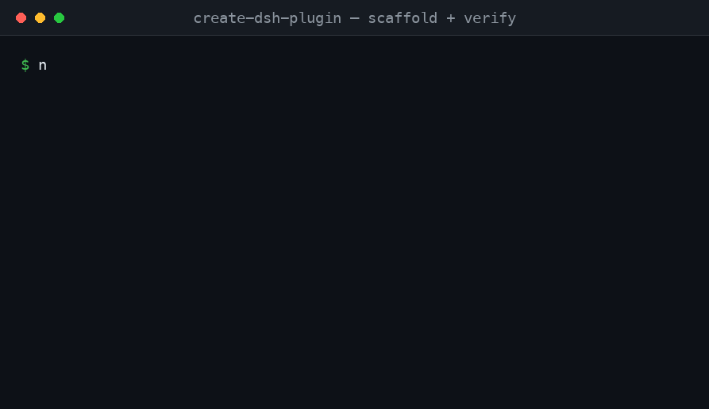

# dsh-suite


> 🌐 English · [中文](README.zh-CN.md)

**Stop scrolling the `dsh-plugin` topic. Find plugins that still work.**

`dsh-suite` is a bilingual, curated directory of [DeepSeek Harness](https://github.com/deepseek-ai/deepseek-harness) (DSH) plugins — re-checked against the latest DSH release every day by CI — plus a `create-dsh-plugin` scaffolder and a small set of first-party plugins.



---

## Why dsh-suite

DSH launched without an official plugin registry. Discovery today is the GitHub `dsh-plugin` topic (50+ one-off plugins) plus a few static awesome-lists that appeared overnight — and DSH itself is still shipping **compatibility-breaking changes**.

So we built three things:

1. **A live directory** — every entry carries a DSH-compatibility badge, re-checked against the latest DSH release every 24h by CI (no API key required).
2. **A scaffolder** — `npm create dsh-plugin` generates a working `dsh.bundle` + Cordis skeleton. The official repo ships none, and "how do I migrate my plugin" is a top community request.
3. **First-party plugins** — a small set we actually maintain, not just links.

## Quick Start

```bash
# 1. Install a plugin from the directory
dsh plugin --profile demo add <package-name>

# 2. Scaffold your own plugin
npm create dsh-plugin@latest my-plugin
```

## 📚 Plugin Catalog

<!-- CATALOG:START -->
### ⭐ Featured

| Plugin | ⭐ | Compat | Description |
|---|---|---|---|
| [dsh-web-ui](https://github.com/zhu1090093659/dsh-web-ui) | 88 | ⚪ unknown | DSH Web UI plugin & skin collection: task board, git panel, etc. |
| [mstar-harness](https://github.com/btspoony/mstar-harness) | 35 | ⚪ unknown | Skill-driven harness/loop engineering workflow plugin |
| [dsh-vision-toolkit](https://github.com/Anionex/dsh-vision-toolkit) | 28 | ⚪ unknown | Vision for text-only models: image QA, screenshot OCR, UI reconstruction |
| [DSH-better-sidebar](https://github.com/omdsh-dev/DSH-better-sidebar) | 19 | ⚪ unknown | Sidebar workbench: file render/terminal/git/subagent |
| [dsh-custom-tool](https://github.com/omdsh-dev/dsh-custom-tool) | 16 | ⚪ unknown | Create sandboxed JS tools with Monaco editor |
| [dsh_workflow](https://github.com/icetomoyo/dsh_workflow) | 16 | ⚪ unknown | Bring Claude Code's UltraCode mode to DSH with governable multi-agent orchestration |
| [ui-status-label](https://github.com/alingalingling/ui-status-label) | 13 | ⚪ unknown | Customize the whale-girl thinking-status label |
| [dsh-deep-whale](https://github.com/Small-tailqwq/dsh-deep-whale) | 12 | ⚪ unknown | DSH Web whale-girl skin series |
| [dsh-turn-rewind](https://github.com/Anionex/dsh-turn-rewind) | 9 | ⚪ unknown | Rewind conversation and workspace state |
| [distill](https://github.com/LoserFox/distill) | 7 | ⚪ unknown | Auto conversation distillation: background subagent reflection |
| [dsh-share](https://github.com/hellodigua/dsh-share) | 6 | ⚪ unknown | DSH conversation sharing plugin |
| [dsh-acp-for-bitfun](https://github.com/bobleer/dsh-acp-for-bitfun) | 5 | ⚪ unknown | BitFun ↔ DSH ACP bridge |
| [plugin-session-export](https://github.com/whyihaveyou/dsh-suite) | 0 | 🟢 ok | Export the append-only session log as human-readable Markdown / HTML, grouped by trajectory source (system prompt / reasoning / t… |
| [create-dsh-plugin](https://github.com/whyihaveyou/dsh-suite) | 0 | 🟢 ok | Scaffold a DeepSeek Harness (DSH) plugin in seconds — tool / events / webui templates, next-tag version pinning, and a built-in -… |
| [plugin-notify](https://github.com/whyihaveyou/dsh-suite) | 0 | 🟢 ok | Send IM webhook + local notifications on turn completion / error / approval (Feishu / WeCom / DingTalk / Slack / Discord / custom… |

### 🧰 Tools

| Plugin | ⭐ | Compat | Description |
|---|---|---|---|
| [open-managed-agents](https://github.com/openma-ai/open-managed-agents) | 226 | ⚪ unknown | Self-hosted Claude Managed Agents API platform (Cloudflare Workers) |
| [role-model](https://github.com/try-works/role-model) | 99 | ⚪ unknown | Protocol to route each job to the right model |
| [irmia_devkit_open](https://github.com/irmia2026/irmia_devkit_open) | 39 | ⚪ unknown | Python devkit (no description) |
| [HoloGram](https://github.com/834063245-creator/HoloGram) | 23 | ⚪ unknown | 3D code dependency graph generator (14 languages) |
| [dsh-custom-tool](https://github.com/omdsh-dev/dsh-custom-tool) | 16 | ⚪ unknown | Create sandboxed JS tools with Monaco editor |
| [dsh-acp-for-bitfun](https://github.com/bobleer/dsh-acp-for-bitfun) | 5 | ⚪ unknown | BitFun ↔ DSH ACP bridge |
| [fabric](https://github.com/omdsh-dev/fabric) | 5 | ⚪ unknown | MC-Fabric-like hook handler |
| [dsh-git-identity](https://github.com/LoserFox/dsh-git-identity) | 4 | ⚪ unknown | Pin git commits to environment author identity |
| [Hypr-Agent-Protal](https://github.com/gfhdhytghd/Hypr-Agent-Protal) | 4 | ⚪ unknown | Computer Use MCP for Hyprland |
| [telegram](https://github.com/LoserFox/telegram) | 4 | ⚪ unknown | Telegram Bot API bridge (long polling) |
| [agent-knock-knock](https://github.com/scotthuang/agent-knock-knock) | 2 | ⚪ unknown | OpenClaw plugin: control local Codex/Claude Code via shared tmux |
| [dsh-bash-encoding](https://github.com/lhh010/dsh-bash-encoding) | 2 | ⚪ unknown | Auto-detect bash output encoding |
| [dsh-data-agent](https://github.com/omdsh-dev/dsh-data-agent) | 2 | ⚪ unknown | Connect DB and write SQL plugin |
| [dsh-doctor](https://github.com/coppynight/dsh-doctor) | 2 | ⚪ unknown | flutter-doctor-style diagnostics and safe auto-repair |
| [dsh-interconnect](https://github.com/Chinesezjc/dsh-interconnect) | 2 | ⚪ unknown | Cross-instance message/event handoff |
| [dsh-openbiliclaw](https://github.com/whiteguo233/dsh-openbiliclaw) | 2 | ⚪ unknown | OpenBiliClaw content-agent bridge for DSH |
| [dsh-plugin-check](https://github.com/omdsh-dev/dsh-plugin-check) | 2 | ⚪ unknown | Scan plugin repo manifest protocol / patch format / build traps |
| [dsh-security-audit](https://github.com/omdsh-dev/dsh-security-audit) | 2 | ⚪ unknown | Local security audit: config/plugin source/session/network |
| [dsh-tool-csv](https://github.com/omdsh-dev/dsh-tool-csv) | 2 | ⚪ unknown | CSV parse/query/stat/transform tool |
| [dsh-toolkit](https://github.com/omdsh-dev/dsh-toolkit) | 2 | ⚪ unknown | Zero-dep toolkit collection |
| [atomstudio](https://github.com/AtomicsLaboratory/atomstudio) | 1 | ⚪ unknown | Document engineering environment for executable documents |
| [dsh-cc-connect](https://github.com/whiteguo233/dsh-cc-connect) | 1 | ⚪ unknown | Use DSH remotely via cc-connect |
| [dsh-mnemon](https://github.com/omdsh-dev/dsh-mnemon) | 1 | ⚪ unknown | Mnemon three-layer memory deep integration |
| [dsh-paseo](https://github.com/renat3u/dsh-paseo) | 1 | ⚪ unknown | paseo plugin extension support for DSH |
| [dsh-plugin-dev](https://github.com/omdsh-dev/dsh-plugin-dev) | 1 | ⚪ unknown | DSH plugin-dev pitfalls archive (skill + docs) |
| [dsh-tool-calculator](https://github.com/omdsh-dev/dsh-tool-calculator) | 1 | ⚪ unknown | Safe math expression evaluator |
| [dsh-tool-diff](https://github.com/omdsh-dev/dsh-tool-diff) | 1 | ⚪ unknown | Structured diff for text/JSON/CSV/Markdown |
| [dsh-tool-encoding](https://github.com/omdsh-dev/dsh-tool-encoding) | 1 | ⚪ unknown | base64/hex/url codec + hash tool |
| [dsh-tool-json](https://github.com/omdsh-dev/dsh-tool-json) | 1 | ⚪ unknown | JMESPath JSON query tool |
| [dsh-tool-markdown](https://github.com/omdsh-dev/dsh-tool-markdown) | 1 | ⚪ unknown | HTML↔Markdown conversion, GFM table normalization |
| [dsh-tool-regex](https://github.com/omdsh-dev/dsh-tool-regex) | 1 | ⚪ unknown | Regex test/capture/safe-replace tool |
| [dsh-tool-schema](https://github.com/omdsh-dev/dsh-tool-schema) | 1 | ⚪ unknown | JSON Schema validation tool |
| [dsh-tool-stat](https://github.com/omdsh-dev/dsh-tool-stat) | 1 | ⚪ unknown | Descriptive stats / percentile / correlation tool |
| [dsh-tool-time](https://github.com/omdsh-dev/dsh-tool-time) | 1 | ⚪ unknown | ISO 8601 / timezone / calendar math tool |
| [dsh-trace](https://github.com/vibeinging/dsh-trace) | 1 | ⚪ unknown | Telemetry backend exporting turns/steps/tools |
| [sandbox-micro](https://github.com/omdsh-dev/sandbox-micro) | 1 | ⚪ unknown | microsandbox support |
| [zotero-harvest](https://github.com/Fisfzy/zotero-harvest) | 1 | ⚪ unknown | Zotero harvest plugin (OpenAlex/arXiv/Crossref) |
| [dsh-harness-ops](https://github.com/fakechris/dsh-harness-ops) | 0 | ⚪ unknown | Ops toolkit: daily snapshot A/B slots, one-click rollback |
| [dsh-inspect](https://github.com/omdsh-dev/dsh-inspect) | 0 | ⚪ unknown | Adversarial checkup→fix→review loop plugin |
| [dsh-openmaic](https://github.com/THU-MAIC/dsh-openmaic) | 0 | ⚪ unknown | OpenMAIC: classrooms, slides, interactive widgets |
| [dsh-plugin-mineru](https://github.com/HuanLinOTO/dsh-plugin-mineru) | 0 | ⚪ unknown | MineRU document parsing tools |
| [dsh-prompt-studio](https://github.com/Moeblack/dsh-prompt-studio) | 0 | ⚪ unknown | Edit user & system prompt sections (live preview) |
| [dsh-scholar](https://github.com/lzszq/dsh-scholar) | 0 | ⚪ unknown | dsh-scholar (literature) |
| [dsh-ssh](https://github.com/UynajGI/dsh-ssh) | 0 | ⚪ unknown | SSH remote-execution: ProxyJump chain, SFTP |
| [dsh-tool-search](https://github.com/vibeinging/dsh-tool-search) | 0 | ⚪ unknown | Per-agent on-demand tool discovery + progressive schema |
| [dsh-webbridge](https://github.com/bill9109/dsh-webbridge) | 0 | ⚪ unknown | DSH + Kimi WebBridge |
| [ego-browser](https://github.com/Fisfzy/ego-browser) | 0 | ⚪ unknown | Bridge ego-lite Chromium browser into DSH |
| [math-lean](https://github.com/Fisfzy/math-lean) | 0 | ⚪ unknown | Lean kernel-verified math reasoning plugin |
| [plugin-template](https://github.com/omdsh-dev/plugin-template) | 0 | ⚪ unknown | Plugin template derived from the official turtle ui repo |
| [Qwen-MM-Plugins](https://github.com/omdsh-dev/Qwen-MM-Plugins) | 0 | ⚪ unknown | Qwen-MM-Plugins support |
| [sandbox-mxc](https://github.com/omdsh-dev/sandbox-mxc) | 0 | ⚪ unknown | Microsoft cross-platform sandbox support |
| [sandbox-nono](https://github.com/omdsh-dev/sandbox-nono) | 0 | ⚪ unknown | nono sandbox support |
| [web-components](https://github.com/omdsh-dev/web-components) | 0 | ⚪ unknown | web-components support |
| [zotero-wave-rag](https://github.com/Fisfzy/zotero-wave-rag) | 0 | ⚪ unknown | Wave-RAG retrieval for Zotero paper library |
| [dsh-bash-terminal](https://github.com/MAXeaglet/dsh-bash-terminal) | 0 | ⚪ unknown | One shell tool running PowerShell / Git Bash / WSL on Windows, with a user-chosen default terminal in DSH settings. |

### 🎨 UI

| Plugin | ⭐ | Compat | Description |
|---|---|---|---|
| [dsh-web-ui](https://github.com/zhu1090093659/dsh-web-ui) | 88 | ⚪ unknown | DSH Web UI plugin & skin collection: task board, git panel, etc. |
| [DSH-better-sidebar](https://github.com/omdsh-dev/DSH-better-sidebar) | 19 | ⚪ unknown | Sidebar workbench: file render/terminal/git/subagent |
| [ui-status-label](https://github.com/alingalingling/ui-status-label) | 13 | ⚪ unknown | Customize the whale-girl thinking-status label |
| [dsh-deep-whale](https://github.com/Small-tailqwq/dsh-deep-whale) | 12 | ⚪ unknown | DSH Web whale-girl skin series |
| [dsh-focus-chat](https://github.com/dingyi222666/dsh-focus-chat) | 3 | ⚪ unknown | Focused-chat minimal session view |
| [dsh-side-panel](https://github.com/ccq1/dsh-side-panel) | 3 | ⚪ unknown | DSH side panel: file browser, terminal, git review |
| [dsh-ui-progress](https://github.com/lhh010/dsh-ui-progress) | 2 | ⚪ unknown | Session progress bar: todos progress + live token rate |
| [dsh-ui-whale](https://github.com/lhh010/dsh-ui-whale) | 2 | ⚪ unknown | Hand-drawn pixel whale companion |
| [dsh-annotation](https://github.com/omdsh-dev/dsh-annotation) | 1 | ⚪ unknown | Selection annotation: select→annotate→send |
| [dsh-chat-width](https://github.com/chen-001/dsh-chat-width) | 1 | ⚪ unknown | Adjust the width of dsh's reply |
| [dsh-companion](https://github.com/william-jin-cmu/dsh-companion) | 1 | ⚪ unknown | Resident desktop companion: global hotkey/automation/plugin market |
| [dsh-genui](https://github.com/omdsh-dev/dsh-genui) | 1 | ⚪ unknown | Inline interactive UI components in chat |
| [dsh-input-history](https://github.com/lhh010/dsh-input-history) | 1 | ⚪ unknown | Input history: Ctrl+Up/Down to recall sent messages |
| [dsh-navbar](https://github.com/vlln/dsh-navbar) | 1 | ⚪ unknown | Conversation node navbar |
| [dsh-paste-input](https://github.com/lhh010/dsh-paste-input) | 1 | ⚪ unknown | Paste/drag/drop file input enhancement |
| [dsh-plugin-background](https://github.com/gameswu/dsh-plugin-background) | 1 | ⚪ unknown | DSH wallpaper plugin |
| [tonghuashun-webui](https://github.com/renat3u/tonghuashun-webui) | 1 | ⚪ unknown | 仿同花顺的webui插件 |
| [dsh-deepcel](https://github.com/Small-tailqwq/dsh-deepcel) | 0 | ⚪ unknown | Excel-style DSH skin |
| [dsh-deeplink](https://github.com/qyw233/dsh-deeplink) | 0 | ⚪ unknown | Deep-link plugin: open session/workspace directly |
| [dsh-diff-viewer](https://github.com/lehhair/dsh-diff-viewer) | 0 | ⚪ unknown | PiUI-style diff viewer replacing the stock DiffBlock |
| [dsh-drag-and-drop](https://github.com/bill9109/dsh-drag-and-drop) | 0 | ⚪ unknown | Cross-platform file drag & drop with raw path insertion |
| [dsh-qq2006](https://github.com/LaplaceYoung/dsh-qq2006) | 0 | ⚪ unknown | QQ2006 skin plugin |
| [dsh-session-notification](https://github.com/dingyi222666/dsh-session-notification) | 0 | ⚪ unknown | Session completion + 4-state notifications |
| [dsh-spotlight](https://github.com/0xsline/dsh-spotlight) | 0 | ⚪ unknown | Keyboard-first command palette |
| [dsh-ths-skin](https://github.com/AdamPlatin123/dsh-ths-skin) | 0 | ⚪ unknown | THS terminal-style skin + K-line panel |
| [dsh-tps](https://github.com/Small-tailqwq/dsh-tps) | 0 | ⚪ unknown | TPS skin plugin |
| [dsh-ultra-ui](https://github.com/havingautism/dsh-ultra-ui) | 0 | ⚪ unknown | (no description) |
| [dsh-web-ui-notify](https://github.com/bill9109/dsh-web-ui-notify) | 0 | ⚪ unknown | Desktop notifications for DSH |
| [ex-setting](https://github.com/omdsh-dev/ex-setting) | 0 | ⚪ unknown | DSH settings extension |
| [whale-girl](https://github.com/vlln/whale-girl) | 0 | ⚪ unknown | QQ-pet-style desktop pet plugin |

### 💬 Session

| Plugin | ⭐ | Compat | Description |
|---|---|---|---|
| [pi-discuss-mode](https://github.com/zwrong/pi-discuss-mode) | 11 | ⚪ unknown | Read-only discussion mode for Pi Coding Agent |
| [dsh-turn-rewind](https://github.com/Anionex/dsh-turn-rewind) | 9 | ⚪ unknown | Rewind conversation and workspace state |
| [dsh-share](https://github.com/hellodigua/dsh-share) | 6 | ⚪ unknown | DSH conversation sharing plugin |
| [dsh-message-edit](https://github.com/Moeblack/dsh-message-edit) | 5 | ⚪ unknown | Branch-based message editing, reroll, version timeline |
| [dsh-context-doctor](https://github.com/Zhenyu98/dsh-context-doctor) | 2 | ⚪ unknown | Context injection audit: AGENTS.md/skills/tool-schema token cost |
| [dsh-session-health](https://github.com/omdsh-dev/dsh-session-health) | 2 | ⚪ unknown | Frame-level scan diagnostics for zstd session files |
| [dsh-evolve](https://github.com/william-jin-cmu/dsh-evolve) | 1 | ⚪ unknown | Self-evolution: agent grows/prunes its own abilities |
| [dsh-memory-evolve](https://github.com/csyangwen/dsh-memory-evolve) | 1 | ⚪ unknown | Cross-session long-term memory + background self-evolution |
| [dsh-web-archive](https://github.com/renat3u/dsh-web-archive) | 1 | ⚪ unknown | Fold noisy messages (Think/Bash) in conversation |
| [deepseek-manners](https://github.com/Moeblack/deepseek-manners) | 0 | ⚪ unknown | Inject gratitude into every message |
| [dsh-agent-budget](https://github.com/vibeinging/dsh-agent-budget) | 0 | ⚪ unknown | Native agent-tree token budget plugin |
| [dsh-conversation-share](https://github.com/bill9109/dsh-conversation-share) | 0 | ⚪ unknown | Share any segment of a DSH conversation |
| [dsh-kb-sieve](https://github.com/omdsh-dev/dsh-kb-sieve) | 0 | ⚪ unknown | Auditable knowledge-base packs (references + SQLite) |
| [dsh-postmortem](https://github.com/zzh-newlearner/dsh-postmortem) | 0 | ⚪ unknown | Local-first failure postmortems |
| [dsh-session-search](https://github.com/Tieboyh/dsh-session-search) | 0 | ⚪ unknown | Index-free cross-agent session search |
| [dsh-sidechain](https://github.com/Buyi-wsgzg/dsh-sidechain) | 0 | ⚪ unknown | Side-chain sessions: /side persistent + /btw one-off |
| [dsh-tool-approval](https://github.com/ilharp/dsh-tool-approval) | 0 | ⚪ unknown | Manual approval (Manual/Ask mode) |
| [dsh-turn-navigator](https://github.com/vibeinging/dsh-turn-navigator) | 0 | ⚪ unknown | DSH Web turn navigation plugin |
| [plugin-session-export](https://github.com/whyihaveyou/dsh-suite) | 0 | 🟢 ok | Export the append-only session log as human-readable Markdown / HTML, grouped by trajectory source (system prompt / reasoning / t… |

### 🧠 LLM

| Plugin | ⭐ | Compat | Description |
|---|---|---|---|
| [dsh-vision-toolkit](https://github.com/Anionex/dsh-vision-toolkit) | 28 | ⚪ unknown | Vision for text-only models: image QA, screenshot OCR, UI reconstruction |
| [Deepseek-omnimodal](https://github.com/good-boy4069/Deepseek-omnimodal) | 2 | ⚪ unknown | Open-source multimodal MCP for text-only agents |
| [dsh-computer-use](https://github.com/Anionex/dsh-computer-use) | 2 | ⚪ unknown | Computer-use plugin (accessibility observation + scoped permission) |
| [dsh-vision](https://github.com/william-jin-cmu/dsh-vision) | 1 | ⚪ unknown | view_image tool bridging any OpenAI-compatible VLM |

### 🎛️ Orchestration

| Plugin | ⭐ | Compat | Description |
|---|---|---|---|
| [openhanako](https://github.com/liliMozi/openhanako) | 5975 | ⚪ unknown | Personal AI agent with memory, personality and autonomy |
| [exo](https://github.com/exoharness/exo) | 639 | ⚪ unknown | Fully recursive agent+harness that self-edits at runtime |
| [synergy](https://github.com/SII-Holos/synergy) | 542 | ⚪ unknown | General-purpose agent for the Open Agentic Web |
| [ccteam](https://github.com/firstintent/ccteam) | 142 | ⚪ unknown | Orchestrates Claude Code/Codex/Grok/Kimi into one team |
| [MateBot](https://github.com/aresbit/MateBot) | 46 | ⚪ unknown | A claudeclaw clone |
| [mstar-harness](https://github.com/btspoony/mstar-harness) | 35 | ⚪ unknown | Skill-driven harness/loop engineering workflow plugin |
| [dsh_workflow](https://github.com/icetomoyo/dsh_workflow) | 16 | ⚪ unknown | Bring Claude Code's UltraCode mode to DSH with governable multi-agent orchestration |
| [agents-go](https://github.com/zzir/agents-go) | 13 | ⚪ unknown | Multi-agent framework in Go |
| [distill](https://github.com/LoserFox/distill) | 7 | ⚪ unknown | Auto conversation distillation: background subagent reflection |
| [dsh-agent-teams](https://github.com/NanmiCoder/dsh-agent-teams) | 5 | ⚪ unknown | AgentTeams plugin |
| [dsh-automation](https://github.com/titanwings/dsh-automation) | 1 | ⚪ unknown | Run scheduled tasks in fresh sessions per plan |
| [dsh-loop](https://github.com/vlln/dsh-loop) | 1 | ⚪ unknown | Scheduled loop (/loop command + tool) |
| [dsh-plannotator](https://github.com/titanwings/dsh-plannotator) | 1 | ⚪ unknown | Plan annotator: annotate plan text line-by-line |
| [dsh-task-status](https://github.com/vlln/dsh-task-status) | 1 | ⚪ unknown | Background task status bar |
| [dsh-work](https://github.com/vibeinging/dsh-work) | 1 | ⚪ unknown | Local-first AI workbench for DSH plugins |
| [dsh-advisor](https://github.com/btspoony/dsh-advisor) | 0 | ⚪ unknown | Second model passively reviews each turn and injects advice |
| [dsh-artifact](https://github.com/william-jin-cmu/dsh-artifact) | 0 | ⚪ unknown | File delivery protocol: send_artifact tool |
| [dsh-deep-research](https://github.com/omdsh-dev/dsh-deep-research) | 0 | ⚪ unknown | Adaptive deep-research orchestrator plugin |
| [dsh-explain](https://github.com/yuezengwu/dsh-explain) | 0 | ⚪ unknown | Local-first learning mode: cross-session learning thread |
| [dsh-llm-fallbacks](https://github.com/btspoony/dsh-llm-fallbacks) | 0 | ⚪ unknown | Role-based LLM retry & fallback strategy |
| [dsh-sentinel](https://github.com/fuhefei/dsh-sentinel) | 0 | ⚪ unknown | Condition-driven wakeup: durable file/command/http triggers |
| [dsh-track](https://github.com/fakechris/dsh-track) | 0 | ⚪ unknown | Embedded task management engine: decision-point protocol |
| [eragear-code-copilot](https://github.com/TongDucThanhNam/eragear-code-copilot) | 0 | ⚪ unknown | Empty shell repo (no description) |

### 🧷 Utility

| Plugin | ⭐ | Compat | Description |
|---|---|---|---|
| [EchoBird](https://github.com/edison7009/EchoBird) | 3012 | ⚪ unknown | One-click install + model switch across 20+ coding agents |
| [awesome-dsh-plugins](https://github.com/AdamPlatin123/awesome-dsh-plugins) | 51 | ⚪ unknown | DSH plugin directory with daily compatibility tracking |
| [deepseek-harness-applicants](https://github.com/Octo-o-o-o/deepseek-harness-applicants) | 48 | ⚪ unknown | DSH internal-test applicants list |
| [awesome-deepseek-harness](https://github.com/0xsline/awesome-deepseek-harness) | 24 | ⚪ unknown | DSH ecosystem curation: plugins, tools, infra |
| [dsh-tianshu-tui](https://github.com/huiliyi37/dsh-tianshu-tui) | 22 | ⚪ unknown | DeepSeek Harness terminal UI |
| [agent-skills](https://github.com/GitHubxsy/agent-skills) | 20 | ⚪ unknown | Reusable skills for AI coding agents |
| [dsh-at-file](https://github.com/omdsh-dev/dsh-at-file) | 18 | ⚪ unknown | Codex-style @file mentions for DeepSeek Harness: search workspace files in the composer and attach their contents to prompts. |
| [dsh-open-in-vscode](https://github.com/omdsh-dev/dsh-open-in-vscode) | 18 | ⚪ unknown | Open DeepSeek Harness workspace directories in VS Code directly from the web GUI. |
| [dsh-notification](https://github.com/omdsh-dev/dsh-notification) | 16 | ⚪ unknown | Desktop notifications for DeepSeek Harness turn completions, with per-outcome controls and include/exclude keyword rules. |
| [dsh-ads](https://github.com/Nagi-ovo/dsh-ads) | 15 | ⚪ unknown | 2005-style sidebar ads plugin (parody) |
| [dsh-group-photo](https://github.com/SenmuuuuW/dsh-group-photo) | 10 | ⚪ unknown | DSH 内测收官合影墙：GitHub OAuth 零权限登录 + 冻结白名单校验的拍立得合影站（含 DSH Skill 包装） |
| [dsh-openpencil](https://github.com/ZSeven-W/dsh-openpencil) | 8 | ⚪ unknown | OpenPencil design preview and editing plugin for DSH |
| [oh-dsh-desktop](https://github.com/hust-open-atom-club/oh-dsh-desktop) | 8 | ⚪ unknown | Extensible macOS DSH workbench with native PTY |
| [dsh-visualize](https://github.com/Nagi-ovo/dsh-visualize) | 6 | ⚪ unknown | In-chat generative UI: interactive HTML cards |
| [awesome-DSH-plugin](https://github.com/Alex-Yanggg/awesome-DSH-plugin) | 4 | ⚪ unknown | Curated list of DSH plugins, extensions and tools |
| [oh-my-dsh](https://github.com/LaplaceYoung/oh-my-dsh) | 4 | ⚪ unknown | DSH plugin ecosystem (700+ plugins) |
| [dsh-gomoku](https://github.com/omdsh-dev/dsh-gomoku) | 3 | ⚪ unknown | Play Gomoku against AI in DSH |
| [dsh-web-review](https://github.com/CanglongCl/dsh-web-review) | 3 | ⚪ unknown | DeepSeek Harness Web GUI 的网页预览与元素批注插件，让 AI 根据可视化反馈直接修改前端源码。 |
| [dsh-emoji](https://github.com/hellodigua/dsh-emoji) | 2 | ⚪ unknown | Auto-add emoji to AI replies |
| [dsh-grok-tui](https://github.com/chen-001/dsh-grok-tui) | 2 | ⚪ unknown | Use dsh via grok-build's TUI |
| [dsh-stock-market](https://github.com/AnacondaKC/dsh-stock-market) | 2 | ⚪ unknown | Parody: lose money while coding |
| [Top](https://github.com/xiaohai-78/Top) | 2 | ⚪ unknown | Daily leaderboard for the dsh-external plugin ecosystem |
| [awesome-dsh-plugin](https://github.com/bruc3van/awesome-dsh-plugin) | 1 | ⚪ unknown | Bilingual complete list of the DSH plugin ecosystem |
| [dsh-launcher](https://github.com/Ruler4396/dsh-launcher) | 1 | ⚪ unknown | WebView2-based DSH launcher |
| [dsh-minigames](https://github.com/lhh010/dsh-minigames) | 1 | ⚪ unknown | Side game panel (18 offline mini-games) |
| [dsh-stickers](https://github.com/william-jin-cmu/dsh-stickers) | 1 | ⚪ unknown | Bidirectional sticker reactions |
| [oh-my-dsh](https://github.com/wangshunnn/oh-my-dsh) | 1 | ⚪ unknown | DeepSeek harness plugins |
| [orbis](https://github.com/icodesign/orbis) | 1 | ⚪ unknown | Mobile client for DSH remote control |
| [plugin-registry](https://github.com/vlln/plugin-registry) | 1 | ⚪ unknown | DSH plugin registry infra: browser panel for official repository plugins |
| [create-dsh-plugin](https://github.com/whyihaveyou/dsh-suite) | 0 | 🟢 ok | Scaffold a DeepSeek Harness (DSH) plugin in seconds — tool / events / webui templates, next-tag version pinning, and a built-in -… |
| [dsh-101](https://github.com/bill9109/dsh-101) | 0 | ⚪ unknown | DSH document reading mode |
| [dsh-desktop-electron](https://github.com/Void0312Aurora/dsh-desktop-electron) | 0 | ⚪ unknown | Cross-platform Electron desktop shell (tray-resident) |
| [dsh-douyin](https://github.com/AnacondaKC/dsh-douyin) | 0 | ⚪ unknown | Sidebar short-video plugin |
| [dsh-launcher](https://github.com/SnowCrescenter-tech/dsh-launcher) | 0 | ⚪ unknown | One-click portable DSH launcher (Windows) |
| [dsh-notebooks](https://github.com/havingautism/dsh-notebooks) | 0 | ⚪ unknown | (no description) |
| [dsh-plugin-d399](https://github.com/HuanLinOTO/dsh-plugin-d399) | 0 | ⚪ unknown | Pop-up mini-game menu while model generates |
| [plugin-notify](https://github.com/whyihaveyou/dsh-suite) | 0 | 🟢 ok | Send IM webhook + local notifications on turn completion / error / approval (Feishu / WeCom / DingTalk / Slack / Discord / custom… |

> Badges: 🟢 compatible · 🔴 broken · ⚪ unverified · ⚫ unmaintained.
> 168 entries total, grouped by category, sorted by ⭐ within each. Schema dictionary: [docs/catalog-schema.md](docs/catalog-schema.md).
<!-- CATALOG:END -->

## Compatibility

Each entry carries a badge that CI re-checks daily against the latest DSH release (static peer comparison → install check → config assembly, all key-free):

| Badge | Meaning |
|---|---|
| 🟢 ok | Verified compatible with the latest DSH release |
| 🔴 broken | Fails against the latest DSH release |
| ⚪ unknown | Not yet verified (first-time listing) |
| ⚫ unmaintained | Abandoned upstream |

Machine-readable daily results live in [`data/compat-report.json`](data/compat-report.json); the workflow is [`.github/workflows/compat.yml`](.github/workflows/compat.yml).

## 🧩 First-party Plugins

| Plugin | Description |
|---|---|
| `@dsh-suite/plugin-notify` | Turn-completion notifications to IM webhooks (Feishu / Slack / Discord / custom) + local toast |
| `@dsh-suite/plugin-session-export` | Human-readable Markdown / HTML session export (official only exports raw JSONL) |
| `@dsh-suite/plugin-team-board` | Lightweight multi-agent task board (roadmap) |

## 🛠 create-dsh-plugin

```bash
npm create dsh-plugin@latest
```

An interactive scaffolder with multiple templates and a Claude Code / MCP migration guide. See [`docs/migration-guide.en.md`](docs/migration-guide.en.md).

## Contributing

Add a catalog entry, submit a plugin, or review the [15 plugin design principles](CONTRIBUTING.md). Inclusion criteria and the submission flow are documented in [`CONTRIBUTING.md`](CONTRIBUTING.md); open an issue with the [inclusion-request](.github/ISSUE_TEMPLATE/plugin-submission.md) template to propose a new entry.

## Roadmap

- **Now (MVP)** — directory + compat CI (layer 1) + scaffolder + 2 first-party plugins.
- **Next** — install / config-assembly compat layers, star auto-refresh, migration guide, `plugin-team-board`.

## License

[MIT](LICENSE) © 2026 whyihaveyou

---

## 📚 Docs

- [Contributing](CONTRIBUTING.md) — inclusion criteria, submission flow, and the 15 plugin design principles
- [Docs](docs/) — catalog schema, category definitions, and the migration guide
